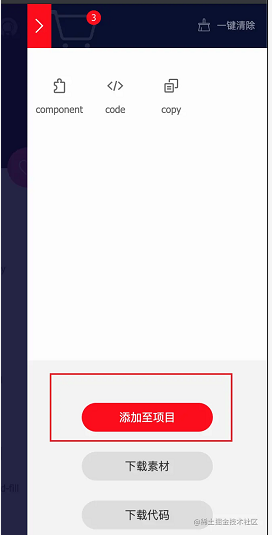
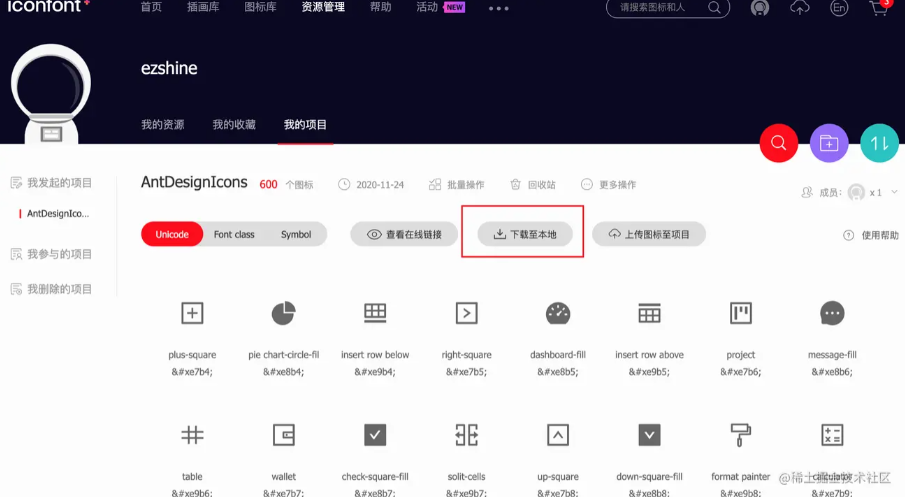
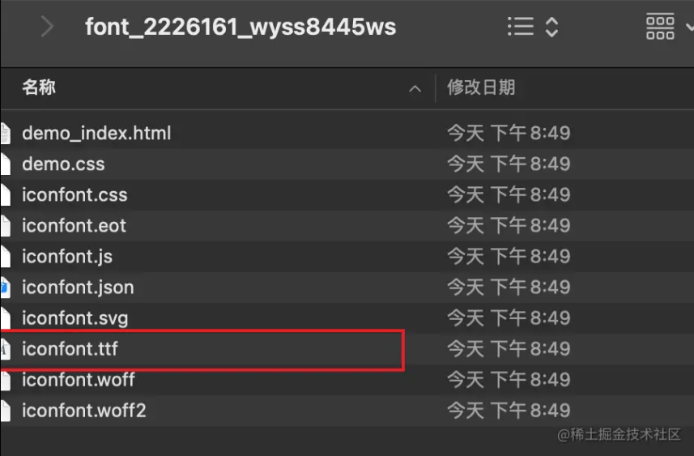
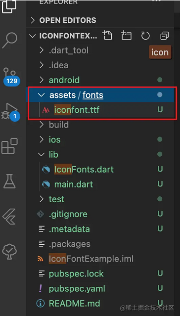
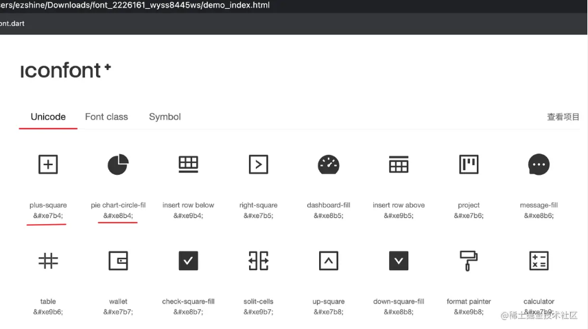
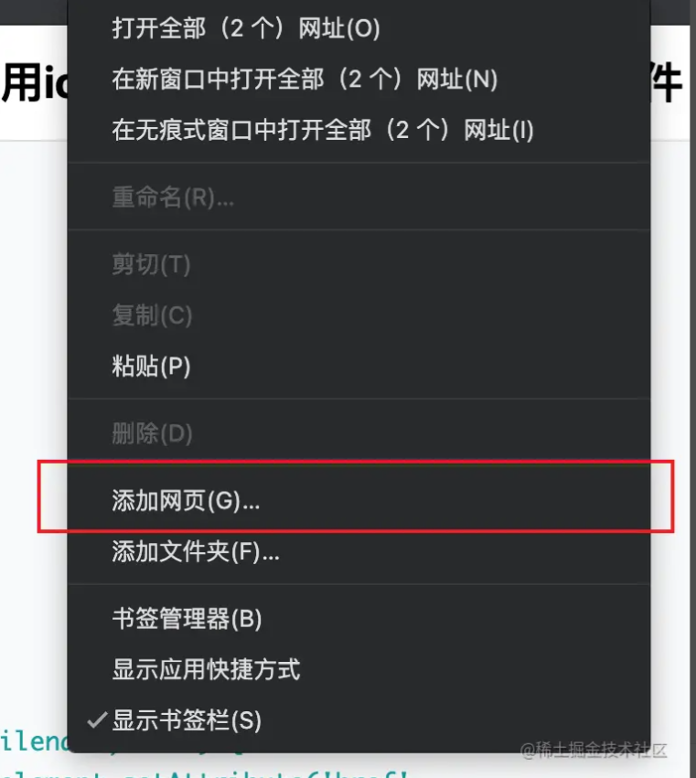
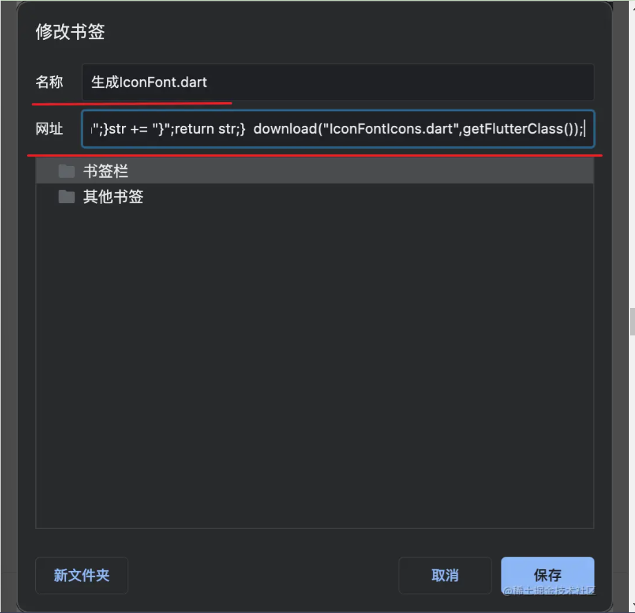
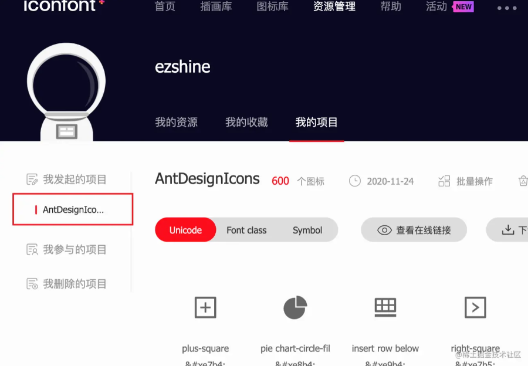
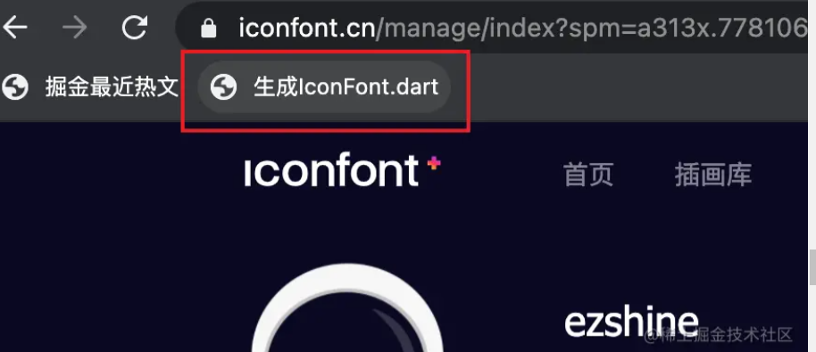
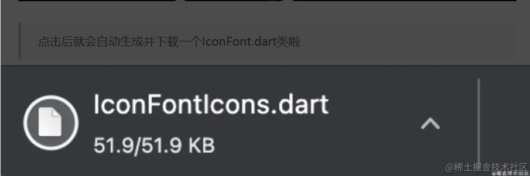

# 在 Flutter 中使用iconfont...附一键生成Dart类的技巧

# 前言

> 对于前端工程师来说，在项目中使用iconfont太习以为常了。而在Flutter中，内置了Icon组件，所有图标都来自[MaterialDesign Icons](https://link.juejin.cn?target=https%3A%2F%2Fmaterial.io%2Ftools%2Ficons%2F)，数量众多，完全是够用的。

可我们在实际开发中还是会要使用到自定义图标，那如何在Flutter项目中使用自定义的IconFont，这就是本文要教给大家的。

# 声明自定义字体

前往 [www.iconfont.cn/](https://link.juejin.cn?target=https%3A%2F%2Fwww.iconfont.cn%2F) 挑选图标，并添加至`购物车`（莫慌，是免费的）。

然后选择添加至项目



从我的项目中进入该项目，并选择下载至本地



将下载好的zip包解压缩，复制其中的iconfont.ttf文件至你的flutter项目中，比如`flutter项目名称/assets/fonts/`内





在Flutter中要使用自定义字体，我们需要在`pubspec.yaml`文件中添加以下内容

```plain
fonts:
    - family: IconFont
      fonts:
        - asset: assets/fonts/iconfont.ttf
```

请注意这个结构，不要写错了。通常情况下，在`pubspec.yaml`中有相关的注释，按照注释的结构写即可。

# 使用IconData

现在我们已经可以正常使用自定义的iconfont了，用法如下

```dart
Icon(
  IconData(0xe7b4, fontFamily: 'IconFont'),
  size: 20,
  color: Colors.black
)
```

其中fontFamily的值'IconFont'就是我们刚才在`pubspec.yaml`中声明的新字体，但是代码中的0xe7b4是指什么呢？回到之前下载解压zip包的文件夹，双击demo\_index.html文件在浏览器中打开后，我们可以看到下面的画面



每个图标下面都标记出了这个图标对应的unicode编码，所以我们想用哪个图标，只要copy它的unicode编码到代码里就行了

# 自定义Icon类

可如果我们有多个Icon，使用unicode非常不友好...读到代码的时候根本不知道是什么吧！所以我们需要把这个东西变得更`优雅`一些。把它们统统装进一个dart类集中管理，并通过图标的名称来使用。

```dart
class IconFontIcons {
  static const IconData iconRotateRight = IconData(0xe9b3,fontFamily:'IconFont');
  static const IconData iconHeartFill = IconData(0xe8b3,fontFamily:'IconFont');
  static const IconData iconMinusSquare = IconData(0xe7b3,fontFamily:'IconFont');
  ...
```

再使用的话，就非常简单直观了

```dart
Icon(IconFontIcons.iconRotateRight)
```

# 总结

在Flutter中使用iconfont简单极了，希望本文有帮到你...

对了，自动将iconfont项目生成`.dart`类的工具也为你准备好了

**请继续往下看**

***

# 一键生成IconFont类

## 使用方法

### 1、复制以下代码并添加到收藏

```javascript
javascript:function download(filename, text) {  var element = document.createElement('a');  element.setAttribute('href', 'data:text/plain;charset=utf-8,' + encodeURIComponent(text));  element.setAttribute('download', filename);  element.style.display = 'none';  document.body.appendChild(element);  element.click();  document.body.removeChild(element);}function toHump(name) {name = name.replace(/\s+/g,"-");    return name.replace(/\-(\w)/g, function(all, letter){        return letter.toUpperCase();    });}function getFlutterClass(){var str = "import 'package:flutter/widgets.dart';\r\n\r\n";str += "class IconFontIcons {\r\n";var arr = document.querySelectorAll(".icon-item");for (var i = arr.length - 1; i >= 0; i--) {var item = arr[i];var item_name = toHump(item.querySelectorAll(".icon-code")[1].textContent);var item_code = item.querySelectorAll(".icon-code")[0].textContent.replace(/\&\#/g,"0");item_code = item_code.replace(/\;/g,"");str += "    static const IconData "+item_name+" = IconData("+item_code+",fontFamily:'IconFontIcons');";str += "\r\n";}str += "}";return str;}  download("IconFontIcons.dart",getFlutterClass());
```

> Chrome浏览器：在收藏栏点击鼠标右键，选择添加网页



> 将名称改为“生成IconFont.dart”，复制上面的代码并粘贴在网址里



### 2、打开 [www.iconfont.cn/](https://link.juejin.cn?target=https%3A%2F%2Fwww.iconfont.cn%2F)

### 3、进入到要生成IconFont类的项目



### 4、点击第1步在收藏夹中添加的网址



> 点击后就会自动生成并下载一个IconFont.dart类啦




> 更新: 2025-09-11 16:11:09  
> 原文: <https://www.yuque.com/hutaoao/blog/nn5enyzw78zpwkyg>