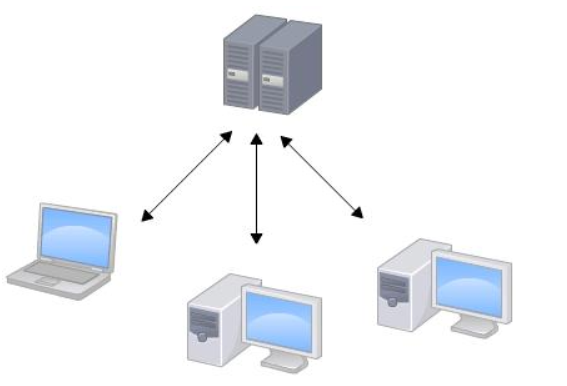
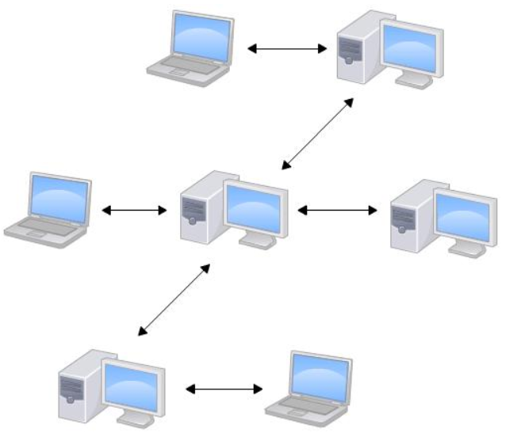
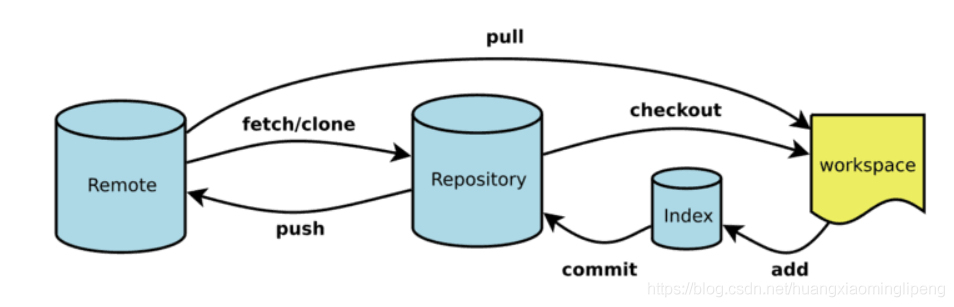

# Git 入门级教程

## 目录
+ 带你快速理解 Git
+ 介绍一下 Git 的由来
+ 集中式和分布式版本控制系统区别
+ 安装 Git
+ 一次完整的 Git 使用过程
+ 分支管理

## 带你快速理解 Git
学完后能立刻上手的 Git 教程！


有没有想过把每次修改的代码内容都记录下来，防止改错了需要回退，也方便查看每次修改了什么；有没有想过一个代码需要多人操作，多人切换修改后能立刻生成一份新的代码，让开发效率更高。那就一起来了解一下 <font style="color:#000000;">Git </font>吧，让你不再手动管理文档了！


版本控制系统有很多，但是 <font style="color:#000000;">Git </font>最出名，为什么呢？像 CVS 和 SVN 这种集中式的版本控制系统，它们不但速度慢，而且必须联网才能使用。

## 介绍一下 Git 的由来
随着 Linux 的不断壮大，其代码的管理遇到了难题，于是，Linux 的缔造者 Linus Torvalds，选用了分布式版本控制系统 BitKeeper 来管理和维护代码。但是，后来由于一些不太美好的原因，开发 BitKeeper 的商业公司同 Linux 内核开源社区的合作关系结束，他们收回了 Linux 内核社区 BitKeeper 的权力。Linux 开源社区（特别是 Linux 的缔造者 Linus Torvalds）基于使用 BitKeeper 时的经验教训，使用 C 开发出了自己的分布式版本系统 Git，而且做了很多改进。不得不说很牛！！

## 集中式和分布式版本控制系统区别
**集中式版本控制系统**，版本库是集中存放在中央服务器的，而干活的时候，用的都是自己的电脑，所以要先从中央服务器取得最新的版本，然后开始干活，干完活了，再把自己的活推送给中央服务器。





**分布式版本控制系统**实质上是根本没有“中央服务器”这一说的，每个人的电脑上都是一个完整的版本库（可以称为本地仓库），这样，你工作的时候，就不需要联网了，因为版本库就在你自己的电脑上。分布式版本控制系统通常也有一台充当“中央服务器”的电脑（这里其实就是远程仓库），但这个服务器的作用仅仅是用来方便“交换”大家的修改，没有它大家也一样干活，只是交换修改不方便而已。




## 安装 Git
**Linux 上安装（****<font style="color:#000000;">两种方法</font>****）：**

****

一是采用 yum 来安装 Git，可以参考下面的步骤。


1. 安装 yum

```bash
yum install git
```


若出现是否下载，点击 yes。


2. 验证安装是否成功

```bash
git --version
```


出现版本号，说明安装成功。Git 是默认安装在 /usr/libexec/git-core 目录下，可输入 cd 指令来查看安装的信息。


二是采用源码编译的方式安装，这种安装方法的好处就是方便控制安装的版本。


1. 先从 [https://github.com/git/git/releases](https://github.com/git/git/releases) 上下载源码，在这里我们可以找到所有 Git 已发布的版本，我们选择最新版的 tar.gz 包。最近最新的版本是 v2.30.0，下载命令为：

```bash
wget https://github.com/git/git/archive/v2.30.0.tar.gz
```


2. 解压

```bash
tar -zxvf git-2.22.0.tar.gz
```


3. 使用 cd 命令进入解压后的文件夹


4. 安装编译所需要的依赖

```bash
yum install curl-devel expat-devel gettext-devel openssl-devel zlib-devel gcc perl-ExtUtils-MakeMaker
```


耐心等待安装完成，中途出现提示的时候输入 y 并按回车。


安装编译源码所需依赖的时候，yum 自动帮你安装了 Git，这时候你需要先卸载这个旧版的 Git。

```bash
yum -y remove git
```


5. 编译 Git 源码

```plain
make prefix=/usr/local/git all
```


6. 安装 Git 至 /usr/local/git 路径

```plain
make prefix=/usr/local/git install
```


7. 配置环境变量

```plain
vi /etc/profile 
在底部加上
export PATH=$PATH:/usr/local/git/bin
```

( 输入 :wq! 保存修改)


8. 刷新环境变量

```plain
source /etc/profile
```


9. 查看 Git 是否安装完成

```plain
git --version
```


**Mac上安装（****<font style="color:#000000;">两种方法</font>****）：**

****

一是安装 homebrew，然后通过 homebrew 安装 Git，具体方法请参考 homebrew 的文档：[http://brew.sh/](http://brew.sh/)。

第二种方法更简单，也是推荐的方法，就是直接从 AppStore 安装 Xcode，Xcode 集成了 Git，不过默认没有安装，你需要运行 Xcode，选择菜单“Xcode”->“Preferences”，在弹出窗口中找到“Downloads”，选择“Command Line Tools”，点“Install”就可以完成安装了。


**Windows上安装：**

从 Git 官网直接下载安装程序，然后按默认选项安装即可。

安装完成后，在开始菜单里找到“Git”->“Git Bash”，蹦出一个类似命令行窗口的东西，就说明 Git 安装成功！或者是右击看到下面这几个图标：


一般习惯于用 Git Bash Here。

最后一步设置标识，输入下面的命令：

```bash
$ git config --global user.name "Your Name"
$ git config --global user.email "email@example.com"
```

注意 git config  --global 参数，有了这个参数，表示你这台机器上所有的 Git 仓库都会使用这个配置，当然你也可以对某个仓库指定不同的用户名和邮箱。


**现在，Git 可以在 Linux、Unix、Mac 和 Windows 这几大平台上正常运行了。**

---

_**先来理解几个基本概念**_

_****_




上面这幅图中展示了 Git 的基本使用流程，大致可以分为以下四个区域：

+ **workspace：工作区**

平时开发时，改动代码的地方，也就是每次有新的需求下来，直接在该区域修改代码，该区域的代码最新。


+ **index/stage：暂存区**

工作区有一个隐藏目录 .git，这个不算工作区，而是 Git 的版本库（包括暂存区和对象区）。

当你完成某个需求或功能后需要提交到远程仓库，那么第一步就是通过 git add 先提交到暂存区，被 <font style="color:#000000;">Git</font> 管理。

.git 目录下的暂存区（index文件）会记录 git add 添加文件的相关信息（文件名、大小、timestamp...），不保存文件实体，通过 id 指向每个文件实体。暂存区标记了你当前工作区中，哪些内容是被 <font style="color:#000000;">Git</font> 管理的。


+ **repository：本地仓库**

git commit 可以同步 index 中的内容到本地仓库。

本地仓库保存了对象被提交过的各个版本，比起工作区和暂存区的内容，它要更旧一些。


+ **remote：远程仓库**

git push 可以同步本地仓库中的内容到远程仓库。


## 一次完整的 Git 使用过程
**1、创建或获取版本库**

+ 创建版本库  
选择一个文件目录，然后右击打开 git bash 命令行窗口，执行下述命令初始化一个本地仓库。

```bash
git init
```

该命令将创建一个名为 .git 的目录，这个目录是 Git 来跟踪管理版本的，没事千万不要手动乱改这个目录里面的文件，否则，会把 <font style="color:#000000;">G</font><font style="color:#000000;">it </font>仓库给破坏了。


+ 获取远程仓库至本地仓库  
ps：远程仓库的建立会再补充的，选择一个文件目录，然后右击打开 git bash 命令行窗口，从一个服务器上克隆一个 <font style="color:#000000;">G</font><font style="color:#000000;">it</font> 远程仓库。

```bash
git clone [url]
```


**2、记录每次更新到版本库**

如果是创建的版本库，此时，工作区中还是没有文件的，可以直接在工作区中新增并修改；如果是获取的版本库，直接修改工作区的内容就好了。

改动好之后，可执行下述几个命令：


1. 检测当前文件状态。

```bash
$ git status
On branch master
Changes not staged for commit:
  (use "git add <file>..." to update what will be committed)
  (use "git checkout -- <file>..." to discard changes in working directory)
 modified:   readme.txt
  
no changes added to commit (use "git add" and/or "git commit -a")
```

<font style="color:#000000;">“</font>Changes not staged for commit<font style="color:#000000;">”</font>说明该文件 readme.txt 被修改了但并不在暂存区。


2. 把更改的内容添加到暂存区。

```bash
git add [filename]（针对特定文件）
git add *(所有文件)
git add *.txt（支持通配符，所有 .txt 文件）
```

此时，暂存区的内容和工作区的内容一致。


3. 忽略文件。

执行 add 操作时，有些文件是不想要放到暂存区，就可以使用下面的方法忽略掉：

+ 使用命令：touch .gitignore 创建 .gitignore 文件。
+ 在文件中写入需要忽略的文件。  
例如，写入 appName/src/test/* 表示忽略掉了 appName 项目下的 test 文件夹下的所有文件。


4. 提交更新。

现在最新的代码在暂存区，需要将其放到本地仓库中，采用下述的命令：

```bash
git commit -m "代码提交信息"
```

注意：每次准备提交前，先用 git status 看下，是不是都已暂存起来了，然后再运行提交命令。


5. 跳过使用暂存区域提交更新的方式。

仔细想一想，修改的内容在暂存区中，我们好像也没有做过什么操作，那为什么不选择直接提交到本地仓库呢？稍后解答~，先说一下跳过使用暂存区域而提交更新的命令：

```bash
git commit -a -m "代码提交信息"。
```

git commit 加上 -a 选项，Git 就会自动把所有已经跟踪过的文件暂存起来一并提交，从而跳过 git add 步骤。


_**git 暂存区存在的意义：**_

会有这个疑惑的，请先问问自己，使用 Git 时候是否是所有的修改一次全部提交，根本没有考虑到修改的多个内容是和多个功能有关的，而每一个功能应该单独做成一次提交，这样可以保证提交历史的清晰。否则，当你想要回滚历史的时候，你会无所适从，根本分不清每个版本包含了哪些功能，修复了哪些 bug。

而暂存区的作用就是为了可以选择性提交，比如你在开发 B 功能的时候，发现 A 功能还存在 Bug，这时候就需要先修复 A 中的 Bug，然后先提交 A 中的 Bug 修复后的内容，然后再提交 B 的。这样就可以使提交版本历史记录更清晰，方便回滚。而提交是原子性操作，文件的选择就交于暂存区去做，每一次提交都是一个完整的功能开发，保证 commit 的干净，降低 commit 的粒度。


6. 查看工作区和版本库里面最新版本的区别。

```bash
git diff HEAD -- [filename]
```


7. 移除文件。

有时候需要先从暂存区移除某文件，然后提交更新本地仓库。移除命令如下：

```bash
git rm [filename]
```


7. 对文件重命名。

```bash
git mv README.*** README 
(这个命令相当于 mv README.*** README、git rm README.***、git add README 这三条命令的集合)
```


8. 查看提交历史。

在提交了若干更新，又或者克隆了某个项目之后，也许想回顾下提交历史。完成这个任务最简单而又有效的工具是 git log 命令。git log 会按提交时间列出所有的更新，最近的更新排在最上面。加上 --pretty=oneline 后输出的信息就不会那么多。

```bash
$ git log
commit 1094adb7b9b3807259d8cb349e7df1d4d6477073 (HEAD -> master)
Author: Michael Liao <askxuefeng@gmail.com>
Date:   Fri May 18 21:06:15 2018 +0800
    append GPL
commit e475afc93c209a690c39c13a46716e8fa000c366
Author: Michael Liao <askxuefeng@gmail.com>
Date:   Fri May 18 21:03:36 2018 +0800
    add distributed
commit eaadf4e385e865d25c48e7ca9c8395c3f7dfaef0
Author: Michael Liao <askxuefeng@gmail.com>
Date:   Fri May 18 20:59:18 2018 +0800
    wrote a readme file
```

```bash
$ git log --pretty=oneline
1094adb7b9b3807259d8cb349e7df1d4d6477073 (HEAD -> master) append GPL
e475afc93c209a690c39c13a46716e8fa000c366 add distributed
eaadf4e385e865d25c48e7ca9c8395c3f7dfaef0 wrote a readme file
```


9. 版本回退。

```bash
git reset --hard HEAD^ 回退到上一版本
git reset --hard HEAD^^ 回退到上上版本
git reset --hard HEAD~100 回退到前100个版本
git reset --hard [版本号] 回退到固定版本号
git reflog 记录每一次的命令（可以查看版本号）
```


10. 推送本地的改动到远程仓库，使本地仓库和远程仓库一致。

如果还没有克隆现有仓库，并想将你的仓库连接到某个远程服务器，你可以使用如下命令添加：

```bash
·git remote add origin <url>
```

如果已经关联了远程仓库，可以使用下述命令看一下远程仓库是哪个：

```bash
git remote -v
```

然后将本地的改动提交到远程仓库：

```bash
git push origin [分支]
```

如此你就能够将你的改动推送到所添加的服务器上去了。


## 分支管理
分支是用来将特性开发绝缘开来的。在你创建仓库的时候，master 是“默认的”分支。在其他分支上进行开发，完成后再将它们合并到主分支上。我们通常在开发新功能、修复一个紧急 bug 等时候会选择创建分支。单分支开发好还是多分支开发好，还是要看具体场景来说。

一开始的时候，master 分支是一条线，Git 用 master 指向最新的提交，再用 HEAD 指向 master，就能确定当前分支，以及当前分支的提交点：


每次提交，master 分支都会向前移动一步，这样，随着你不断提交，master 分支的线也越来越长。

+ 创建一个分支 dev

```bash
git branch dev
git branch 后面不加分支的名字就是查看当前的分支
```


+ 切换当前分支到 dev

```bash
git checkout dev
```


+ 创建并切换分支

```bash
git checkout -b dev   （两条命令的合写）
```


+ 切换到主分支

```bash
git checkout master
```

+ 合并 dev 分支到 master（可能会有冲突）

```bash
git merge dev
```

那冲突该怎么解决呢？

首先通过 git status 命令查看一下冲突的文件，然后使用 cat [文件名] 查看该文件内是哪几行的代码出现了冲突，git 是用<<<<<<<，=======，>>>>>>> 标记出不同分支的内容，其中 <<<HEAD 是指主分支修改的内容，>>>>>dev 是指 dev 上修改的内容，最后手动解决一下，再执行合并操作。


+ 把刚新建的分支删掉

```bash
git branch -d dev
```


+ 将分支推送到远端仓库（推送成功后其他人可见）

```bash
git push origin [分支名]
```

这里可能会存在 push 失败的情况，那很可能就是因为你的另一个小伙伴和你修改了同一个文件的代码并且他 push 完成了，而你本次 push 的文件与远程仓库中现有的该文件产生了冲突，那需要先 pull 一下，再 push。

```bash
git pull 
ps: 如果失败了，根据提示，执行 git pull --set-upstream-to=origin/<branch> <branch>
就是说让你指定本地分支和远程分支的链接
```


> 更新: 2026-03-06 11:30:25  
> 原文: <https://www.yuque.com/hutaoao/blog/lebv8g>