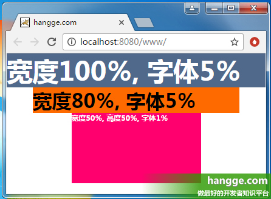
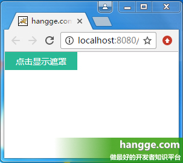
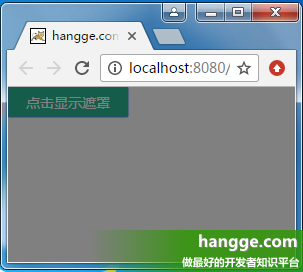
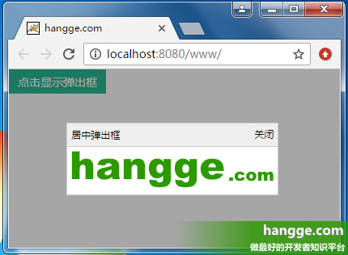
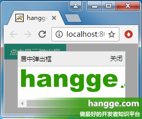
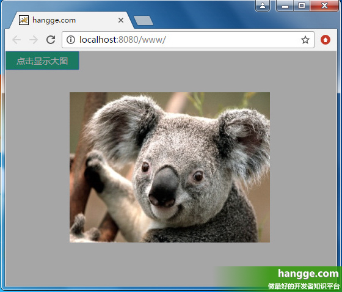
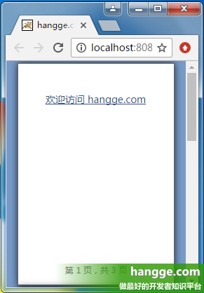
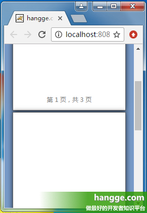

# CSS3新单位vw、vh、vmin、vmax介绍

### 一、让我介绍一下


#### 1，vw、vh、vmin、vmax 的含义


（1）vw、vh、vmin、vmax 是一种视窗单位，也是相对单位。它相对的不是父节点或者页面的根节点。而是由视窗（Viewport）大小来决定的，单位 1，代表类似于 1%。视窗(Viewport)是你的浏览器实际显示内容的区域—，换句话说是你的不包括工具栏和按钮的网页浏览器。


（2）具体描述如下：


+ vw：视窗宽度的百分比（1vw 代表视窗的宽度为 1%）
+ vh：视窗高度的百分比
+ vmin：当前 vw 和 vh 中较小的一个值
+ vmax：当前 vw 和 vh 中较大的一个值


#### 2，vw、vh 与 % 百分比的区别


（1）% 是相对于父元素的大小设定的比率，vw、vh 是视窗大小决定的。  
（2）vw、vh 优势在于能够直接获取高度，而用 % 在没有设置 body 高度的情况下，是无法正确获得可视区域的高度的，所以这是挺不错的优势。


#### 3，vmin、vmax 用处


做移动页面开发时，如果使用 vw、wh 设置字体大小（比如 5vw），在竖屏和横屏状态下显示的字体大小是不一样的。  
由于 vmin 和 vmax 是当前较小的 vw 和 vh 和当前较大的 vw 和 vh。这里就可以用到 vmin 和 vmax。使得文字大小在横竖屏下保持一致。


#### 4，浏览器兼容性


##### （1）桌面 PC（1）桌面 PC


+ Chrome：自 26 版起就完美支持（2013年2月）
+ Firefox：自 19 版起就完美支持（2013年1月）
+ Safari：自 6.1 版起就完美支持（2013年10月）
+ Opera：自 15 版起就完美支持（2013年7月）
+ IE：自 IE10 起（包括 Edge）到现在还只是部分支持（不支持 vmax，同时 vm 代替 vmin）


##### （2）移动设备


+ Android：自 4.4 版起就完美支持（2013年12月）
+ iOS：自 iOS8 版起就完美支持（2014年9月）


### 二、一个简单的样例


#### 1，页面代码


视窗（Viewport）单位除了可以用来设置元素的宽高尺寸，也可以在文本中使用。下面使用 vw 设置字体大小来实现响应式文字。


```html
<!DOCTYPE html>
<html>
  <head>
    <meta charset="utf-8">
    <title>hangge.com</title>
    <style>
      html, body, div, span, h1, h2, h3 {
        margin: 0;
        padding: 0;
        border: 0;
      }
 
      .demo {
       width: 100vw;
       font-size: 5vw;
       margin: 0 auto;
       background-color: #50688B;
       color: #FFF;
      }
 
      .demo2 {
       width: 80vw;
       font-size: 5vw;
       margin: 0 auto;
       background-color: #ff6a00;
      }
 
      .demo3 {
       width: 50vw;
       height: 50vh;
       font-size: 1vw;
       margin: 0 auto;
       background-color: #ff006e;
       color: #FFF;
      }
    </style>
  </head>
  <body>
      <div class="demo">
          <h1>宽度100％, 字体5％</h1>
      </div>
      <div class="demo2">
          <h2>宽度80％, 字体5％</h2>
      </div>
      <div class="demo3">
          <h3>宽度50％, 高度50％, 字体1％</h3>
      </div>
  </body>
</html>
```


#### 2，效果图





### 三、实现完整覆盖的遮罩层


有时为了突出弹出框，或者避免页面元素被点击。我们需要一个覆盖整个可视区域的半透明遮罩，这个使用 vw、vh 就可以很轻易地实现。


#### 1，样例代码


```html
<!DOCTYPE html>
<html>
  <head>
    <meta charset="utf-8">
    <title>hangge.com</title>
    <style>
      html, body, div, span, button {
        margin: 0;
        padding: 0;
        border: 0;
      }
 
      button {
        width: 120px;
        height: 30px;
        color: #FFFFFF;
        font-family: "微软雅黑";
        font-size: 14px;
        background: #28B995;
      }
 
      #mask {
        width: 100vw;
        height: 100vh;
        position: fixed;
        top: 0;
        left: 0;
        background: #000000;
        opacity: 0.5;
        display: none;
      }
    </style>
  </head>
  <body>
      <button onclick="document.getElementById('mask').style.display='inline'">点击显示遮罩</button>
      <div id="mask" onclick="document.getElementById('mask').style.display='none'"></div></div>
  </body>
</html>
```


#### 2，效果图








### 四、实现居中显示的弹出框


#### 1，弹出框大小随内容自适应


##### （1）样例效果图


点击弹出按钮后，会显示一个在整个屏幕上居中显示的弹出框。  
弹出框的大小根据内容的大小自适应（logo 图片），同时弹出框后面还有个覆盖整个屏幕的半透明遮罩层。  
点击关闭按钮后，则隐藏弹出框。





##### （2）样例代码


遮罩层使用 vw、vh 实现全屏覆盖。弹出框添加到遮罩层中并居中。


```html
<!DOCTYPE html>
<html>
  <head>
    <meta charset="utf-8">
    <title>hangge.com</title>
    <script type="text/javascript" src="js/jquery.js"></script>
    <style>
      html, body, div, span, button {
        margin: 0;
        padding: 0;
        border: 0;
      }
 
      button {
        width: 120px;
        height: 30px;
        color: #FFFFFF;
        font-family: "微软雅黑";
        font-size: 14px;
        background: #28B995;
      }
 
      .dialog-container {
        display: none;
        width: 100vw;
        height: 100vh;
        background-color: rgba(0,0,0,.35);
        text-align: center;
        position: fixed;
        top: 0;
        left: 0;
        z-index: 10;
      }
 
      .dialog-container:after {
        display: inline-block;
        content: '';
        width: 0;
        height: 100%;
        vertical-align: middle;
      }
 
      .dialog-box {
        display: inline-block;
        border: 1px solid #ccc;
        text-align: left;
        vertical-align: middle;
        position: relative;
      }
 
      .dialog-title {
        line-height: 28px;
        padding-left: 5px;
        padding-right: 5px;
        border-bottom: 1px solid #ccc;
        background-color: #eee;
        font-size: 12px;
        text-align: left;
      }
 
      .dialog-close {
        position: absolute;
        top: 5px;
        right: 5px;
        font-size: 12px;
      }
 
      .dialog-body {
        background-color: #fff;
      }
    </style>
  </head>
  <body>
      <button onclick="$('#dialogContainer').show();">点击显示弹出框</button>
      <div id="dialogContainer" class="dialog-container">
          <div class="dialog-box">
              <div class="dialog-title">居中弹出框</div>
              <a onclick="$('#dialogContainer').hide();" class="dialog-close">关闭</a>
              <div class="dialog-body">
                
              </div>
          </div>
      </div>
  </body>
</html>
```


#### 2，弹出框大小随视窗大小改变


##### （1）样例效果图


点击弹出按钮后，会显示一个在整个屏幕上居中显示的弹出框。  
弹出框的大小不再由内容的大小决定，而是随视窗大小改变（宽高均为屏幕可视区域的 80%）。  
点击关闭按钮后，则隐藏弹出框。





##### （2）样例代码


遮罩层使用 vw、vh 实现全屏覆盖。而弹出框的尺寸位置同样使用 vw、vh 设置。


```html
<!DOCTYPE html>
<html>
  <head>
    <meta charset="utf-8">
    <title>hangge.com</title>
    <script type="text/javascript" src="js/jquery.js"></script>
    <style>
      html, body, div, span, button {
        margin: 0;
        padding: 0;
        border: 0;
      }
 
      button {
        width: 120px;
        height: 30px;
        color: #FFFFFF;
        font-family: "微软雅黑";
        font-size: 14px;
        background: #28B995;
      }
 
      .dialog-container {
        display: none;
        width: 100vw;
        height: 100vh;
        background-color: rgba(0,0,0,.35);
        text-align: center;
        position: fixed;
        top: 0;
        left: 0;
        z-index: 10;
      }
 
      .dialog-box {
        top:10vh;
        left:10vw;
        width: 80vw;
        height: 80vh;
        text-align: left;
        position: absolute;
        border: 1px solid #ccc;
        display: flex;
        flex-direction: column;
      }
 
      .dialog-title {
        line-height: 28px;
        padding-left: 5px;
        padding-right: 5px;
        border-bottom: 1px solid #ccc;
        background-color: #eee;
        font-size: 12px;
        text-align: left;
      }
 
      .dialog-close {
        position: absolute;
        top: 5px;
        right: 5px;
        font-size: 12px;
      }
 
      .dialog-body {
        background-color: #fff;
        flex:1;
        overflow: auto;
      }
    </style>
  </head>
  <body>
      <button onclick="$('#dialogContainer').show();">点击显示弹出框</button>
      <div id="dialogContainer" class="dialog-container">
          <div class="dialog-box">
              <div class="dialog-title">居中弹出框</div>
              <a onclick="$('#dialogContainer').hide();" class="dialog-close">关闭</a>
              <div class="dialog-body">
                
              </div>
          </div>
      </div>
  </body>
</html>
```


### 五、显示大图时限制其最大尺寸


我们还可以通过视图单位来限制一些元素的最大宽度或高度，避尺寸过大而超出屏幕。


#### 1，效果图


（1）点击按钮，在屏幕中央显示原始图片的大图。  
（2）如果图片原始宽高均不超过屏幕宽高的 90%，则显示图片的默认大小。  
（3）如果图片原始宽高均超过屏幕宽高的 90%，则限制为屏幕的 90%，使其能够完全显示。





#### 2，样例代码


```html
<!DOCTYPE html>
<html>
  <head>
    <meta charset="utf-8">
    <title>hangge.com</title>
    <script type="text/javascript" src="js/jquery.js"></script>
    <style>
      html, body, div, span, button {
        margin: 0;
        padding: 0;
        border: 0;
      }
 
      button {
        width: 120px;
        height: 30px;
        color: #FFFFFF;
        font-family: "微软雅黑";
        font-size: 14px;
        background: #28B995;
      }
 
      .dialog-container {
        display: none;
        width: 100vw;
        height: 100vh;
        background-color: rgba(0,0,0,.35);
        text-align: center;
        position: fixed;
        top: 0;
        left: 0;
        z-index: 10;
      }
 
      .dialog-container:after {
        display: inline-block;
        content: '';
        width: 0;
        height: 100%;
        vertical-align: middle;
      }
 
      .dialog-box {
        display: inline-block;
        text-align: left;
        vertical-align: middle;
        position: relative;
      }
 
      .demo-image {
        max-width: 90vw;
        max-height: 90vh;
      }
    </style>
  </head>
  <body>
      <button onclick="$('#dialogContainer').show();">点击显示大图</button>
      <div id="dialogContainer" class="dialog-container" onclick="$('#dialogContainer').hide();">
          <div class="dialog-box">
              
          </div>
      </div>
  </body>
</html>
```


### 六、实现 Word 文档页面效果


#### 1，效果图


（1）使用 vh 单位，我们可把 web 页面做得像 Office 文档那样，一屏正好一页。改变浏览器窗口尺寸，每页的大小也会随之变化。  
（2）拖动滚动条，我们可以一直往下看到最后一页。








#### 2，样例代码


```html
<!DOCTYPE html>
<html>
  <head>
    <meta charset="utf-8">
    <title>hangge.com</title>
    <script type="text/javascript" src="js/jquery.js"></script>
    <style>
      html, body, div, span, button {
        margin: 0;
        padding: 0;
        border: 0;
      }
 
      body {
        background-color: #789BC9;
      }
 
      page {
        display: block;
        height: 98vh;
        width: 69.3vh;
        margin: 1vh auto;
        padding: 12vh;
        border: 1px solid #646464;
        box-shadow: 0 0 15px rgba(0,0,0,.75);
        box-sizing: border-box;
        background-color: white;
        position: relative;
      }
 
      page:after {
        content: attr(data-page);
        color: graytext;
        font-size: 12px;
        text-align: center;
        bottom: 4vh;
        position: absolute;
        left: 10vh;
        right: 10vh;
      }
 
      a {
        color: #34538b;
        font-size: 14px;
      }
    </style>
    <script type="text/javascript">
      $(document).ready(function(){
        var lenPage = $("page").length;
        //自动添加每页底部的页码
        $("page").each(function(i){
          $(this).attr("data-page", "第 "+ (i+1) +" 页，共 "+ lenPage +" 页");
        });
      });
    </script>
  </head>
  <body>
    <page><a href="http://hangge.com">欢迎访问 hangge.com</a></page>
    <page></page>
    <page></page>
  </body>
</html>
```


> 更新: 2026-03-06 11:33:03  
> 原文: <https://www.yuque.com/hutaoao/blog/hifsiq>