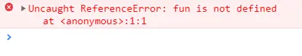
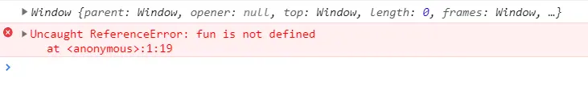

# setTimeout 详解

### 定义

用于在指定的毫秒数后调用函数或计算表达式

### 语法：

1. setTimeout(function, milliseconds, param1, param2, ...)
2. setTimeout(code, milliseconds, param1, param2, ...)

> function/code——要调用的代码串或函数，milliseconds——延迟时间，param1, param2, ...——传给执行函数的其他参数

###

实例与解析

#### （1）第一个参数是函数

```javascript
setTimeout( function(param1, param2) {
  console.log('1秒后输出', param1, param2)     // 1秒后输出 其他参数1 其他参数2
}, 1000, '其他参数1', '其他参数2')

// 或
function fn(param1, param2) {
    console.log('1秒后输出', param1, param2)
}
setTimeout(fn, 1000, '其他参数1', '其他参数2')
```

#### （2）第一个参数是字符串

当第一个参数是字符串不是函数时，setTimeout函数会通过 <code>**eval()**</code> 将这个字符串解析为一段JS代码并执行，如果无法解析为JS代码，则会报错

```javascript
setTimeout(
  "console.log('1秒后输出')",     // 1秒后输出
  1000
);

setTimeout(
  "hello('1秒后输出')",     // 报错 - Uncaught ReferenceError: hello is not defined
  1000
);
```

#### （3）第一个参数是代码串

注意与第一个参数是字符串的情况比较

```javascript
setTimeout(
  console.log('直接输出，延迟时间不生效'),     // 直接输出，延迟时间不生效
  1000
);

// 或
function fn() {
    console.log('1秒后输出')				// 直接输出，延迟时间不生效
}
setTimeout(fn(), 1000)  // 此时 fn() 就是被调用的代码串 - 是一个函数执行而不是函数定义
```

### <font style="color:rgb(64, 64, 64);">setTimeout返回值</font>

setTimeout有一个返回值，可以通过变量进行接收，这个值通过 `typeof` 进行判断后可以看出是一个 `number` 类型，这个值其实对应的是 setTimtout() 的 **ID**，当页面定时器不断增多，需要对某一个定时器做操作时，通过 ID 就能够确定到该定时器并通过 clearTimeout() 清除该定时器。

```javascript
var timeoutID = setTimeout(function(){
  console.log('1秒后输出')    // 1秒后输出
}, 1000);
console.log('定时器ID：', timeoutID)     // 1
```

### 结束/阻止setTimeout的执行 - clearTimeout

```javascript
var timeoutID = setTimeout(function() {
  console.log('这是一个定时器')  
}, 1000);
clearTimeout(timeoutID);
```

解析：上边代码并不会输出任何值，因为已经通过clearTimeout(timeoutID)方法取消了定时函数的执行，并且由于timeoutID的值是1，因此也可以通过 clearTimeout(1) 取消定时器的执行

###

<font style="color:rgb(64, 64, 64);">回调函数的执行时机</font>
为什么 setTimeout 的延迟时间设置为0时也不会立即执行？

**是因为浏览器是基于事件循环的，其中会有多个队列，页面的渲染是一个队列，JS代码的执行也是一个队列。JS代码执行时会创建一系列的任务，而这些任务按照先进先出的原则被加入到队列中；**

**<font style="color:#DF2A3F;">但是setTimeout是特殊的，当执行到setTimeout时，JS会将其拿出来放到一个单独的特殊队列中，这个队列中的任务在JS队列还有未执行完的任务时，永远不会被执行。</font>**

**<font style="color:#DF2A3F;"></font>**

### <font style="color:rgb(64, 64, 64);">应用</font>

#### <font style="color:rgb(64, 64, 64);">（1）实现异步编程</font>

alert会阻塞代码的执行是因为JS是单线程的，弹出框出现后如果不对其进行操作，则后面的代码就无法执行，如：

```javascript
alert('弹出框');
var code = '弹出框后需要执行的代码';
console.log(code);
```

如果我们把alert代码放在setTimeout函数中，则可以避免这种情况的出现，如：

```javascript
setTimeout(function() {
  alert('弹出框');
}, 1000);
var code = '弹出框后需要执行的代码';
console.log(code);     // 弹出框后需要执行的代码
```

#### <font style="color:rgb(64, 64, 64);">（2）利用setTimeout循环输出1、2、3、4、5、.....</font>

```javascript
for (var i = 1; i <= 5; i++) {
  setTimeout( function timer() {
    console.log(i);     //每隔1秒输出一个6，最后一共输出5个6
  }, i * 1000);
}
```

解析：上面的代码并没有按照我们的预想依次输出1、2、3、4、5，即使把定时函数的时间设置为0秒也不会依次输出1、2、3、4、5，原因是，**<font style="color:#DF2A3F;">定时器都被放在了一个被称为队列的数据结构中，等待上下文的可执行代码运行完毕后，才开始运行定时器，此时的 i 的值已经是最后一次输出后再加1的值，即6。</font>**

所以要想依次输出不同的数字，就需要把每个定时器所访问的变量独立起来，这就需要用到JS的**闭包**（**立即执行函数**），因为闭包可以很好的区分开各个作用域，避免变量的混淆，如：

```javascript
for (var i = 1; i <= 5; i++) {
  (function(i){
    setTimeout( function timer() {
      console.log(i);
    }, i * 1000);     // 1、2、3、4、5
  })(i);
}
```

**！！！**此处也是**立即执行函数：**<font style="color:rgb(0, 0, 0);">上面的现象也可以说是闭包，因为在外层的 function 里面还包含着 setTimeout 里面的 timer 函数，而里面的 function 函数就访问了外层 function 的 i 的值，由此就形成了一个闭包。每次循环时，将 i 的值保存在一个闭包中，当 setTimeout 中定义的操作执行时，就会访问对应闭包保存的 i 值，所以输出 0 1 2 3 4。</font>

也可以通过作用域在函数内部把变量隔离起来，在闭包内部访问i的时候，i就是一个常量：

```javascript
for (var i = 1; i <= 5; i++) {
  (function(){
    var s = i;     //把i赋值给另外一个变量
    setTimeout( function timer() {
      console.log(s);     // 1、2、3、4、5
    }, s * 1000);
  })();
}
```

**使用闭包可以依次输出数字，原因是改变了 i 的作用域**，那如果我们把循环中的每个setTimeout都独立成一个作用域是不是也能实现同样的结果呢？

在JavaScript中，每个函数是一个独立的作用域，但是“{}”是不能形成独立作用域的。而ES6中提出了一个新的关键字 <code>**let**</code>，就可以声明一个仅对当前“{}”内部有作用的变量，如：

```javascript
for (let i = 1; i <= 5; i++) {
  setTimeout( function timer() {
    console.log(i);     //每隔1秒输出一个6，最后一共输出5个6
  }, i * 1000);
}
```

### <font style="color:rgb(64, 64, 64);">setTimeout第一个参数是回调函数和代码串的区别</font>

#### <font style="color:rgb(64, 64, 64);">（1）第一个参数是代码串</font>

```javascript
for(var i = 1; i <= 5; i++){
  setTimeout(console.log(i),i*1000);
}
```

解析：上面的代码一次性输出1、2、3、4、5，延迟时间并没有起作用，原因在于 console.log() 是方法的执行调用，调用setTimeout后是马上执行。

那如何解决这个问题呢，就是把代码串放在函数中如：

```javascript
for(let i = 1; i<= 5; i++ ){ //为什么要用let定义而不是var定义，通过上边的分析也已经知道了
  setTimeout(function(){
    console.log(i);
  }, i*1000);
}
```

#### <font style="color:rgb(64, 64, 64);">（2）第一个参数是字符串</font>

```javascript
function test() {
  var fun = function() {
    console.log('第一个参数是字符串')
  }
  setTimeout('fun()', 1000)
}
test()
```



<font style="color:rgb(64, 64, 64);">解析：setTimeout的第一个参数是字符串时，JS内部将会调用 </font><code>**<font style="color:rgb(64, 64, 64);">eval()</font>**</code><font style="color:rgb(64, 64, 64);"> 函数将字符串转换为JS可执行代码，但是为什么找不到 fun 函数？</font>

<font style="color:rgb(64, 64, 64);">我们现在setTimeout中输出this看一下，如：</font>

```javascript
function test() {
  var fun = function() {
    console.log('第一个参数是字符串')
  }
  setTimeout('console.log(this);fun()', 1000)
}
test()
```



解析：从执行结果可以看出this绑定window全局对象，因此 <code>**eval()**</code> 执行动态脚本的时，在全局作用域并没有找到定义在函数test内部的 fun函数，所以会报错。

经过改造后，如：

```javascript
var fun = function() {
  console.log('Hello World!')
}
setTimeout(fun(), 1000)
```

解析：将上面代码复制到文本中执行会发现，延迟时间并没有生效，这是因为这里的 **fun()是一个函数执行而不是函数定义**，如果想延迟执行，需要传递一个函数地址，如：

```javascript
var fun = function() {
  console.log('Hello World!')
}
setTimeout(fun, 1000)
```

或直接return一个函数，如：

```javascript
var fun = function() {
  return function(){
    console.log('Hello World')
  }
}
setTimeout(fun(), 1000)
```

<font style="color:rgb(64, 64, 64);">或按照setTimeout的标准直接将一个函数作为其第一个参数，如：</font>

```javascript
setTimeout(function(){
  console.log('Hello World!')
}, 1000)
```


> 更新: 2024-01-11 11:13:36  
> 原文: <https://www.yuque.com/hutaoao/blog/zz596lu8tasqcnzc>