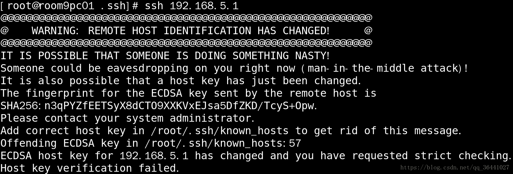

# 主机密钥已更改报错

使用本机连接 ssh  192.168.5.1出现如下报错

报错的大概意思是192.168.5.1的ECDSA主机密钥已更改,并且您已请求严格检查,远程主机发送的ECDSA密钥指纹信息是和本机的密钥指纹信息不一致

ssh链接的时候首先会验证公钥，如果公钥不对，那么就会报错，

# 解决办法
我们需要删除本机 ~/.ssh/known_hosts文件的192.168.5.1[需要远程的主机IP] 公钥信息

> 更新: 2026-03-06 11:32:14  
> 原文: <https://www.yuque.com/hutaoao/blog/zrgrdu>