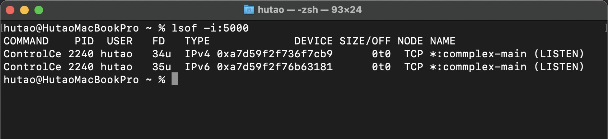
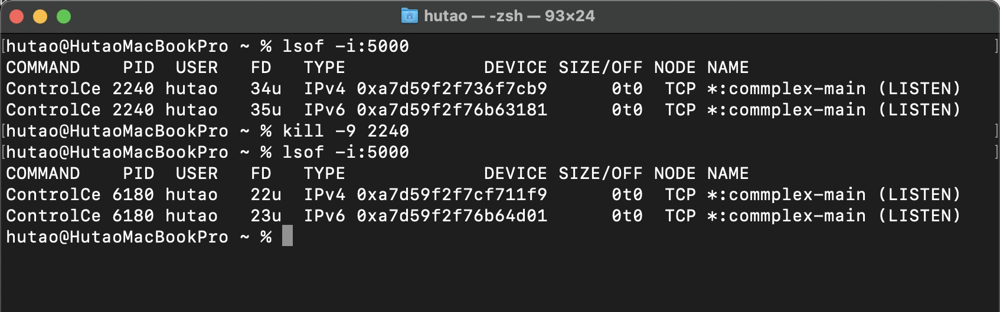
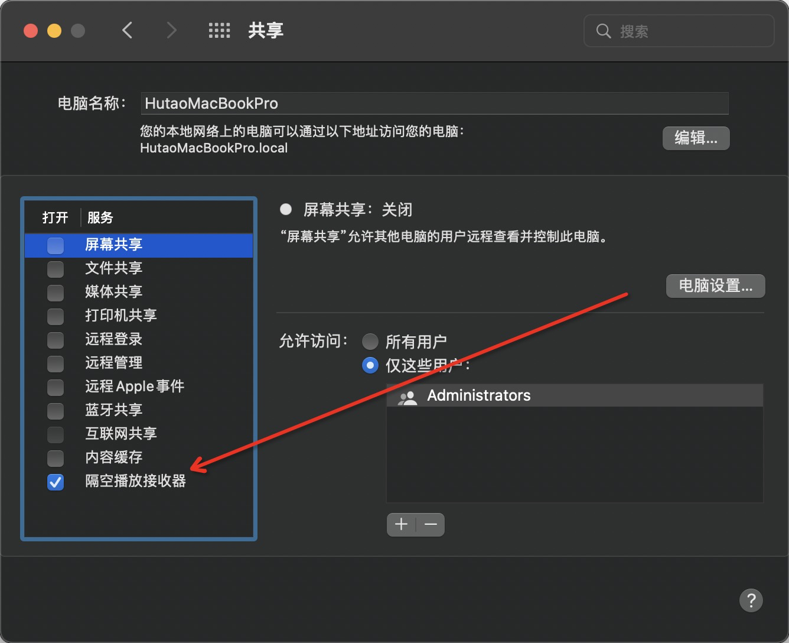

# 5000端口被锁定

试图杀死它们以解锁端口，但它不会起作用，因为一旦我运行kill（或sudo kill）命令，具有新PID的进程将再次锁定我的5000端口。

  

**解决方案：**

****

关闭AirPlay Receiver（在端口5000上侦听）修复了我的问题：

转到系统首选项-->共享-->取消选中AirPlay Receiver（隔空播放接收器）

  

> 更新: 2024-01-08 17:17:04  
> 原文: <https://www.yuque.com/hutaoao/blog/ass5wl>