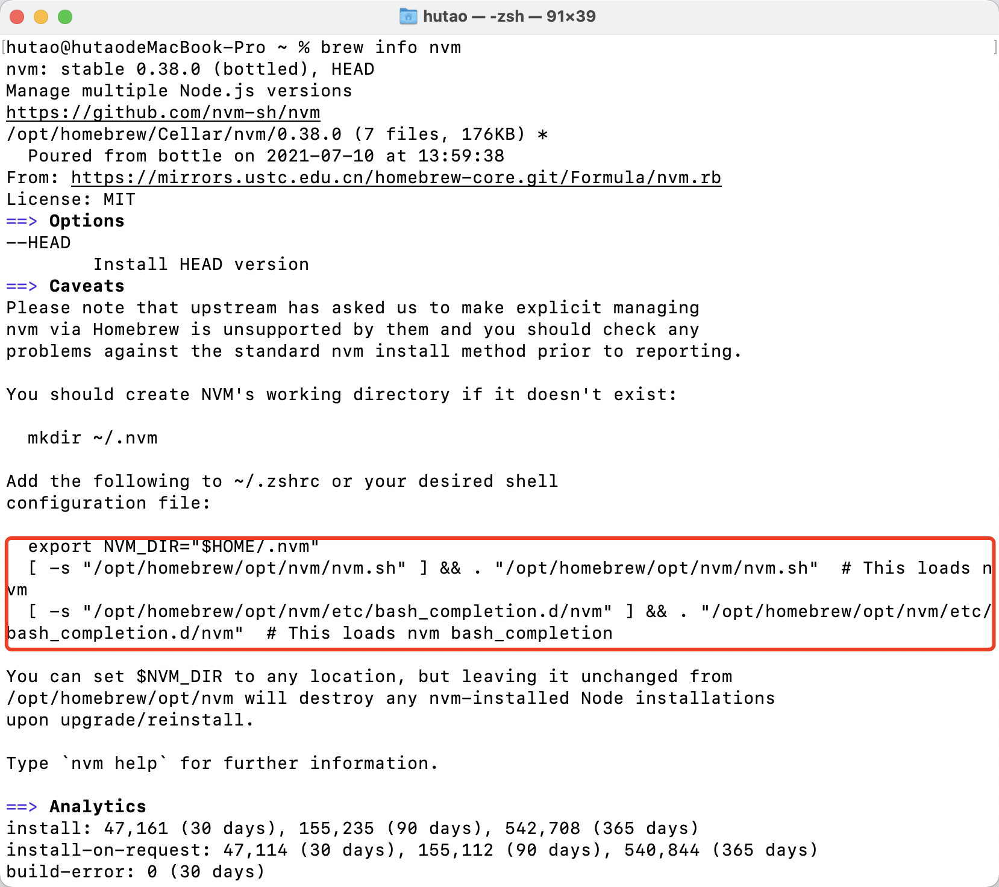

# Homebrew安装nvm

安装

```bash
brew install nvm
```


但是到这一步并没有安装好，这时直接使用nvm指令会得到：

```bash
nvm zsh: command not found: nvm
```

此时按照网上方法添加环境变量行不通，所以我们可以：

```bash
brew info nvm
```

如下图：按照提示添加环境变量即可

vi ~/.zshrc 进入编辑，最后 source ~/.zshrc 即可




node缓存目录 /Users/hutao/.nvm/.cache/


> 更新: 2024-06-24 10:41:24  
> 原文: <https://www.yuque.com/hutaoao/blog/zmvytu>