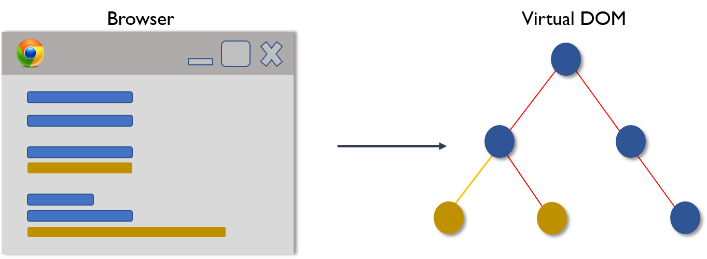
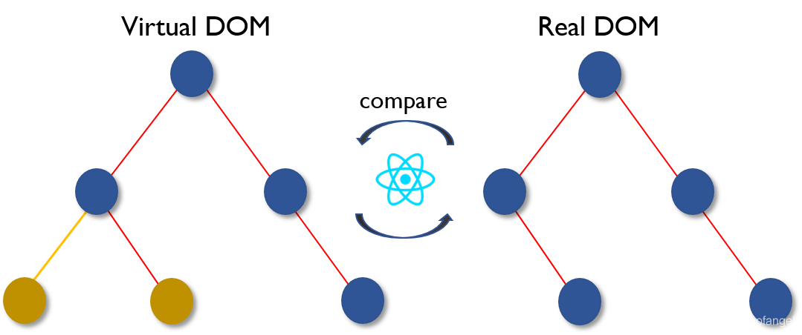
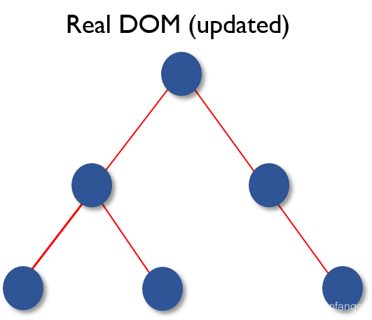

# Real DOM和Virtual DOM

### 真实DOM 和 虚拟DOM 对比

| Real DOM | Virtual DOM |
| --- | --- |
| + 更新缓慢。 + 可以直接更新 HTML。 + 如果元素更新，则创建新DOM。 + DOM操作代价很高。 + 消耗的内存较多。 | + 更新更快。 + 无法直接更新 HTML。 + 如果元素更新，则更新 JSX 。 + DOM 操作非常简单。 + 很少的内存消耗。 |

### 虚拟DOM （VDOM）

Virtual DOM 是一个轻量级的 JavaScript 对象，它最初只是 real DOM 的副本。它是一个节点树，它将元素、它们的属性和内容作为对象及其属性。 React 的渲染函数从 React 组件中创建一个节点树。然后它响应数据模型中的变化来更新该树，该变化是由用户或系统完成的各种动作引起的。

Virtual DOM 工作过程有三个简单的步骤。

1. 每当底层数据发生改变时，整个 UI 都将在 Virtual DOM 描述中重新渲染。

2. 然后计算之前 DOM 表示与新表示的之间的差异。

3. 完成计算后，将只用实际更改的内容更新 real DOM。

> 更新: 2026-03-06 11:34:45  
> 原文: <https://www.yuque.com/hutaoao/blog/axw96a>