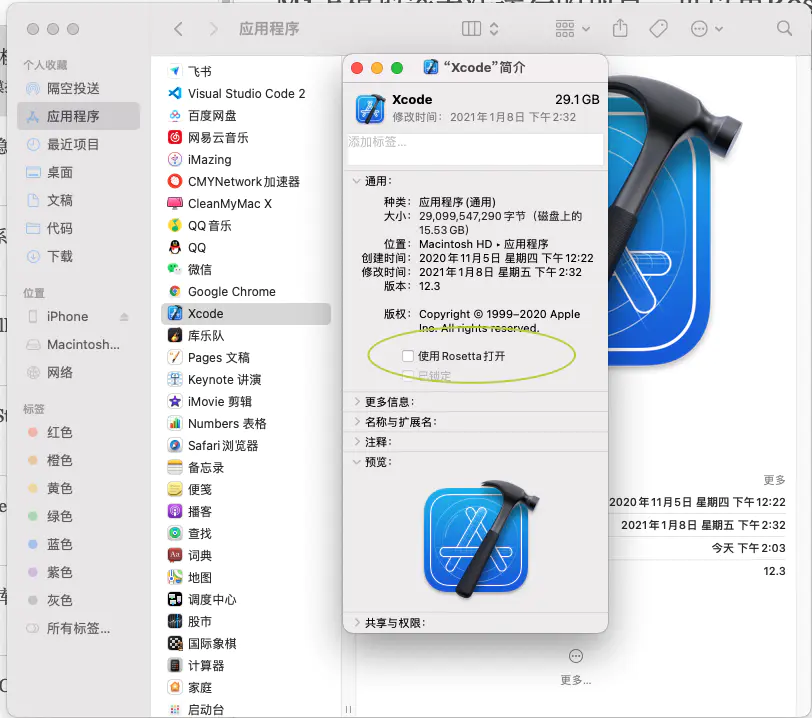

# M1 模拟器x86兼容性导致无法运行

<font style="color:rgb(64, 64, 64);">报错信息有以下内容：</font>

```objectivec
... for architecture arm64
```

<font style="color:rgb(64, 64, 64);"></font>

<font style="color:rgb(64, 64, 64);">M1上模拟器上无法运行，真机可以</font>

<font style="color:#FADB14;background-color:#8C8C8C;">可能项目上集成了某些SDK不兼容ARM架构导致的。</font>

<font style="color:rgb(64, 64, 64);"></font>

<font style="color:rgb(64, 64, 64);">此时可以尝试用 </font>**<font style="color:#F5222D;">Rosetta</font>**<font style="color:rgb(64, 64, 64);"> 打开</font>  
<font style="color:rgb(64, 64, 64);">访达-应用程序-Xcode-右键-显示简介-通用-使用Rosetta打开</font>

<font style="color:rgb(64, 64, 64);"></font>




> 更新: 2022-06-01 15:39:41  
> 原文: <https://www.yuque.com/hutaoao/blog/qyw44q>