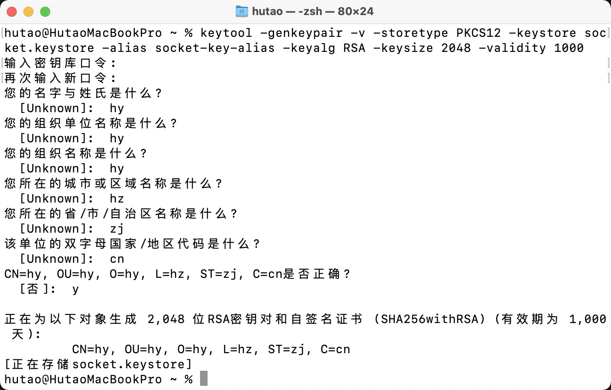
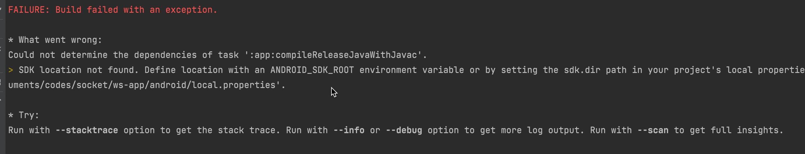

# Mac 打包 Android

### 生成签名密钥

```bash
$ keytool -genkeypair -v -storetype PKCS12 -keystore my-release-key.keystore -alias my-key-alias -keyalg RSA -keysize 2048 -validity 1000
```



> 密钥库文件位置：用户主目录（即 cd）
>
> 密钥库口令：至少六位数

### 设置 gradle 变量

1. 把 socket.keystore 文件放到你工程中的 android/app 文件夹下。
2. 编辑 ~/.gradle/gradle.properties（全局配置，对所有项目有效）

   或是项目目录/android/gradle.properties（项目配置，只对所在项目有效）。如果没有gradle.properties文					      件你就自己创建一个，添加如下的代码（注意把其中的\*\*\*\*替换为相应密码）

```bash
MYAPP_RELEASE_STORE_FILE=my-release-key.keystore
MYAPP_RELEASE_KEY_ALIAS=my-key-alias
MYAPP_RELEASE_STORE_PASSWORD=*****
MYAPP_RELEASE_KEY_PASSWORD=*****
```

### 把签名配置加入到项目的 gradle 配置中

编辑你项目目录下的 `android/app/build.gradle`，添加如下的签名配置：

```bash
...
android {
    ...
    defaultConfig { ... }
    signingConfigs {
        release {
            if (project.hasProperty('MYAPP_RELEASE_STORE_FILE')) {
                storeFile file(MYAPP_RELEASE_STORE_FILE)
                storePassword MYAPP_RELEASE_STORE_PASSWORD
                keyAlias MYAPP_RELEASE_KEY_ALIAS
                keyPassword MYAPP_RELEASE_KEY_PASSWORD
            }
        }
    }
    buildTypes {
        release {
            ...
            signingConfig signingConfigs.release
        }
    }
}
...
```

### 生成发行 APK 包

```bash
$ cd android
$ ./gradlew assembleRelease
```

###

### 碰到的问题：



找不大SDK 位置：

> 原因是打包命令用的 `sudo ./gradlew assembleRelease` sudo环境变量差异导致的

解决方法：

1. android目录下增加 `local.properties` 文件，加入代码：<font style="color:#808080;">sdk.dir=/Users/hutao/Library/Android/sdk</font>
2. 删除之前打包生成的文件 android/app/build 和 /android/.gradle （有时node\_modules也需删除），重新使用 `./gradlew assembleRelease` 打包 <font style="color:#F5222D;">【推荐】</font>


> 更新: 2026-03-06 11:41:41  
> 原文: <https://www.yuque.com/hutaoao/blog/iqczgd>