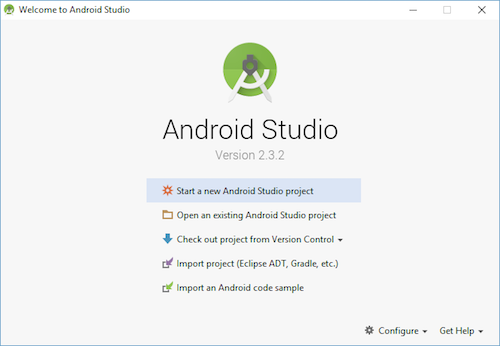
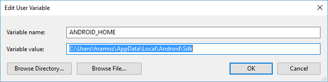

# React Native环境搭建（Windows+Android）

官方文档：<https://www.reactnative.cn/docs/getting-started.html>

### 清除Rn Android缓存

`cd /android`

`sudo ./gradlew clean`

### 安装依赖

#### <font style="color:#1A1A1A;">Node（</font>[下载地址](https://nodejs.org/en/)<font style="color:#1A1A1A;">）</font>

<font style="color:#1A1A1A;"></font>

<font style="color:#1A1A1A;">推荐使用</font>[nvm](https://github.com/coreybutler/nvm-windows/releases)<font style="color:#1A1A1A;">（</font>Node Package Manage<font style="color:#1A1A1A;">）node版本管理工具来下载node</font>

<font style="color:#1A1A1A;"></font>

> <font style="color:#F5222D;">注意：</font><font style="color:#1A1A1A;">Node 的版本应大于等于 12</font>
>
> <font style="color:#F5222D;">注意：</font><font style="color:#1A1A1A;background-color:transparent;">不要使用 cnpm！cnpm 安装的模块路径比较奇怪，packager 不能正常识别！</font>

#### JDK（[下载地址](https://www.oracle.com/java/technologies/javase/javase-jdk8-downloads.html)）

> <font style="color:#1A1A1A;"> </font><font style="color:#F5222D;">注意：</font><font style="color:#1A1A1A;">JDK 的版本必须是 1.8（目前不支持 1.9 及更高版本，注意 1.8 版本官方也直接称 8 版本）</font>

```bash
# 使用nrm工具切换淘宝源
npx nrm use taobao

# 如果之后需要切换回官方源可使用
npx nrm use npm
```

[环境变量配置](https://www.cnblogs.com/nojacky/p/9497724.html)：

1. <font style="color:#000000;">新建变量—变量名：JAVA\_HOME ，变量值： </font><font style="color:#000000;background-color:#FFFB8F;">C:\Program Files\Java\jdk1.8.0\_171</font><font style="color:#000000;">  (这里填你自己选择的安装路径！！！)</font>
2. <font style="color:#000000;">新建变量—变量名：CLASSPATH , 变量值： </font><font style="color:#000000;background-color:#FFFB8F;"> .;%JAVA\_HOME%\lib;%JAVA\_HOME%\lib\tools.jar</font><font style="color:#000000;">（注意最前面有一点）。</font>
3. <font style="color:#000000;">配置系统环境变量Path：Path-->新建-->添加  </font><font style="color:#000000;background-color:#FFFB8F;">%JAVA\_HOME%\bin</font>

<font style="color:#000000;background-color:#FFFB8F;"></font>

> <font style="color:#000000;">命令行窗口，分别输入"java -version"、"javac" 检验是否成功</font>

<font style="color:#000000;"></font>

#### Yarn

```bash
npm install -g yarn
```

#### Android 开发环境

**1. 安装 Android Studio**

首先[下载](https://developer.android.com/studio/index.html)和[安装](https://blog.csdn.net/qq_41976613/article/details/91432304) Android Studio，<font style="color:#1A1A1A;">安装界面中选择"Custom"选项，确保选中了以下几项：</font>

<font style="color:#1A1A1A;"></font>

* `Android SDK`
* `Android SDK Platform`
* `Performance (Intel ® HAXM)` ([AMD 处理器看这里](https://android-developers.googleblog.com/2018/07/android-emulator-amd-processor-hyper-v.html))
* `Android Virtual Device`

> <font style="color:#1A1A1A;background-color:transparent;">如果选择框是灰的，你也可以先跳过，稍后再来安装这些组件。</font>

<font style="color:#1A1A1A;">安装完成后，看到欢迎界面时，就可以进行下面的操作了。</font>

**2. 安装 Android SDK**

***

Android Studio 默认会安装最新版本的 Android SDK。目前编译 React Native 应用需要的是\*\*<font style="color:#F5222D;background-color:rgba(27, 31, 35, 0.05);">Android 10 (Q)</font>\*\*\*\*<font style="color:#F5222D;"> </font>\*\*版本的 SDK（注意 SDK 版本不等于终端系统版本，RN 目前支持 android4.1 以上设备）。你可以在 Android Studio 的 SDK Manager 中选择安装各版本的 SDK。

你可以在 Android Studio 的欢迎界面中找到 SDK Manager。点击"Configure"，然后就能看到"SDK Manager"。



> <font style="color:#1A1A1A;background-color:transparent;">SDK Manager 还可以在 Android Studio 的"Preferences"菜单中找到。具体路径是</font>**<font style="background-color:transparent;">Appearance & Behavior</font>**<font style="color:#1A1A1A;background-color:transparent;"> → </font>**<font style="background-color:transparent;">System Settings</font>**<font style="color:#1A1A1A;background-color:transparent;"> → </font>**<font style="background-color:transparent;">Android SDK</font>**<font style="color:#1A1A1A;background-color:transparent;">。</font>

在 SDK Manager 中选择"SDK Platforms"选项卡，然后在右下角勾选"Show Package Details"。展开<code><font style="color:#F5222D;">Android 10 (Q)</font></code>选项，确保勾选了下面这些组件：

* `Android SDK Platform 29`
* `Intel x86 Atom_64 System Image`（官方模拟器镜像文件，使用非官方模拟器不需要安装此组件）

然后点击"SDK Tools"选项卡，同样勾中右下角的"Show Package Details"。展开"Android SDK Build-Tools"选项，确保选中了 React Native 所必须的<code><font style="color:#F5222D;">29.0.2</font></code>版本。你可以同时安装多个其他版本。

最后点击"Apply"来下载和安装这些组件。

**3. 配置 ANDROID\_HOME 环境变量**

***

创建一个名为`ANDROID_HOME`的环境变量（系统或用户变量均可），指向你的 Android SDK 所在的目录（具体的路径可能和下图不一致，请自行确认）：



SDK 默认是安装在下面的目录：

> <font style="color:#000000;background-color:transparent;">c:\Users\你的用户名\AppData\Local\Android\Sdk</font><font style="color:#1A1A1A;"></font>

<font style="color:#1A1A1A;"></font>

<font style="color:#F5222D;">注意：</font><font style="color:#1A1A1A;">你需要关闭现有的命令符提示窗口然后重新打开，这样新的环境变量才能生效。</font>

**4. 把一些工具目录添加到环境变量 Path 中**

***

<font style="color:#1A1A1A;">选中</font>**Path**<font style="color:#1A1A1A;">变量 编辑》新建》</font><font style="color:#1A1A1A;">然后把这些工具目录路径添加进去：platform-tools、emulator、tools、tools/bin</font>

<font style="color:#1A1A1A;"></font>

```bash
%ANDROID_HOME%\platform-tools
%ANDROID_HOME%\emulator 
%ANDROID_HOME%\tools 
%ANDROID_HOME%\tools\bin
```

\*\*5. \*\***更改Android AVD模拟器创建路径位置**

***

<font style="color:#333333;">Android AVD模拟器默认路径为</font> <code><font style="color:#333333;">c:\user\用户名\.android\avd</font></code> <font style="color:#333333;">，欲将其移植到d盘下，方法为：</font>

<font style="color:#333333;"></font>

1. <font style="color:#333333;">建立文件夹：\ </font><font style="color:#333333;">在D盘下建立AndroidSdkHome文件夹，在其下建立.android子文件夹（注意前面有个点，如果系统提示请输入文件名，则将原路径下的文件夹拷贝过来即可），再在.android下建立avd文件夹，即建立了 </font><code><font style="color:#333333;">D:\</font>``<font style="color:#333333;">AndroidSdkHome</font>``<font style="color:#333333;">\.android\avd</font></code>
2. <font style="color:#333333;">配置环境变量：\ </font><font style="color:#333333;">打开 计算机->属性->环境变量->系统变量，新建变量名ANDROID\_SDK\_HOME（不可用其它名称）,值为 </font><code><font style="color:#333333;">D:\</font>``<font style="color:#333333;">AndroidSdkHome</font></code><font style="color:#333333;">，</font><font style="color:#333333;">(tip：变量值后面不加任何符号，包括分号，点号等)</font>
3. <font style="color:#333333;">移植原avd文件：\ </font><font style="color:#333333;">将原路径下的avd设备拷贝到新的路径下，将.ini文件下的原路径更改为新的路径。</font>
4. <font style="color:#333333;">建立新的avd：\ </font><font style="color:#333333;">打开AVD Manager.exe,\ </font><font style="color:#333333;">顶端已经显示为新的路径，点击New,新建avd设备即可。</font>

### 创建新项目

> <font style="color:#1A1A1A;background-color:transparent;">如果你之前全局安装过旧的 </font><code><font style="background-color:transparent;">react-native-cli</font></code>  <font style="color:#1A1A1A;background-color:transparent;">命令行工具，请使用 </font><code><font style="background-color:transparent;">npm uninstall -g react-native-cli</font></code>  <font style="color:#1A1A1A;background-color:transparent;">卸载掉它以避免一些冲突。</font>

```bash
npx react-native init AwesomeProject
```

<font style="color:#1A1A1A;">这个命令行工具不需要安装，可以直接用 node 自带的</font>`npx`<font style="color:#1A1A1A;">命令来使用（注意 init 命令默认会创建最新的版本）</font>

<font style="color:#1A1A1A;"></font>

> <font style="color:#1A1A1A;background-color:transparent;">提示：你可以使用 </font><code><font style="background-color:transparent;">--version</font></code>  <font style="color:#1A1A1A;background-color:transparent;">参数（注意是</font>**<font style="color:#000000;background-color:transparent;">2</font>**<font style="color:#1A1A1A;background-color:transparent;">个杠）创建指定版本的项目。例如 </font><code><font style="background-color:transparent;">npx react-native init MyApp --version 0.44.3</font></code>  <font style="color:#1A1A1A;background-color:transparent;">。注意版本号必须精确到两个小数点。</font>

> *<font style="color:#000000;">Windows 用户请注意，请不要在某些权限敏感的目录例如 System32 目录中 init 项目！会有各种权限限制导致不能运行！</font>*

### 编译并运行 React Native 应用

```bash
cd AwesomeProject
yarn android
# 或者
yarn react-native run-android
```

#


> 更新: 2024-06-04 14:09:36  
> 原文: <https://www.yuque.com/hutaoao/blog/ighz4n>