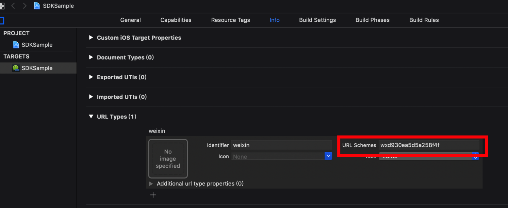
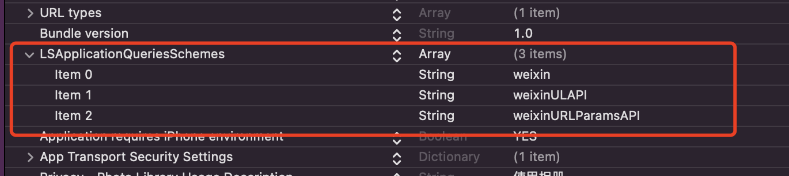

# 集成微信open-sdk

### 业务场景

客户端集成微信、支付宝支付

* 支付宝通过 alipay 协议跳转支付
* 微信通过拉起小程序支付

### 环境

node：12.12.0

react-native：0.59.8

open-sdk：6.8.0

### Android

#### 代码

在 <font style="color:#DF2A3F;">android/app/build.gradle</font> 下面的 <font style="color:#DF2A3F;">dependencies</font>� 加入 <code><font style="color:#DF2A3F;">api 'com.tencent.mm.opensdk:wechat-sdk-android:6.8.0'�</font></code>

> 需要有稳定的代理，保证可以成功从 Maven Central 下载微信 SDK 即可。

```java
package com.service_mall_app;

import android.content.Context;
import android.content.Intent;

import com.facebook.react.bridge.Callback;
import com.facebook.react.bridge.ReactContext;
import com.facebook.react.bridge.ReactApplicationContext;
import com.facebook.react.bridge.ReactContextBaseJavaModule;
import com.facebook.react.bridge.ReactMethod;
import com.facebook.react.modules.core.DeviceEventManagerModule;

import com.tencent.mm.opensdk.modelbase.BaseReq;
import com.tencent.mm.opensdk.modelbase.BaseResp;
import com.tencent.mm.opensdk.modelbiz.WXLaunchMiniProgram;
import com.tencent.mm.opensdk.openapi.IWXAPI;
import com.tencent.mm.opensdk.openapi.IWXAPIEventHandler;
import com.tencent.mm.opensdk.openapi.WXAPIFactory;
import com.tencent.mm.opensdk.constants.ConstantsAPI;

import java.util.ArrayList;

public class WeChatLibModule extends ReactContextBaseJavaModule implements IWXAPIEventHandler {
  private static String appid = "wx*****************";

  private static IWXAPI api = null;
  private static Context mContext;
  private static ReactApplicationContext reactContext;

  private static ArrayList<WeChatLibModule> modules = new ArrayList<>();

  @Override
  public void initialize() {
    super.initialize();
    modules.add(this);
  }

  @Override
  public void onCatalystInstanceDestroy() {
    super.onCatalystInstanceDestroy();
    if (api != null) {
      api = null;
    }
    modules.remove(this);
  }

  public static void handleIntent(Intent intent) {
    for (WeChatLibModule mod : modules) {
        mod.api.handleIntent(intent, mod);
    }
  }

  public static void setContext(Context context) {
    mContext = context;
  }

  /**
    * 注册到微信
    */
  @ReactMethod
  public static void registerWeChat() {
    api = WXAPIFactory.createWXAPI(mContext, appid, true);
    api.registerApp(appid);
  }

  public WeChatLibModule(ReactApplicationContext context) {
    super(context);
    reactContext = context;
  }

  @Override
  public String getName() {
    return "WechatPay";
  }

  /**
    * 发送请求或响应到微信
    */
  @Override
  public void onReq(BaseReq req) {}

  /**
    * 接收微信的请求及返回值
    */
  @Override
  public void onResp(BaseResp resp) {
    if (resp.getType() == ConstantsAPI.COMMAND_LAUNCH_WX_MINIPROGRAM) {
      WXLaunchMiniProgram.Resp launchMiniProResp = (WXLaunchMiniProgram.Resp) resp;
      String extraData =launchMiniProResp.extMsg; //对应小程序组件 <button open-type="launchApp"> 中的 app-parameter 属性
      WeChatLibModule.sendEvent(reactContext, extraData);
    }
  }

  /**
   * 判断客户端是否安装微信
   * @param callback // 回调
   */
  @ReactMethod
  public void isWXAppInstalled(Callback callback) {
    Object result;
    if (api != null && api.isWXAppInstalled()) {
      result = 1;
    } else {
      result = 0;
    }
    callback.invoke(result);
  }

  /**
   * 拉起小程序
   * @param userName // 小程序原始id
   * @param path // 拉起小程序页面的可带参路径，不填默认拉起小程序首页，对于小游戏，可以只传入 query 部分，来实现传参效果，如：传入 "?foo=bar"。
   * @param miniProgramType // 可选打开 开发版(2)，体验版(1)和正式版(0)
   */
  @ReactMethod
  public void launchMiniProgram(String userName, String path, int miniProgramType) {
    WXLaunchMiniProgram.Req req = new WXLaunchMiniProgram.Req();
    req.userName = userName;
    req.path = path;
    req.miniprogramType = miniProgramType;
    api.sendReq(req);
  }

  public static void sendEvent(ReactContext reactContext, String msg) {
    reactContext
      .getJSModule(DeviceEventManagerModule.RCTDeviceEventEmitter.class)
      .emit("WechatPayEvents", msg);
  }
}
```

```java
package com.service_mall_app;

import com.facebook.react.ReactPackage;
import com.facebook.react.bridge.JavaScriptModule;
import com.facebook.react.bridge.NativeModule;
import com.facebook.react.bridge.ReactApplicationContext;
import com.facebook.react.uimanager.ViewManager;

import java.util.Arrays;
import java.util.Collections;
import java.util.List;

public class WeChatLibPackage implements ReactPackage {
    @Override
    public List<NativeModule> createNativeModules(ReactApplicationContext reactContext) {
        return Arrays.asList(new NativeModule[]{
            // Modules from third-party
            new WeChatLibModule(reactContext),
        });
    }

    public List<Class<? extends JavaScriptModule>> createJSModules() {
        return Collections.emptyList();
    }

    @Override
    public List<ViewManager> createViewManagers(ReactApplicationContext reactContext) {
        return Collections.emptyList();
    }
}
```

```java
...

public class MainActivity extends ReactActivity {
	...

    protected void onCreate(Bundle savedInstanceState) {
        super.onCreate(savedInstanceState);
        ...
        
        WeChatLibModule.setContext(this);
        
    }
    ...
}
```

```java
...
import com.service_mall_app.WeChatLibPackage;

public class MainApplication extends Application implements ShareApplication,ReactApplication {
    ...

    private final ReactNativeHost mReactNativeHost = new ReactNativeHost(this) {
        ...
        @Override
    	protected List<ReactPackage> getPackages() {
            return Arrays.<ReactPackage>asList(
                ...
                new WeChatLibPackage()
            );
        }
    }
    ...
}
```

<font style="color:rgb(34, 34, 34);">a. </font>在你的包名相应目录下新建一个 **<font style="color:#DF2A3F;">wxapi</font>** 目录，并在该 **<font style="color:#DF2A3F;">wxapi</font>** 目录下新增一个 **<font style="color:#DF2A3F;">WXEntryActivity</font>** 类，该类继承自 <font style="color:#DF2A3F;">Activity</font>

> <font style="color:#DF2A3F;">此处的 </font>**<font style="color:#DF2A3F;">wxapi</font>** 目录和 **<font style="color:#DF2A3F;">WXEntryActivity</font>** 类 必须的！！！

```java
package com.service_mall_app.wxapi;

import android.app.Activity;
import android.os.Bundle;

import com.service_mall_app.WeChatLibModule;

public class WXEntryActivity extends Activity {
  @Override
  protected void onCreate(Bundle savedInstanceState) {
    super.onCreate(savedInstanceState);
    WeChatLibModule.handleIntent(getIntent());
    finish();
  }
}
```

最后，并在 **<font style="color:#DF2A3F;">manifest</font>** 文件里面加上<font style="color:#DF2A3F;">exported、taskAffinity及launchMode</font>属性，其中exported设置为true，taskAffinity设置为你的包名，launchMode设置为singleTask，例如：

```java
<activity
    android:name=".wxapi.WXEntryActivity"
    android:label="@string/app_name"
    android:theme="@android:style/Theme.Translucent.NoTitleBar"
    android:exported="true"
    android:taskAffinity="填写你的包名"
    android:launchMode="singleTask">
</activity>
```

***

### IOS

#### 接入指引

1、确认App的 <font style="color:#DF2A3F;">Universal Links</font> 配置成功（具体请看 [IOS接入文档](https://developers.weixin.qq.com/doc/oplatform/Mobile_App/Access_Guide/iOS.html)）

2、通过 <font style="color:#DF2A3F;">CocoaPods</font> 集成

<font style="color:rgb(34, 34, 34);">【1】在工程的 Podfile 里面添加以下代码：</font>

`pod 'WechatOpenSDK-XCFramework'`

<font style="color:rgb(34, 34, 34);">保存并执行 pod install</font>

<font style="color:rgb(34, 34, 34);">【2】</font>在 Xcode 中，选择你的工程设置项，选中“TARGETS”一栏，在“info”标签栏的“URL type“添加“URL scheme”为你所注册的应用程序 id（如下图所示）。



【3】在Xcode中，选择你的工程设置项，选中“TARGETS”一栏，在 “info”标签栏的<font style="color:#DF2A3F;">“LSApplicationQueriesSchemes“添加weixin、weixinULAPI、weixinURLParamsAPI</font>（如下图所示）。

经验证，在iOS 15系统上，使用Xcode 13编译出的App，LSApplicationQueriesSchemes的数量会限制为50个。第50个之后的scheme配置会不生效，需要确保"weixin"、"weixinULAPI"和"weixinURLParamsAPI"配置在LSApplicationQueriesSchemes的前50个。



【4】在你需要使 用微信终端 API 的文件中 import WXApi.h 头文件，并增加 WXApiDelegate 协议。

```objectivec
#import <UIKit/UIKit.h>
#import <WXApi.h>

@interface AppDelegate : UIResponder<UIApplicationDelegate, WXApiDelegate>

@property (strong, nonatomic) UIWindow *window;

@end
```

后续请查看 [IOS接入指南](https://developers.weixin.qq.com/doc/oplatform/Mobile_App/Access_Guide/iOS.html)

### 代码

```objectivec
#import <WechatOpenSDK-XCFramework/WXApi.h>
#import <React/RCTBridgeModule.h>
#import <React/RCTEventEmitter.h>

@interface WechatPay : RCTEventEmitter <RCTBridgeModule, WXApiDelegate>

+ (instancetype)sharedManager;

@end
```

```objectivec
#import <React/RCTBridge.h>
#import <React/RCTLog.h>
#import "WechatPay.h"

@implementation WechatPay

static id _instace;
+ (instancetype)allocWithZone:(struct _NSZone *)zone {
    static dispatch_once_t onceToken;
    dispatch_once(&onceToken, ^{
        _instace = [super allocWithZone:zone];
    });
    return _instace;
}

#pragma mark - LifeCycle
+(instancetype)sharedManager {
    static dispatch_once_t onceToken;
    static WechatPay *instance;
    dispatch_once(&onceToken, ^{
        instance = [[WechatPay alloc] init];
    });
    return instance;
}

// 微信回调
#pragma mark - WXApiDelegate
-(void)onResp:(WXLaunchMiniProgramResp *)resp
{
  if ([resp isKindOfClass:[WXLaunchMiniProgramResp class]])
  {
    NSString *strMsg = [NSString stringWithFormat:@"errCode:%d,errStr:%@,extMsg:%@", resp.errCode, resp.errStr, resp.extMsg];
    NSLog(@"小程序回调%@", strMsg);
    [self sendEventWithName:@"WechatPayEvents" body: strMsg];
    // “extMsg”对应小程序组件 <button open-type="launchApp"> 中的 app-parameter 属性
  }
}

// RN的回调事件名称列表
- (NSArray<NSString *> *)supportedEvents
{
    return @[@"WechatPayEvents"];
}

RCT_EXPORT_MODULE(WechatPay)

// 判断客户端是否安装微信
RCT_EXPORT_METHOD(isWXAppInstalled:(RCTResponseSenderBlock)callback)
{
  if ([WXApi isWXAppInstalled]) {
    NSNumber *returnData = @(1);
    callback(@[returnData]);
  } else {
    NSNumber *returnData = @(0);
    callback(@[returnData]);
  }
}

// 拉起微信小程序
RCT_EXPORT_METHOD(launchMiniProgram:(NSString *)userName
                  path:(NSString *)path
                  type:(NSUInteger)miniProgramType)
{
  WXLaunchMiniProgramReq *launchMiniProgramReq = [WXLaunchMiniProgramReq object];
  launchMiniProgramReq.userName = userName;
  launchMiniProgramReq.path = path;
  launchMiniProgramReq.miniProgramType = miniProgramType;
  return [WXApi sendReq:launchMiniProgramReq completion:nil];
}
@end
```

```objectivec
//微信open SDK
#import <WechatOpenSDK-XCFramework/WXApi.h>

...

- (BOOL)application:(UIApplication *)application didFinishLaunchingWithOptions:(NSDictionary *)launchOptions
{
	...

	// 向微信注册
    [WXApi registerApp: @"wx-----------"
    universalLink: @"https://sezc.grey-ants.com/appLinkCbk/"];
    return YES;
}

// WechatOpenSDK > 重写 AppDelegate 的 handleOpenURL 方法：
- (BOOL)application:(UIApplication *)application handleOpenURL:(NSURL *)url {
    return  [WXApi handleOpenURL:url delegate:[WechatPay sharedManager]];
}

// WechatOpenSDK > 重写 AppDelegate 的 openURL 方法：
- (BOOL)application:(UIApplication *)application openURL:(NSURL *)url sourceApplication:(NSString *)sourceApplication annotation:(id)annotation {
    return [WXApi handleOpenURL:url delegate:[WechatPay sharedManager]];
}

// WechatOpenSDK > 重写AppDelegate的continueUserActivity方法：
- (BOOL)application:(UIApplication *)application continueUserActivity:(NSUserActivity *)userActivity restorationHandler:(void(^)(NSArray<id<UIUserActivityRestoring>> * __nullable restorableObjects))restorationHandler {
    return [WXApi handleOpenUniversalLink:userActivity delegate:[WechatPay sharedManager]];
}
```

```objectivec
#import <WechatOpenSDK-XCFramework/WXApi.h>
```

### RN端使用

```javascript
import {NativeModules} from "react-native";

const {WechatPay} = NativeModules;
const {isWXAppInstalled, launchMiniProgram} = WechatPay;

...

class Payment extends Component<IProps, IState> {
	...

  componentDidMount() {
  	registerWeChat(); // 注册到微信
  }
  // 付款
  goPay = async () => {
    const {payment} = this.state;
    if (payment === 'wechat') {
      this.goWechatPay();
    } else {
      this.goAliPay();
    }
  }

  // 支付宝支付
  goAliPay = () => {
    let url = `${PaymentEnum.alipay}://`;
    Linking.canOpenURL(url).then((supported: boolean) => {
      if (!supported) {
        toast('未检测到支付宝客户端，请安装后重试。');
      } else {
        // let url = payInfo.replace("alipay", "xxx");//这里面的xxx是你在iOS原生配置的urlScheme，用来返回你的app的一个标志
        return Linking.openURL(url);
      }
    }).catch((err: any) => console.error('An error occurred', err));
  }

  // 微信支付
  goWechatPay = () => {
    isWXAppInstalled((isWXAppInstalled: 0 | 1) => {
      if (isWXAppInstalled === 1) {
        launchMiniProgram('gh_********', '', 0);
      } else {
        toast('未检测到微信客户端，请安装后重试。');
      }
    })
  }
}
```


> 更新: 2026-03-06 11:41:04  
> 原文: <https://www.yuque.com/hutaoao/blog/vzwfpgt6g98ozpqn>