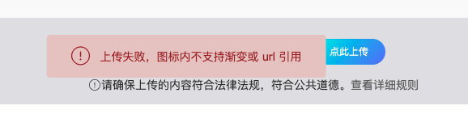

# 记录svg格式显示问题

项目中使用了`react-native-svg` 来显示svg图标，通过蓝湖下载的SVG图标显示黑色 没有样式填充，同时将该SVG上传至iconfont平台也有报错提示：



下面是一张由蓝湖下载的SVG图标源码：

:::success
\<svg xmlns="<http://www.w3.org/2000/svg"> xmlns:xlink="<http://www.w3.org/1999/xlink"> width="38" height="38"

```
 viewBox="0 0 38 38">
```

  <defs>

```
<style>.a{fill:url(#a);}.b{fill:url(#b);}.c{clip-path:url(#c);}.d{fill:#db9d0e;}.e{fill:#fff;}</style>

<linearGradient id="a" x1="0.093" y1="0.037" x2="0.949" y2="0.924" gradientUnits="objectBoundingBox">

  <stop offset="0" stop-color="#6da7fc"/>

  <stop offset="1" stop-color="#2263c1"/>

</linearGradient>

<linearGradient id="b" x1="0.093" y1="0.037" x2="0.949" y2="0.924" gradientUnits="objectBoundingBox">

  <stop offset="0" stop-color="#ffdc00"/>

  <stop offset="1" stop-color="#ffa400"/>

</linearGradient>

<clipPath id="c">

  <rect class="a" width="38" height="38" rx="8"/>

</clipPath>
```

  </defs>

  <rect class="b" width="38" height="38" rx="8"/>

  <g class="c">

```
<path class="d" d="M-4154-493.189h-17.711v18.27l17.711,9.895h10.435l1.553-3.018-1.122-9.832v-7.072Z"

      transform="translate(4181 503)"/>
```

  </g>

  <g transform="translate(8.721 8.72)">

```
<path class="e"

      d="M17.99,0H2.57A2.578,2.578,0,0,0,0,2.57V17.99a2.578,2.578,0,0,0,2.57,2.57H17.99a2.578,2.578,0,0,0,2.57-2.57V2.57A2.578,2.578,0,0,0,17.99,0ZM3.213,3.213H14.778a.607.607,0,0,1,.643.643.607.607,0,0,1-.643.643H3.213a.607.607,0,0,1-.643-.643A.607.607,0,0,1,3.213,3.213Zm0,3.984H14.778a.643.643,0,1,1,0,1.285H3.213a.643.643,0,1,1,0-1.285Zm5.14,5.4H3.213a.643.643,0,0,1,0-1.285h5.14a.643.643,0,0,1,0,1.285Zm10.923,6.3a.621.621,0,0,1-.9,0l-2.57-2.57a3.463,3.463,0,0,1-1.928.643,3.6,3.6,0,1,1,3.6-3.6,3.883,3.883,0,0,1-.643,2.056l2.57,2.57A.792.792,0,0,1,19.276,18.89Z"/>

<path class="e" d="M571.913,552.713m-2.313,0a2.313,2.313,0,1,0,2.313-2.313A2.313,2.313,0,0,0,569.6,552.713Z"

      transform="translate(-558.163 -539.349)"/>
```

  </g>

</svg>

:::

根据提示应该是某种原因`<style>`里的`url`无法识别

经过尝试，解决办法如下：

**将每个class对应的样式写到内部去，同时删掉**<code>**<style>**</code>**：**

**这样就能正常使用了（具体原因待调研）**

:::color2
\<svg xmlns="<http://www.w3.org/2000/svg"> xmlns:xlink="<http://www.w3.org/1999/xlink"> width="38" height="38"

```
 viewBox="0 0 38 38">
```

  <defs>

```
<linearGradient id="a" x1="0.093" y1="0.037" x2="0.949" y2="0.924" gradientUnits="objectBoundingBox">

  <stop offset="0" stop-color="#6da7fc"/>

  <stop offset="1" stop-color="#2263c1"/>

</linearGradient>

<linearGradient id="b" x1="0.093" y1="0.037" x2="0.949" y2="0.924" gradientUnits="objectBoundingBox">

  <stop offset="0" stop-color="#ffdc00"/>

  <stop offset="1" stop-color="#ffa400"/>

</linearGradient>

<clipPath id="c">

  <rect class="a" width="38" height="38" rx="8" fill="url(#a)"/>

</clipPath>
```

  </defs>

  <rect class="b" width="38" height="38" rx="8" fill="url(#b)"/>

  <g class="c" clip-path="url(#c)">

```
<path fill="#db9d0e" class="d" d="M-4154-493.189h-17.711v18.27l17.711,9.895h10.435l1.553-3.018-1.122-9.832v-7.072Z"

      transform="translate(4181 503)"/>
```

  </g>

  <g transform="translate(8.721 8.72)">

```
<path class="e"

      fill="#fff"

      d="M17.99,0H2.57A2.578,2.578,0,0,0,0,2.57V17.99a2.578,2.578,0,0,0,2.57,2.57H17.99a2.578,2.578,0,0,0,2.57-2.57V2.57A2.578,2.578,0,0,0,17.99,0ZM3.213,3.213H14.778a.607.607,0,0,1,.643.643.607.607,0,0,1-.643.643H3.213a.607.607,0,0,1-.643-.643A.607.607,0,0,1,3.213,3.213Zm0,3.984H14.778a.643.643,0,1,1,0,1.285H3.213a.643.643,0,1,1,0-1.285Zm5.14,5.4H3.213a.643.643,0,0,1,0-1.285h5.14a.643.643,0,0,1,0,1.285Zm10.923,6.3a.621.621,0,0,1-.9,0l-2.57-2.57a3.463,3.463,0,0,1-1.928.643,3.6,3.6,0,1,1,3.6-3.6,3.883,3.883,0,0,1-.643,2.056l2.57,2.57A.792.792,0,0,1,19.276,18.89Z"/>

<path class="e" d="M571.913,552.713m-2.313,0a2.313,2.313,0,1,0,2.313-2.313A2.313,2.313,0,0,0,569.6,552.713Z"

      transform="translate(-558.163 -539.349)"/>
```

  </g>

</svg>

:::

**�**

**�**


> 更新: 2024-08-15 09:43:05  
> 原文: <https://www.yuque.com/hutaoao/blog/ewm4cxpfwtr44com>