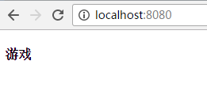
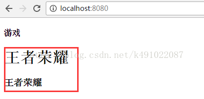
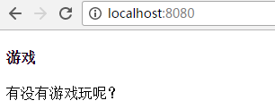
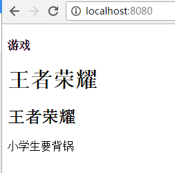
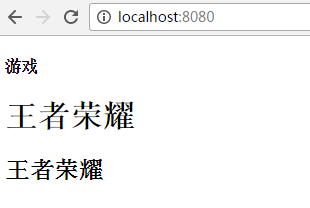
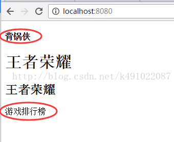

# vue组件—slot（"插槽"）分发内容

### 单个slot


如果子组件的模板不包含 slot，那么父组件的内容就会被抛弃。


父组件html中的内容：


```html
<div id="app">
   <game>
      <h1>王者荣耀</h1>
      <h3>王者荣耀</h3>
   </game>
</div>
```


main.js中引入子组件game


```javascript
import game from "./game.vue"
new Vue({
   el: '#app',
   data: {},
   methods: {},
   components: {
      game,
   }
})
```


game.vue子组件中没有slot的情况


```html
<template>
   <div>
      <h4>游戏</h4>
   </div>
</template>
```


运行的结果发现父组件中内容没有显示在子组件中。





那么game.vue子组件中有slot的情况


```html
<template>
   <div>
      <h4>游戏</h4>
      <slot></slot>
   </div>
</template>
```


运行结果就会发现父组件中的内容显示在子组件中了





如果父组件中没有传递内容，子组件中slot给默认内容，那么子组件中的默认内容会显示出来。


父组件html中的内容：


```html
<div id="app">
   <game> </game>
</div>
```


game子组件：


```html
<template>
   <div>
      <h4>游戏</h4>
      <slot>有没有游戏可以玩？</slot>
   </div>
</template>
```


运行结果会显示子组件中的slot中的内容





### 具名slot


slot元素可以用一个特殊的属性name 来配置如何分发内容，多个slot可以有不同的名字，根据具名slot的name来进行匹配，显示内容。如果有默认的slot，那么没有匹配到的内容将会显示到默认的slot中，如果没有默认的slot，那么没有匹配到的内容将会被抛弃


父组件中的内容


```html
<game>
   <h1 slot="k1">王者荣耀</h1>
   <h2 slot="k2">王者荣耀</h2>
   <p>小学生要背锅</p>
</game>
```


子组件中的slot有name属性，与父组件的slot的值相对应，那么久会匹配到。没有匹配到的先会显示在默认的slot中。


```html
<template>
   <div>
      <h4>游戏</h4>
      <slot name="k1"></slot>
      <slot name="k2"></slot>
      <slot></slot>
   </div>
</template>
```


运行结果：当子组件有默认的slot时，会显示没有匹配到的内容 "小学生要背锅"





如果子组件中没有默认的slot时


```html
<template>
   <div>
      <h4>游戏</h4>
      <slot name="k1"></slot>
      <slot name="k2"></slot>
   </div>
</template>
```


那么运行的结果，将会把父组件中没有匹配到的内容 "小学生要背锅" 给抛弃掉





### 编译作用域


父组件模板的内容在父组件作用域内编译；子组件模板的内容在子组件作用域内编译


父组件模板：


```html
<game>

   <p>{{ msg }}</p>

   <h1 slot="k1">王者荣耀</h1>
   <h2 slot="k2">王者荣耀</h2>
</game>
```


父组件的js文件 main.js


```json
data: {
   msg: "游戏排行榜",
}
```


子组件模板


```html
<template>
   <div>

      <h4>{{ msg }}</h4>

      <slot name="k1"></slot>
      <slot name="k2"></slot>
      <slot></slot>
   </div>
</template>
```


子组件的js文件 game.js


```javascript
let vm = {
   data() {
      return {
         msg: "背锅侠",
      }
   }
}
export  default vm
```


运行的结果如下图，可以发现父组件的内容 “游戏排行榜” 在父组件作用域内编译，并且显示在子组件的默认slot中，而子组件中的内容 "背锅侠"在子组件作用域内编译，显示在子组件中。





### 具名插槽的缩写


跟 v-on 和 v-bind 一样，v-slot 也有缩写，即把参数之前的所有内容 (**v-slot:**) 替换为字符 **#**。例如 **v-slot:header** 可以被重写为 **#header**


### 注意


在 2.6.0 中，我们为具名插槽和作用域插槽引入了一个新的统一的语法 (即 **v-slot** 指令)。它取代了 slot 和 slot-scope


> 更新: 2019-11-25 09:17:47  
> 原文: <https://www.yuque.com/hutaoao/blog/ml6w3f>