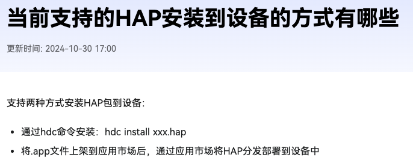
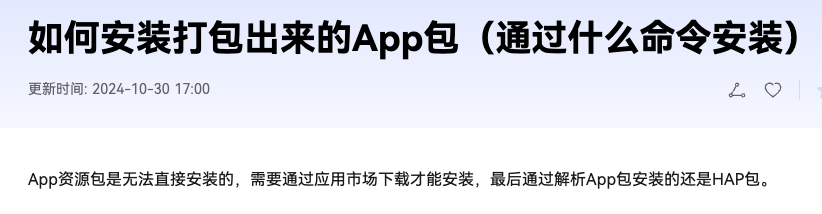
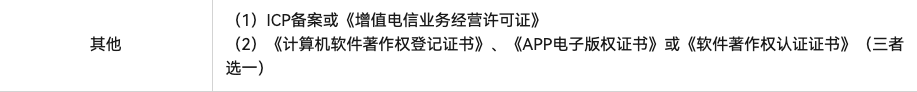
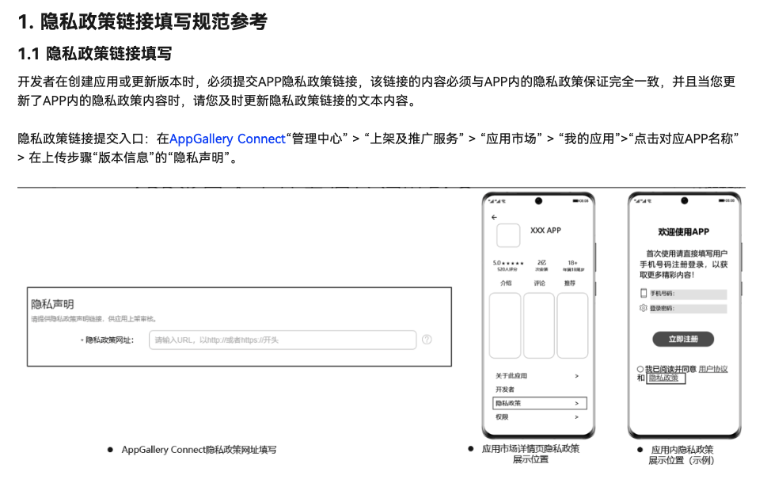

# HarmonyOS Next调研

### 前言
10月22日举行“原生鸿蒙之夜暨华为全场景新品发布会”

重点介绍了**HarmonyOS NEXT**也就是鸿蒙操作系统·原生，华为称其为面向万物智联时代的全场景智能操作系统。

### 特点
+ 使用全新的开发语言（**ArkTS**）、全新的UI框架（**ArkUI**）、专属开发工具（**DevEco Studio**）；
+ 不再兼容Android（apk）格式，仅支持**HAP**格式（须上架才能安装使用）；
+ 不支持热更新服务；

### HAP安装方式
来自官网截图

### 应用资质审核

### 账号注册
支持个人开发者/企业开发者 - 企业开发者比个人开发者享受的服务更多

| **开发者类型** | **享受的服务/权益** |
| --- | --- |
| 个人开发者 | 应用市场、主题、商品管理、账号、PUSH、新游预约、互动评论、社交、HUAWEI HiAI、手表应用市场等。 |
| 企业开发者 | 应用市场、主题、首发、支付、游戏礼包、应用市场推广、商品管理、游戏、账号、PUSH、新游预约、互动评论、社交、HUAWEI HiAI、手表应用市场、运动健康、云测、智能家居等。 |

### 企业开发者实名认证
| **认证方式（任选一种方式）** | **所需资料** |
| --- | --- |
| 打款认证（**推荐**使用，最快30分钟） | 企业对公账号 |
| | 详见：[对公银行打款认证](https://developer.huawei.com/consumer/cn/doc/start/atpopb-0000001062836624) |
| 人工审核（1-2个工作日） | 1.营业执照原件扫描件或照片 |
| | 2.法定代表人手持身份证正反面照片或法人人脸识别认证（无需提供法人证件） |
| | 详见：[企业资料人工审核认证](https://developer.huawei.com/consumer/cn/doc/start/mracoei-0000001062678404) |
| 华为云授权认证 | 您的账号已在华为云平台实名认证为企业客户 |
| | 详见：[华为云授权认证](https://developer.huawei.com/consumer/cn/doc/start/cloudqrz-0000001154842822) |

### 调试设备支持
+ **2024年10月22日**
    - HUAWEI Mate 60 / 5999起
    - HUAWEI Mate 60 Pro	/ 6999起
    - HUAWEI Mate 60 Pro+ / 8999起
    - HUAWEI Mate 60 RS ULTIMATE DESIGN / 11999起
    - HUAWEI Mate X5 / 13999起
    - HUAWEI Mate X5 典藏版 / 15999起
    - HUAWEI Pura 70 / 5999起
    - HUAWEI Pura 70 Pro / 6999起
    - HUAWEI Pura 70 Pro+ / 7999起
    - HUAWEI Pura 70 Ultra / 9999起
    - HUAWEI Pocket 2 / 7999起
    - HUAWEI Pocket 2 艺术定制版
+ **2025年**
    - HUAWEI Mate XT l ULTIMATE DESIGN
    - HUAWEI nova Flip /5288
    - HUAWEI nova 13系列 / 2999
    - HUAWEI nova 12系列 / 3399
    - ......

### 隐私政策链接提交及内容规范
具体参考：[https://developer.huawei.com/consumer/cn/doc/app/50128](https://developer.huawei.com/consumer/cn/doc/app/50128)

### APP备案
根据[《工业和信息化部关于开展移动互联网应用程序备案工作的通知》](https://www.miit.gov.cn/zwgk/zcwj/wjfb/tz/art/2023/art_920db564162e4312916a01bed6540ad8.html)要求，APP主办者应当依照[《中华人民共和国反电信网络诈骗法》](https://www.miit.gov.cn/jgsj/zfs/fl/art/2022/art_d30139b442a141f48f05775d8c0b3cee.html)第二十三条“设立移动互联网应用程序应当按照国家有关规定向电信主管部门办理许可或者备案手续”相关规定履行备案手续。未履行备案手续的，不得从事APP互联网信息服务。

具体参考：[https://developer.huawei.com/consumer/cn/doc/app/50130](https://developer.huawei.com/consumer/cn/doc/app/50130)

### 传统应用（APP）和元服务
HarmonyOS除支持传统的需要安装的应用（以下简称传统应用）外，还支持更加方便快捷的免安装的应用，即元服务。

元服务是HarmonyOS提供的一种轻量应用程序形态，具备秒开直达，纯净清爽；服务相伴，恰合时宜；即用即走，账号相随；一体两面，嵌入运行；原生智能，全域搜索；高效开发，生而可信等特征。

元服务可独立上架、分发、运行，独立实现业务闭环，可大幅提升信息与服务的获取效率。

| **区别** | **特征** | **载体** | **API****范围** | **经营** |
| --- | --- | --- | --- | --- |
| 传统应用 | + 手动下载安装 + 包大小无限制 + 按需使用 + 应用内或应用市场更新 + 功能齐全，开发成本高，周期长 | 跟随设备 | 全量API | + 自主运营 + 人找应用成本高 |
| 元服务 | + 免安装 + 包大小有限制 + 即用即走 + 自动更新 + 轻量化完整功能，开发成本较低 | 跟随华为账号 | 只能使用“元服务API集” | + 支付、地图、广告等经营履约能力辅助经营 + 负一屏等系统分发入口帮助人找服务、服务找人 |

> 更新: 2024-11-01 09:44:53  
> 原文: <https://www.yuque.com/hutaoao/blog/ocixs2g68oa987s9>