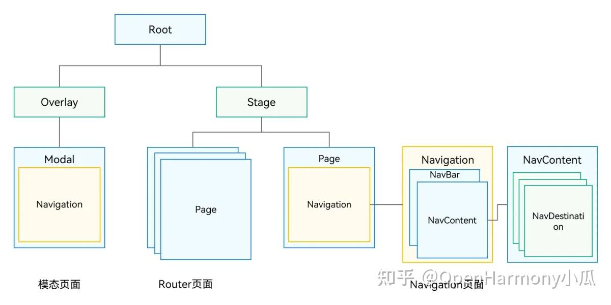
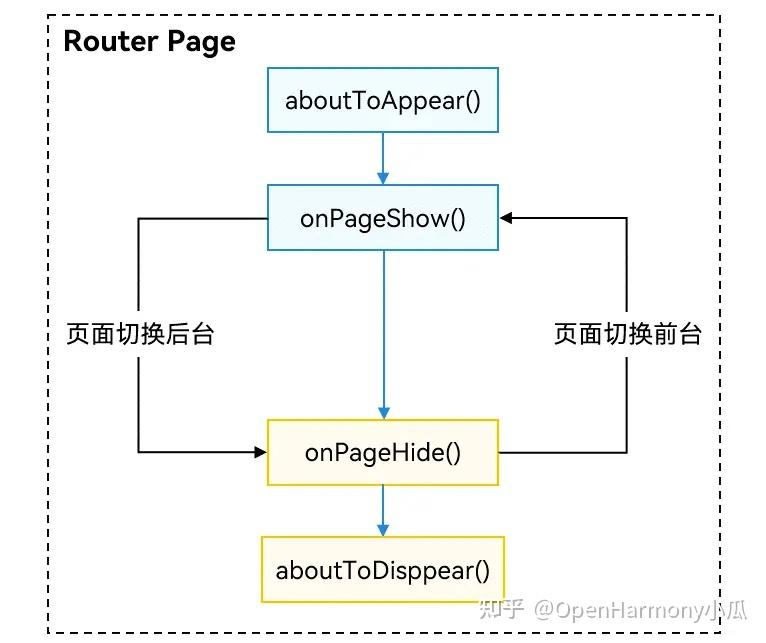

# Router切换Navigation

## <font style="color:rgb(25, 27, 31);">架构差异</font>
<font style="color:rgb(25, 27, 31);">从ArkUI组件树层级上来看，原先由Router管理的page在页面栈管理节点stage的下面。Navigation作为导航容器组件，可以挂载在单个page节点下，也可以叠加、嵌套。Navigation管理了标题栏、内容区和工具栏，内容区用于显示用户自定义页面的内容，并支持页面的路由能力。Navigation的这种设计上有如下优势：</font>



1. <font style="color:rgb(25, 27, 31);">接口上显式区分标题栏、内容区和工具栏，实现更加灵活的管理和UX动效能力；</font>
2. <font style="color:rgb(25, 27, 31);">显式提供路由容器概念，由开发者决定路由容器的位置，支持在全模态、半模态、弹窗中显示；</font>
3. <font style="color:rgb(25, 27, 31);">整合UX设计和一多能力，默认提供统一的标题显示、页面切换和单双栏适配能力；</font>
4. <font style="color:rgb(25, 27, 31);">基于通用UIBuilder能力，由开发者决定页面别名和页面UI对应关系，提供更加灵活的页面配置能力；</font>
5. <font style="color:rgb(25, 27, 31);">基于组件属性动效和</font>[<font style="color:rgb(25, 27, 31);">共享元素</font>](https://zhida.zhihu.com/search?content_id=249226190&content_type=Article&match_order=1&q=%E5%85%B1%E4%BA%AB%E5%85%83%E7%B4%A0&zhida_source=entity)<font style="color:rgb(25, 27, 31);">动效能力，将页面切换动效转换为组件属性动效实现，提供更加丰富和灵活的切换动效；</font>
6. <font style="color:rgb(25, 27, 31);">开放了</font>[<font style="color:rgb(25, 27, 31);">页面栈</font>](https://zhida.zhihu.com/search?content_id=249226190&content_type=Article&match_order=2&q=%E9%A1%B5%E9%9D%A2%E6%A0%88&zhida_source=entity)<font style="color:rgb(25, 27, 31);">对象，开发者可以继承，能更好的管理页面显示。</font>

## <font style="color:rgb(25, 27, 31);">能力对标</font>
| **<font style="color:rgb(25, 27, 31);">业务场景</font>** | **<font style="color:rgb(25, 27, 31);">Navigation</font>** | **<font style="color:rgb(25, 27, 31);">Router</font>** |
| :--- | :--- | :--- |
| <font style="color:rgb(25, 27, 31);">一多能力</font> | <font style="color:rgb(25, 27, 31);">支持，Auto模式自适应单栏跟双栏显示</font> | <font style="color:rgb(25, 27, 31);">不支持</font> |
| <font style="color:rgb(25, 27, 31);">跳转指定页面</font> | <font style="color:rgb(25, 27, 31);">pushPath & pushDestination</font> | <font style="color:rgb(25, 27, 31);">pushUrl & pushNameRoute</font> |
| <font style="color:rgb(25, 27, 31);">跳转HSP中页面</font> | <font style="color:rgb(25, 27, 31);">支持</font> | <font style="color:rgb(25, 27, 31);">支持</font> |
| <font style="color:rgb(25, 27, 31);">跳转HAR中页面</font> | <font style="color:rgb(25, 27, 31);">支持</font> | <font style="color:rgb(25, 27, 31);">支持</font> |
| <font style="color:rgb(25, 27, 31);">跳转传参</font> | <font style="color:rgb(25, 27, 31);">支持</font> | <font style="color:rgb(25, 27, 31);">支持</font> |
| <font style="color:rgb(25, 27, 31);">获取指定页面参数</font> | <font style="color:rgb(25, 27, 31);">支持</font> | <font style="color:rgb(25, 27, 31);">不支持</font> |
| <font style="color:rgb(25, 27, 31);">传参类型</font> | <font style="color:rgb(25, 27, 31);">传参为对象形式</font> | <font style="color:rgb(25, 27, 31);">传参为对象形式，对象中暂不支持</font>[<font style="color:rgb(25, 27, 31);">方法变量</font>](https://zhida.zhihu.com/search?content_id=249226190&content_type=Article&match_order=1&q=%E6%96%B9%E6%B3%95%E5%8F%98%E9%87%8F&zhida_source=entity) |
| <font style="color:rgb(25, 27, 31);">跳转结果回调</font> | <font style="color:rgb(25, 27, 31);">支持</font> | <font style="color:rgb(25, 27, 31);">支持</font> |
| <font style="color:rgb(25, 27, 31);">跳转单例页面</font> | <font style="color:rgb(25, 27, 31);">不支持</font> | <font style="color:rgb(25, 27, 31);">支持</font> |
| <font style="color:rgb(25, 27, 31);">页面返回</font> | <font style="color:rgb(25, 27, 31);">支持</font> | <font style="color:rgb(25, 27, 31);">支持</font> |
| <font style="color:rgb(25, 27, 31);">页面返回传参</font> | <font style="color:rgb(25, 27, 31);">支持</font> | <font style="color:rgb(25, 27, 31);">支持</font> |
| <font style="color:rgb(25, 27, 31);">返回指定路由</font> | <font style="color:rgb(25, 27, 31);">支持</font> | <font style="color:rgb(25, 27, 31);">支持</font> |
| <font style="color:rgb(25, 27, 31);">页面返回弹窗</font> | <font style="color:rgb(25, 27, 31);">支持，通过路由拦截实现</font> | <font style="color:rgb(25, 27, 31);">showAlertBeforeBackPage</font> |
| <font style="color:rgb(25, 27, 31);">路由替换</font> | <font style="color:rgb(25, 27, 31);">replacePath & replacePathByName</font> | <font style="color:rgb(25, 27, 31);">replaceUrl & replaceNameRoute</font> |
| [<font style="color:rgb(25, 27, 31);">路由栈</font>](https://zhida.zhihu.com/search?content_id=249226190&content_type=Article&match_order=1&q=%E8%B7%AF%E7%94%B1%E6%A0%88&zhida_source=entity)<br/><font style="color:rgb(25, 27, 31);">清理</font> | <font style="color:rgb(25, 27, 31);">clear</font> | <font style="color:rgb(25, 27, 31);">clear</font> |
| <font style="color:rgb(25, 27, 31);">清理指定路由</font> | <font style="color:rgb(25, 27, 31);">removeByIndexes & removeByName</font> | <font style="color:rgb(25, 27, 31);">不支持</font> |
| <font style="color:rgb(25, 27, 31);">转场动画</font> | <font style="color:rgb(25, 27, 31);">支持</font> | <font style="color:rgb(25, 27, 31);">支持</font> |
| <font style="color:rgb(25, 27, 31);">自定义转场动画</font> | <font style="color:rgb(25, 27, 31);">支持</font> | <font style="color:rgb(25, 27, 31);">支持，动画类型受限</font> |
| <font style="color:rgb(25, 27, 31);">屏蔽转场动画</font> | <font style="color:rgb(25, 27, 31);">支持全局和单次</font> | <font style="color:rgb(25, 27, 31);">支持 设置pageTransition方法duration为0</font> |
| <font style="color:rgb(25, 27, 31);">geometryTransition共享元素动画</font> | <font style="color:rgb(25, 27, 31);">支持（NavDestination之间共享）</font> | <font style="color:rgb(25, 27, 31);">不支持</font> |
| <font style="color:rgb(25, 27, 31);">页面生命周期监听</font> | <font style="color:rgb(25, 27, 31);">UIObserver.on('navDestinationUpdate')</font> | <font style="color:rgb(25, 27, 31);">UIObserver.on('routerPageUpdate')</font> |
| <font style="color:rgb(25, 27, 31);">获取页面栈对象</font> | <font style="color:rgb(25, 27, 31);">支持</font> | <font style="color:rgb(25, 27, 31);">不支持</font> |
| [<font style="color:rgb(25, 27, 31);">路由拦截</font>](https://zhida.zhihu.com/search?content_id=249226190&content_type=Article&match_order=2&q=%E8%B7%AF%E7%94%B1%E6%8B%A6%E6%88%AA&zhida_source=entity) | <font style="color:rgb(25, 27, 31);">支持通过setInercption做路由拦截</font> | <font style="color:rgb(25, 27, 31);">不支持</font> |
| <font style="color:rgb(25, 27, 31);">路由栈信息查询</font> | <font style="color:rgb(25, 27, 31);">支持</font> | <font style="color:rgb(25, 27, 31);">getState() & getLength()</font> |
| <font style="color:rgb(25, 27, 31);">路由栈move操作</font> | <font style="color:rgb(25, 27, 31);">moveToTop & moveIndexToTop</font> | <font style="color:rgb(25, 27, 31);">不支持</font> |
| <font style="color:rgb(25, 27, 31);">沉浸式页面</font> | <font style="color:rgb(25, 27, 31);">支持</font> | <font style="color:rgb(25, 27, 31);">不支持，需通过window配置</font> |
| <font style="color:rgb(25, 27, 31);">设置页面标题栏（titlebar）和工具栏（toolbar）</font> | <font style="color:rgb(25, 27, 31);">支持</font> | <font style="color:rgb(25, 27, 31);">不支持</font> |
| <font style="color:rgb(25, 27, 31);">模态嵌套路由</font> | <font style="color:rgb(25, 27, 31);">支持</font> | <font style="color:rgb(25, 27, 31);">不支持</font> |


## <font style="color:rgb(25, 27, 31);">切换指导</font>
### <font style="color:rgb(25, 27, 31);">页面结构</font>
<font style="color:rgb(25, 27, 31);">Router路由的页面是一个@Entry修饰的Component，每一个页面都需要在main_page.json中声明。</font>

```json
// main_page.json
{
  "src": [
    "pages/Index",
    "pages/pageOne",
    "pages/pageTwo"
  ]
}
```

<font style="color:rgb(25, 27, 31);">以下为Router页面的示例：</font>

```typescript
// index.ets
@Entry
  @Component
  struct Index {
    @State message: string = 'Hello World';

    build() {
      Row() {
        Column() {
          Text(this.message)
            .fontSize(50)
            .fontWeight(FontWeight.Bold)
        }
        .width('100%')
      }
      .height('100%')
    }
  }
```

<font style="color:rgb(25, 27, 31);">而基于Navigation的路由页面分为导航页和子页，导航页又叫Navbar，是Navigation包含的子组件，子页是NavDestination包含的子组件。</font>

<font style="color:rgb(25, 27, 31);">以下为Navigation导航页的示例：</font>

```typescript
// index.ets
@Entry
  @Component
  struct Index {
    pathStack: NavPathStack = new NavPathStack()

    build() {
      Navigation(this.pathStack) {
        Column() {
          Button('Push PageOne', { stateEffect: true, type: ButtonType.Capsule })
            .width('80%')
            .height(40)
            .margin(20)
            .onClick(() => {
              this.pathStack.pushPathByName('pageOne', null)
            })
        }.width('100%').height('100%')
      }
      .title("Navigation")
    }
  }
```

<font style="color:rgb(25, 27, 31);">以下为Navigation子页的示例：</font>

```typescript
// PageOne.ets

@Builder
  export function PageOneBuilder() {
    PageOne()
  }

@Component
  export struct PageOne {
    pathStack: NavPathStack = new NavPathStack()

    build() {
      NavDestination() {
        Column() {
          Button('回到首页', { stateEffect: true, type: ButtonType.Capsule })
            .width('80%')
            .height(40)
            .margin(20)
            .onClick(() => {
              this.pathStack.clear()
            })
        }.width('100%').height('100%')
      }.title('PageOne')
        .onReady((context: NavDestinationContext) => {
          this.pathStack = context.pathStack
        })
    }
  }
```

<font style="color:rgb(25, 27, 31);">每个子页也需要配置到系统配置文件route_map.json中（参考 系统路由配置 ）：</font>

```json
// 工程配置文件module.json5中配置 {"routerMap": "$profile:route_map"}
// route_map.json
{
  "routerMap": [
    {
      "name": "pageOne",
      "pageSourceFile": "src/main/ets/pages/PageOne.ets",
      "buildFunction": "PageOneBuilder",
      "data": {
        "description": "this is pageOne"
      }
    }
  ]
}
```

### <font style="color:rgb(25, 27, 31);">路由操作</font>
<font style="color:rgb(25, 27, 31);">Router通过@</font>[<font style="color:rgb(25, 27, 31);">ohos.router</font>](https://zhida.zhihu.com/search?content_id=249226190&content_type=Article&match_order=1&q=ohos.router&zhida_source=entity)<font style="color:rgb(25, 27, 31);">模块提供的方法来操作页面，使用前需要先import：</font>

```typescript
import router from '@ohos.router';

// push page
router.pushUrl({ url:"pages/pageOne", params: null })

// pop page
router.back({ url: "pages/pageOne" })

// replace page
router.replaceUrl({ url: "pages/pageOne" })

// clear all page
router.clear()

// 获取页面栈大小
let size = router.getLength()

// 获取页面状态
let pageState = router.getState()
```

<font style="color:rgb(25, 27, 31);">Navigation通过页面栈对象 NavPathStack 提供的方法来操作页面，需要创建一个栈对象并传入Navigation中：</font>

```typescript
@Entry
  @Component
  struct Index {
    pathStack: NavPathStack = new NavPathStack()

    build() {
      // 设置NavPathStack并传入Navigation
      Navigation(this.pathStack) {
        ...
      }.width('100%').height('100%')
    }
    .title("Navigation")
  }


// push page
this.pathStack.pushPath({ name: 'pageOne' })

// pop page
this.pathStack.pop()
this.pathStack.popToIndex(1)
this.pathStack.popToName('pageOne')

// replace page
this.pathStack.replacePath({ name: 'pageOne' })

// clear all page
this.pathStack.clear()

// 获取页面栈大小
let size = this.pathStack.size()

// 删除栈中name为PageOne的所有页面
this.pathStack.removeByName("pageOne")

// 删除指定索引的页面
this.pathStack.removeByIndexes([1,3,5])

// 获取栈中所有页面name集合
this.pathStack.getAllPathName()

// 获取索引为1的页面参数
this.pathStack.getParamByIndex(1)

// 获取PageOne页面的参数
this.pathStack.getParamByName("pageOne")

// 获取PageOne页面的索引集合
this.pathStack.getIndexByName("pageOne")
  ...
```

<font style="color:rgb(25, 27, 31);">Router作为全局通用模块，可以在任意页面中调用，Navigation作为组件，子页面想要做路由需要拿到Navigation持有的页面栈对象NavPathStack，可以通过如下几种方式获取：</font>

**<font style="color:rgb(25, 27, 31);">方式一</font>**<font style="color:rgb(25, 27, 31);">：通过@Provide和@Consume传递给子页面（有耦合，不推荐）；</font>

```plain
// Navigation根容器
@Entry
@Component
struct Index {
  // Navigation创建一个Provide修饰的NavPathStack
 @Provide('pathStack') pathStack: NavPathStack

  build() {
    Navigation(this.pathStack) {
        ...
      }.width('100%').height('100%')
    }
    .title("Navigation")
  }
}

// Navigation子页面
@Component
export struct PageOne {
  // NavDestination通过Consume获取到
  @Consume('pathStack') pathStack: NavPathStack;

  build() {
    NavDestination() {
      ...
    }
    .title("PageOne")
  }
}
```

**<font style="color:rgb(25, 27, 31);">方式二</font>**<font style="color:rgb(25, 27, 31);">：子页面通过OnReady回调获取；</font>

```typescript
@Component
  export struct PageOne {
    pathStack: NavPathStack = new NavPathStack()

    build() {
      NavDestination() {
        ...
      }.title('PageOne')
        .onReady((context: NavDestinationContext) => {
          this.pathStack = context.pathStack
        })
    }
  }
```

**<font style="color:rgb(25, 27, 31);">方式三</font>**<font style="color:rgb(25, 27, 31);">： 通过全局的AppStorage接口设置获取；</font>

```typescript
@Entry
  @Component
  struct Index {
    pathStack: NavPathStack = new NavPathStack()

    // 全局设置一个NavPathStack
    aboutToAppear(): void {
      AppStorage.setOrCreate("PathStack", this.pathStack)
    }

    build() {
      Navigation(this.pathStack) {
        ...
      }.width('100%').height('100%')
    }
    .title("Navigation")
  }
}

// Navigation子页面
@Component
  export struct PageOne {
    // 子页面中获取全局的NavPathStack
    pathStack: NavPathStack = AppStorage.get("PathStack") as NavPathStack

    build() {
      NavDestination() {
        ...
      }
      .title("PageOne")
    }
  }
```

**<font style="color:rgb(25, 27, 31);">方式四</font>**<font style="color:rgb(25, 27, 31);">：通过自定义组件查询接口获取（参考 自定义组件方法）；</font>

```plain
import observer from '@ohos.arkui.observer';

// 子页面中的自定义组件
@Component
struct CustomNode {
  pathStack : NavPathStack = new NavPathStack()

  aboutToAppear() {
    // query navigation info
    let  navigationInfo : NavigationInfo = this.queryNavigationInfo() as NavigationInfo
    this.pathStack = navigationInfo.pathStack;
  }

  build() {
    Row() {
      Button('跳转到PageTwo')
        .onClick(()=>{
          this.pathStack.pushPath({ name: 'pageTwo' })
        })
    }
  }
}
```

### <font style="color:rgb(25, 27, 31);">生命周期</font>
<font style="color:rgb(25, 27, 31);">Router页面生命周期为@Entry页面中的通用方法，主要有如下四个生命周期：</font>

```plain
// 页面创建后挂树的回调
aboutToAppear(): void {
}

// 页面销毁前下树的回调  
aboutToDisappear(): void {
}

// 页面显示时的回调  
onPageShow(): void {
}

// 页面隐藏时的回调  
onPageHide(): void {
}
```

<font style="color:rgb(25, 27, 31);">其生命周期时序如下图所示：</font>



<font style="color:rgb(25, 27, 31);">Navigation作为路由容器，其生命周期承载在NavDestination组件上，以组件事件的形式开放。</font>

```plain
@Component
struct PageOne {

  aboutToDisappear() {
  }

  aboutToAppear() {
  }

  build() {
    NavDestination() {
      ...
    }
    .onWillAppear(()=>{
    })
    .onAppear(()=>{
    })
    .onWillShow(()=>{
    })
    .onShown(()=>{
    })
    .onWillHide(()=>{
    })
    .onHidden(()=>{
    })
    .onWillDisappear(()=>{
    })
    .onDisAppear(()=>{
    })
  }
}
```

### <font style="color:rgb(25, 27, 31);">转场动画</font>
<font style="color:rgb(25, 27, 31);">Router和Navigation都提供了系统的转场动画也提供了自定义转场的能力。</font>

<font style="color:rgb(25, 27, 31);">其中Router自定义页面转场通过通用方法pageTransition()实现，具体可参考：</font>

<font style="color:rgb(25, 27, 31);">Router自定义转场动画</font>

<font style="color:rgb(25, 27, 31);">Navigation作为路由容器组件，其内部的页面切换动画本质上属于组件跟组件之间的属性动画，可以通过Navigation中的 customNavContentTransition 事件提供自定义转场动画的能力，具体实现可以参考如下指导：</font>

<font style="color:rgb(25, 27, 31);">Navigation自定义转场动画 （注意：Dialog类型的页面当前没有转场动画）</font>

### <font style="color:rgb(25, 27, 31);">共享元素转场</font>
<font style="color:rgb(25, 27, 31);">页面和页面之间跳转的时候需要进行共享元素过渡动画，Router可以通过通用属性sharedTransition来实现共享元素转场</font>

<font style="color:rgb(25, 27, 31);">Navigation也提供了共享元素一镜到底的转场能力，需要配合geometryTransition属性，在子页面（NavDestination）之间切换时，可以实现共享元素转场</font>

### <font style="color:rgb(25, 27, 31);">跨包路由</font>
<font style="color:rgb(25, 27, 31);">Router可以通过命名路由的方式实现跨包跳转。</font>

1. <font style="color:rgb(25, 27, 31);">在想要跳转到的共享包 Har 或者 Hsp 页面里，给 @Entry修饰的自定义组件 命名：</font>

```plain
// library/src/main/ets/pages/Index.ets
// library为新建共享包自定义的名字
@Entry({ routeName: 'myPage' })
@Component
export struct MyComponent {
  build() {
    Row() {
      Column() {
        Text('Library Page')
          .fontSize(50)
          .fontWeight(FontWeight.Bold)
      }
      .width('100%')
    }
    .height('100%')
  }
}
```

1. <font style="color:rgb(25, 27, 31);">配置成功后需要在跳转的页面中引入命名路由的页面并跳转：</font>

```plain
import router from '@ohos.router';
import { BusinessError } from '@ohos.base';
import('library/src/main/ets/pages/Index');  // 引入共享包中的命名路由页面

@Entry
@Component
struct Index {
  build() {
    Flex({ direction: FlexDirection.Column, alignItems: ItemAlign.Center, justifyContent: FlexAlign.Center }) {
      Text('Hello World')
        .fontSize(50)
        .fontWeight(FontWeight.Bold)
        .margin({ top: 20 })
        .backgroundColor('#ccc')
        .onClick(() => { // 点击跳转到其他共享包中的页面
          try {
            router.pushNamedRoute({
              name: 'myPage',
              params: {
                data1: 'message',
                data2: {
                  data3: [123, 456, 789]
                }
              }
            })
          } catch (err) {
            let message = (err as BusinessError).message
            let code = (err as BusinessError).code
            console.error(`pushNamedRoute failed, code is ${code}, message is ${message}`);
          }
        })
    }
    .width('100%')
    .height('100%')
  }
}
```

<font style="color:rgb(25, 27, 31);">Navigation作为路由组件，默认支持跨包跳转。</font>

1. <font style="color:rgb(25, 27, 31);">从HSP（HAR）中完成自定义组件（需要跳转的目标页面）开发，将自定义组件申明为export；</font>

```plain
@Component
export struct PageInHSP {
  build() {
    NavDestination() {
        ...
    }
  }
}
```

1. <font style="color:rgb(25, 27, 31);">在HSP（HAR）的index.ets中导出组件</font>

```plain
export { PageInHSP } from "./src/main/ets/pages/PageInHSP"
```

1. <font style="color:rgb(25, 27, 31);">配置好HSP（HAR）的项目依赖后，在mainPage中导入自定义组件，并添加到pageMap中，即可正常调用。</font>

```plain
// 1.导入跨包的路由页面
import { PageInHSP } from 'library/src/main/ets/pages/PageInHSP'

@Entry
@Component
struct mainPage {
 pageStack: NavPathStack = new NavPathStack()

 @Builder pageMap(name: string) {
   if (name === 'PageInHSP') {
     // 2.定义路由映射表
     PageInHSP()
   }
 }
 build() {
   Navigation(this.pageStack) {
     Button("Push HSP Page")
       .onClick(() => {
          // 3.跳转到Hsp中的页面
          this.pageStack.pushPath({ name: "PageInHSP"});
     })
   }
   .navDestination(this.pageMap)
 }
}
```

<font style="color:rgb(25, 27, 31);">以上是通过</font>**<font style="color:rgb(25, 27, 31);">静态依赖</font>**<font style="color:rgb(25, 27, 31);">的形式完成了跨包的路由，在大型的项目中一般跨模块的开发需要解耦，那就需要依赖</font>[<font style="color:rgb(25, 27, 31);">动态路由</font>](https://zhida.zhihu.com/search?content_id=249226190&content_type=Article&match_order=1&q=%E5%8A%A8%E6%80%81%E8%B7%AF%E7%94%B1&zhida_source=entity)<font style="color:rgb(25, 27, 31);">的能力。</font>

### <font style="color:rgb(25, 27, 31);">动态路由</font>
<font style="color:rgb(25, 27, 31);">动态路由设计的目的是解决多个产品（Hap）之间可以复用相同的业务模块，各个业务模块之间解耦（模块之间跳转通过路由表跳转，不需要互相依赖）和路由功能扩展整合。</font>

<font style="color:rgb(25, 27, 31);">业务特性模块对外暴露的就是模块内支持完成具体业务场景的多个页面的集合；</font>[<font style="color:rgb(25, 27, 31);">路由管理</font>](https://zhida.zhihu.com/search?content_id=249226190&content_type=Article&match_order=1&q=%E8%B7%AF%E7%94%B1%E7%AE%A1%E7%90%86&zhida_source=entity)<font style="color:rgb(25, 27, 31);">就是将每个模块支持的页面都用统一的路由表结构管理起来。 当产品需要某个业务模块时，就会注册对应的模块的路由表。</font>

**<font style="color:rgb(25, 27, 31);">动态路由的优势：</font>**

1. <font style="color:rgb(25, 27, 31);">路由定义除了跳转的URL以外，可以丰富的配置任意扩展信息，如横竖屏默认模式，是否需要鉴权等等，做路由跳转时的统一处理。</font>
2. <font style="color:rgb(25, 27, 31);">给每个路由设置一个名字，按照名称进行跳转而不是ets文件路径。</font>
3. <font style="color:rgb(25, 27, 31);">页面的加载可以使用动态Import（按需加载），防止首个页面加载大量代码导致卡顿。</font>

**<font style="color:rgb(25, 27, 31);">Router实现动态路由主要有下面三个过程：</font>**

1. <font style="color:rgb(25, 27, 31);">定义过程： 路由表定义新增路由 -></font><font style="color:rgb(25, 27, 31);"> </font>[<font style="color:rgb(25, 27, 31);">页面文件</font>](https://zhida.zhihu.com/search?content_id=249226190&content_type=Article&match_order=1&q=%E9%A1%B5%E9%9D%A2%E6%96%87%E4%BB%B6&zhida_source=entity)<font style="color:rgb(25, 27, 31);">绑定路由名称（装饰器） -> 加载函数和页面文件绑定（动态import函数）</font>
2. <font style="color:rgb(25, 27, 31);">定义注册过程： 路由注册（可在入口ability中按需注入依赖模块的路由表）。</font>
3. <font style="color:rgb(25, 27, 31);">跳转过程： 路由表检查(是否注册过对应路由名称) -> 路由前置钩子（路由页面加载-动态Import） -> 路由跳转 -> 路由后置钩子（公共处理，如打点）。</font>

## **<font style="color:rgb(25, 27, 31);">Navigation实现动态路由有如下两种实现方案：</font>**
**<font style="color:rgb(25, 27, 31);">方案一： 自定义路由表</font>**

<font style="color:rgb(25, 27, 31);">基本实现跟上述Router动态路由类似</font>

1. <font style="color:rgb(25, 27, 31);">开发者自定义路由管理模块，各个提供路由页面的模块均依赖此模块；</font>
2. <font style="color:rgb(25, 27, 31);">构建Navigation组件时，将NavPactStack注入路由管理模块，路由管理模块对NavPactStack进行封装，对外提供路由能力；</font>
3. <font style="color:rgb(25, 27, 31);">各个路由页面不再提供组件，转为提供@build封装的构建函数，并再通过WrappedBuilder封装后，实现全局封装；</font>
4. <font style="color:rgb(25, 27, 31);">各个路由页面将模块名称、路由名称、WrappedBuilder封装后构建函数注册如路由模块。</font>
5. <font style="color:rgb(25, 27, 31);">当路由需要跳转到指定路由时，路由模块完成对指定路由模块的动态导入，并完成路由跳转。</font>

**<font style="color:rgb(25, 27, 31);">方案二：系统路由表</font>**

<font style="color:rgb(25, 27, 31);">从API version 12版本开始，Navigation支持系统跨模块的路由表方案，整体设计是将路由表方案下沉到系统中管理，即在需要路由的各个业务模块（HSP/HAR）中独立配置router_map.json文件，在触发路由跳转时，应用只需要通过NavPactStack进行路由跳转，此时系统会自动完成路由模块的动态加载、组件构建，并完成路由跳转功能，从而实现了开发层面的模块解耦。</font>

### <font style="color:rgb(25, 27, 31);">生命周期监听</font>
<font style="color:rgb(25, 27, 31);">Router可以通过observer实现注册监听，接口定义请参考：</font>

```plain
import observer from '@ohos.arkui.observer';

function callBackFunc(info: observer.RouterPageInfo) {
    console.info("RouterPageInfo is : " + JSON.stringify(RouterPageInfo))
}

// used in ability context.
observer.on('routerPageUpdate', this.context, callBackFunc);

// used in UIContext.
observer.on('routerPageUpdate', this.getUIContext(), callBackFunc);
```

<font style="color:rgb(25, 27, 31);">在页面状态发生变化时，注册的回调将会触发，开发者可以通过回调中传入的入参拿到页面的相关信息，如：页面的名字，索引，路径，生命周期状态等。</font>

<font style="color:rgb(25, 27, 31);">Navigation同样可以通过在observer中实现注册监听。</font>

```plain
export default class EntryAbility extends UIAbility {
  ...
  onWindowStageCreate(windowStage: window.WindowStage): void {
    ...
    windowStage.getMainWindow((err: BusinessError, data) => {
      ...
      windowClass = data;
      // 获取UIContext实例。
      let uiContext: UIContext = windowClass.getUIContext();
      // 获取UIObserver实例。
      let uiObserver : UIObserver = uiContext.getUIObserver();
      // 注册DevNavigation的状态监听.
      uiObserver.on("navDestinationUpdate",(info) => {
        // NavDestinationState.ON_SHOWN = 0, NavDestinationState.ON_HIDE = 1
        if (info.state == 0) {
          // NavDestination组件显示时操作
          console.info('page ON_SHOWN:' + info.name.toString());
        }
      })
    })
  }
}
```

### <font style="color:rgb(25, 27, 31);">页面信息查询</font>
<font style="color:rgb(25, 27, 31);">为了实现页面内自定义组件跟页面解耦，自定义组件中提供了全局查询页面信息的接口。</font>

<font style="color:rgb(25, 27, 31);">Router可以通过 queryRouterPageInfo 接口查询当前自定义组件所在的Page页面的信息，其返回值包含如下几个属性，其中pageId是页面的唯一</font>[<font style="color:rgb(25, 27, 31);">标识符</font>](https://zhida.zhihu.com/search?content_id=249226190&content_type=Article&match_order=1&q=%E6%A0%87%E8%AF%86%E7%AC%A6&zhida_source=entity)<font style="color:rgb(25, 27, 31);">：</font>

| **<font style="color:rgb(25, 27, 31);">名称</font>** | **<font style="color:rgb(25, 27, 31);">类型</font>** | **<font style="color:rgb(25, 27, 31);">必填</font>** | **<font style="color:rgb(25, 27, 31);">说明</font>** |
| :--- | :--- | :--- | :--- |
| <font style="color:rgb(25, 27, 31);">context</font> | <font style="color:rgb(25, 27, 31);">UIAbilityContext/ UIContext</font> | <font style="color:rgb(25, 27, 31);">是</font> | <font style="color:rgb(25, 27, 31);">routerPage页面对应的上下文信息</font> |
| <font style="color:rgb(25, 27, 31);">index</font> | <font style="color:rgb(25, 27, 31);">number</font> | <font style="color:rgb(25, 27, 31);">是</font> | <font style="color:rgb(25, 27, 31);">routerPage在栈中的位置。</font> |
| <font style="color:rgb(25, 27, 31);">name</font> | <font style="color:rgb(25, 27, 31);">string</font> | <font style="color:rgb(25, 27, 31);">是</font> | <font style="color:rgb(25, 27, 31);">routerPage页面的名称。</font> |
| <font style="color:rgb(25, 27, 31);">path</font> | <font style="color:rgb(25, 27, 31);">string</font> | <font style="color:rgb(25, 27, 31);">是</font> | <font style="color:rgb(25, 27, 31);">routerPage页面的路径。</font> |
| <font style="color:rgb(25, 27, 31);">state</font> | <font style="color:rgb(25, 27, 31);">RouterPageState</font> | <font style="color:rgb(25, 27, 31);">是</font> | <font style="color:rgb(25, 27, 31);">routerPage页面的状态</font> |
| <font style="color:rgb(25, 27, 31);">pageId12+</font> | <font style="color:rgb(25, 27, 31);">string</font> | <font style="color:rgb(25, 27, 31);">是</font> | <font style="color:rgb(25, 27, 31);">routerPage页面的唯一标识</font> |


```plain
import observer from '@ohos.arkui.observer';

// 页面内的自定义组件
@Component
struct MyComponent {
  aboutToAppear() {
    let info: observer.RouterPageInfo | undefined = this.queryRouterPageInfo();
  }

  build() {
    // ...
  }
}
```

<font style="color:rgb(25, 27, 31);">Navigation也可以通过 queryNavDestinationInfo 接口查询当前自定义组件所在的NavDestination的信息，其返回值包含如下几个属性，其中navDestinationId是页面的唯一标识符：</font>

| **<font style="color:rgb(25, 27, 31);">名称</font>** | **<font style="color:rgb(25, 27, 31);">类型</font>** | **<font style="color:rgb(25, 27, 31);">必填</font>** | **<font style="color:rgb(25, 27, 31);">说明</font>** |
| :--- | :--- | :--- | :--- |
| <font style="color:rgb(25, 27, 31);">navigationId</font> | <font style="color:rgb(25, 27, 31);">ResourceStr</font> | <font style="color:rgb(25, 27, 31);">是</font> | <font style="color:rgb(25, 27, 31);">包含NavDestination组件的Navigation组件的id。</font> |
| <font style="color:rgb(25, 27, 31);">name</font> | <font style="color:rgb(25, 27, 31);">ResourceStr</font> | <font style="color:rgb(25, 27, 31);">是</font> | <font style="color:rgb(25, 27, 31);">NavDestination组件的名称。</font> |
| <font style="color:rgb(25, 27, 31);">state</font> | <font style="color:rgb(25, 27, 31);">NavDestinationState</font> | <font style="color:rgb(25, 27, 31);">是</font> | <font style="color:rgb(25, 27, 31);">NavDestination组件的状态。</font> |
| <font style="color:rgb(25, 27, 31);">index12+</font> | <font style="color:rgb(25, 27, 31);">number</font> | <font style="color:rgb(25, 27, 31);">是</font> | <font style="color:rgb(25, 27, 31);">NavDestination在页面栈中的索引。</font> |
| <font style="color:rgb(25, 27, 31);">param12+</font> | <font style="color:rgb(25, 27, 31);">Object</font> | <font style="color:rgb(25, 27, 31);">否</font> | <font style="color:rgb(25, 27, 31);">NavDestination组件的参数。</font> |
| <font style="color:rgb(25, 27, 31);">navDestinationId12+</font> | <font style="color:rgb(25, 27, 31);">string</font> | <font style="color:rgb(25, 27, 31);">是</font> | <font style="color:rgb(25, 27, 31);">NavDestination组件的唯一标识ID。</font> |


```plain
import observer from '@ohos.arkui.observer';

@Component
export struct NavDestinationExample {
  build() {
    NavDestination() {
      MyComponent()
    }
  }
}

@Component
struct MyComponent {
  navDesInfo: observer.NavDestinationInfo | undefined

  aboutToAppear() {
    this.navDesInfo = this.queryNavDestinationInfo();
    console.log('get navDestinationInfo: ' + JSON.stringify(this.navDesInfo))
  }

  build() {
    // ...
  }
}
```

### <font style="color:rgb(25, 27, 31);">路由拦截</font>
<font style="color:rgb(25, 27, 31);">Router原生没有提供路由拦截的能力，开发者需要自行封装路由跳转接口，并在自己封装的接口中做路由拦截的判断并重定向路由。</font>

<font style="color:rgb(25, 27, 31);">Navigation提供了 setInterception 方法，用于设置Navigation页面跳转拦截回调。</font>

  


> 更新: 2026-03-06 11:38:24  
> 原文: <https://www.yuque.com/hutaoao/blog/fvzkf1w8qdplz2i2>