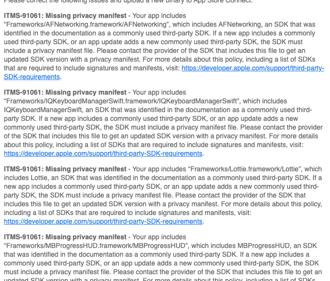

# ITMS-91061: Missing privacy manifest for third-party SDKs

### <font style="color:rgb(79, 79, 79);">一、问题起因：</font>

<font style="color:rgb(77, 77, 77);">新TF包在上传至苹果后台以后，相关的包出现了“</font>[<font style="color:rgb(252, 85, 49);">二进制文件</font>](https://so.csdn.net/so/search?q=%E4%BA%8C%E8%BF%9B%E5%88%B6%E6%96%87%E4%BB%B6\&spm=1001.2101.3001.7020)<font style="color:rgb(77, 77, 77);">无效”的情况！</font>

<font style="color:rgb(77, 77, 77);">首先排查一下邮箱，发现收到邮件提示：</font>



我们先分析一下：

粗看一眼，我们发现这个问题就是缺少隐私清单造成的，但是因为我们App之前就已经适配过了缺少隐私清单的问题，所以就感到很奇怪，已经有了App隐私清单，为什么还要我们去适配呢？

后面仔细一看，发现我们之前只适配了主App的隐私清单，现在要求每个三方的SDK都需要单独的隐私清单。

因为我们的App不止一个，为什么有些App会出现这种情况，另外一些App没有出现这种情况呢？

我们着重下面这句话：

<u>If a new app includes a commonly used third-party SDK, or an app update adds a new commonly used third-party SDK, the SDK must include a privacy manifest file.</u>

<u></u>

也就是说如果你是一个新上线的App，里面包含了三方SDK的，每个用到的三方SDK都需要包含各自的隐私清单文件。或者说你的App已经在线上发布过了，如果下次新增了三方的SDK，那么该SDK则需要包含对应的隐私清单文件。

需要适配的三方SDK列表也在官方网站上列出来了：third-party-SDK-requirements

### 二、解决方案

问题原因已经找到了，那么我们该怎么去解决这个问题呢？首先肯定是Google、各种AI大模型一顿乱搜，找到了一个官方回复：ITMS-91061: Missing privacy manifest

看完之后发现，要适配三方SDK的隐私清单文件，目前有两种方案可行：

方案一：把用到的三方SDK全部升级到有隐私清单文件的版本（对我们这种中大型App，伴随着三方SDK的大版本升级改动很大，牵一发动全身，线上造成影响无法评估）

关于苹果官方需要适配隐私清单的三方SDK列表中的所有SDK最小支持隐私清单文件的SDK版本，网上已经有整理好的文档，详见：需适配的三方SDK最小支持隐私清单文件列表

方案二：把对应的隐私清单文件注入到三方SDK中（影响范围小，但是不知道方案是否可行）

对比完成后，我们选择第二种解决方案。开整！

在网上查找发现，其实目前已经有相关开源项目可以解决这个问题：

方法一：app privacy manifest fixer

方法二：cocoapods-privacy

以上两种方法大家可以自己根据项目结构来选择（项目地址详见文章末尾参考资料），我们项目没用那么复杂，所以选择了开箱即用的方法：app privacy manifest fixer

### 三、app privacy manifest fixer 使用指南（更多说明详见开源项目的README）

1、下载最新版本，解压后命名为[app\_privacy\_manifest\_fixer](https://github.com/crasowas/app_privacy_manifest_fixer?tab=readme-ov-file)，放置项目根目录下。

> 我们是RN项目，所以这里我放在 ios/ 目录下

2、在Xcode中，找到项目对应的 TARGETS Tab，选择对应的target

3、切换到对应Build Phases选项卡，点击右上角的“+”按钮，选择“New Run Script Phase”

4、创建一个"Run Script"

5、在shell脚本框里，添加以下代码：

`"$WORKSPACE_DIR/path/to/app_privacy_manifest_fixer/fixer.sh"`

需要注意自己所使用的：

```css
$WORKSPACE_DIR：当前目录包含.xcworkspace的目录
$PROJECT_DIR：当前包含.xcodeproj文件的目录
```

<font style="color:rgb(77, 77, 77);">6、编译打包后验证结果：可以直接解开打包产物IPA包，在Frameworks文件夹中找到对应的三方SDK文件夹，其中就包含对应的隐私清单文件。</font>


> 更新: 2025-05-28 10:20:09  
> 原文: <https://www.yuque.com/hutaoao/blog/qo4ih5egetbiorml>