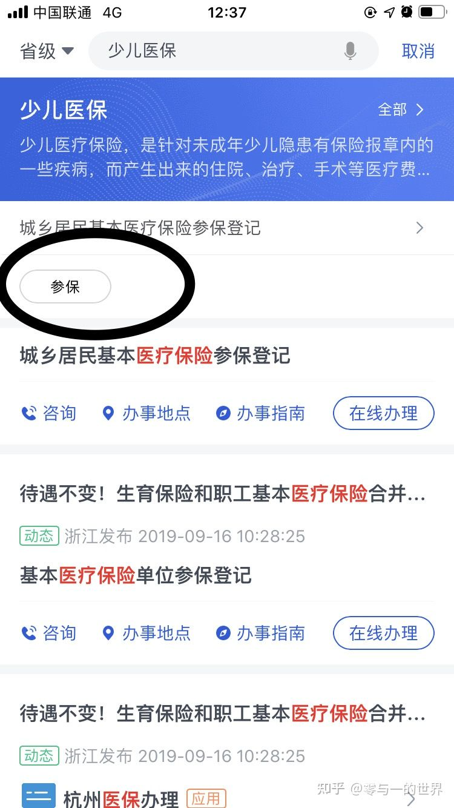
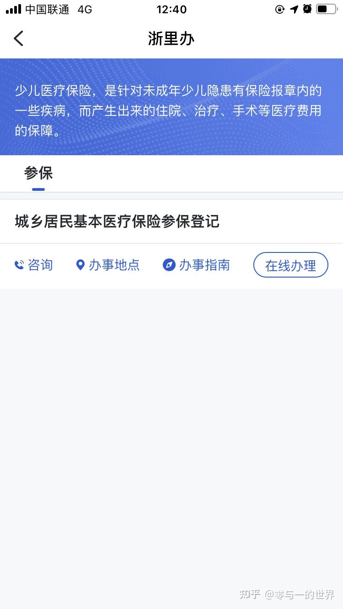
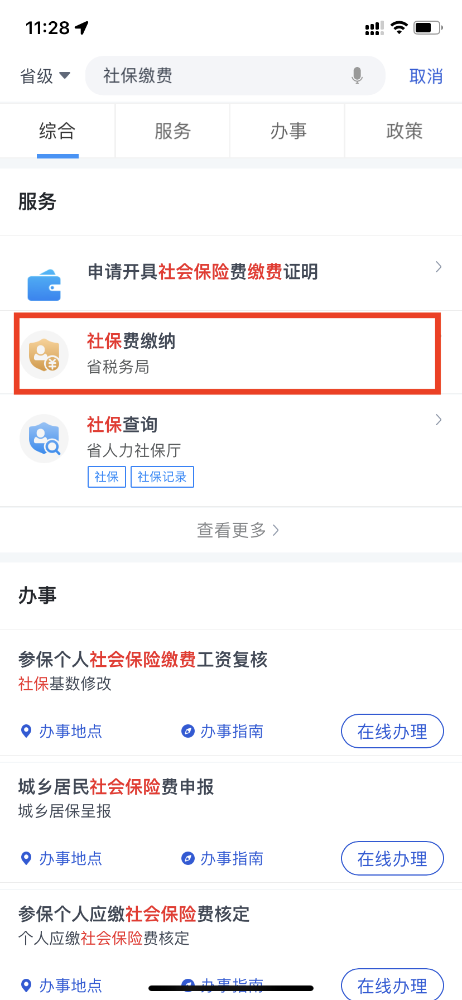
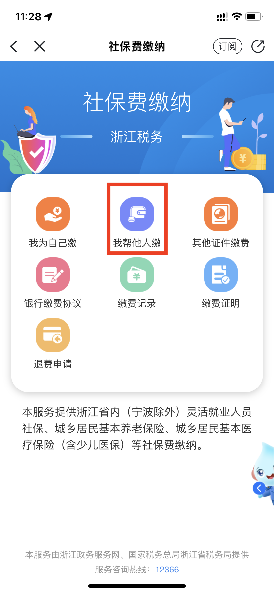
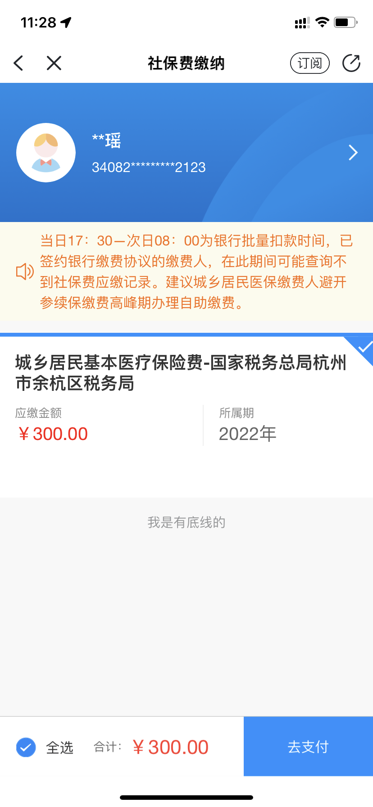
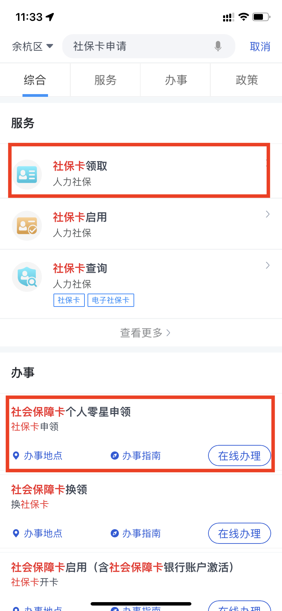
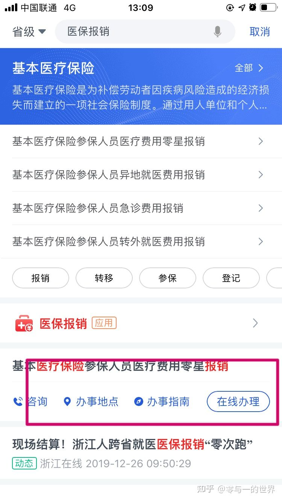
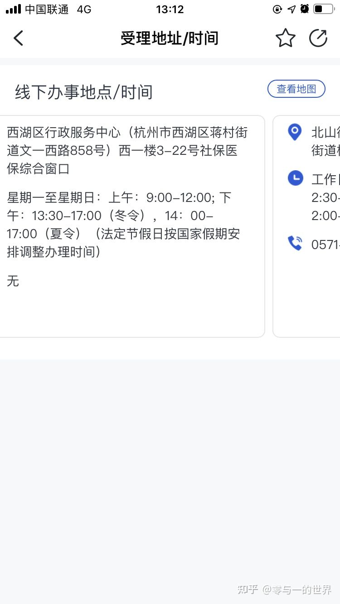
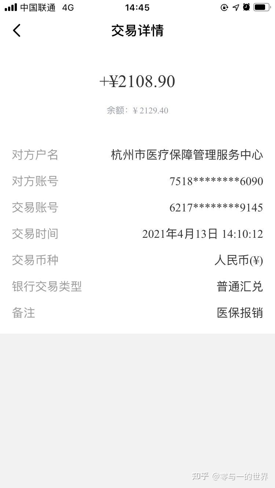

# 杭州外地户口新生儿社保报销问题总结

> 场景：打工人（省外农村户口）在杭州诞下孩子后，住院费用报销问题。
>

一、回老家报销

如果回老家报销，需要给新生儿在老家办当地城乡医疗保险，办完后再去社保部门报销

需要材料：

1. 新生儿出生证
2. 新生儿社保卡
3. 新生儿住院发票
4. 新生儿住院清单 盖章 医院的
5. 新生儿出院记录 盖章
6. 父母一方的身份证和银行卡

二、在杭州报销

在杭州报销的话，首先要给新生儿办城乡医疗保险，我办的时候交300；

流程

**申请城乡居民医疗保险登记->缴费->申领社保卡->医保报销**

2.1 外地户口如何给新生儿办医疗保险

资格：父母任意一方在杭州交够三年的社保即可

办理方式分为在线办理和线下办理，我这里只介绍线上办理

浙里办app或者电脑访问浙江政务服务网

下面只介绍apo

2.1.1 打开浙里办apo 登录账号密码

2.1.2 搜索少儿医保

2.1.3 点击上图参保进入下一个界面，点击在线办理

2.1.4然后进入办理系统

选择杭州下某个区，选择代办后面操作就很简单了

后面的审批也很快，杭州政务服务真的很方便，审批完成后就该下一个阶段了，缴费

三、缴费

前提是前面的社保登记已经审批完成

3.1 搜索社保缴费，选择下图红框进入下一个界面

3.2 选择我帮他人交

3.3后面就很简单了，付费就好了，300。

缴费成功进行下一步 社保卡申请

四、社保卡申请

4.1需要的材料：

4.1.1新生儿户口页照片

4.1.2 新生儿出生证明照片

4.1.3 申请人（父母任意一方，跟上面登记缴费保持一致）身份证正反面照片

4.2 打开浙里办 搜索社保卡申请，在下图的红框中选择在线申请

4.3后面就选择邮寄，代办，然后输入地址，一两天就会邮政快递到你的地址，届时快递小哥会让你付个邮费，我的是七块 到了这一步，社保卡到手了然后就是办理社保报销了

五、社保报销，

场景一：新生儿出生一个月内报销 去医院

场景二、新生儿出生一到三个月 报销去对应的每个街道办下的服务中心 重点介绍第二种

5.1 线下办理地址查询（推荐线下办理，在线上办理时间比较久，要20天）

5.1.1app打开搜索医保报销，在下图红框中选择办事地点

5.1.2 选择杭州市西湖区，然后下图界面左右滑动查看你最方便的位置

5.2 需要的材料

5.2.1 新生儿出生证明

5.2.2 医院 消费发票

5.2.3 医院清单盖章

5.2.4 医院出院记录

5.2.5 代办人身份证及开户行在杭州的银行卡

追更

报销已下发

> 更新: 2024-01-08 17:16:49  
> 原文: <https://www.yuque.com/hutaoao/blog/ailn1r>