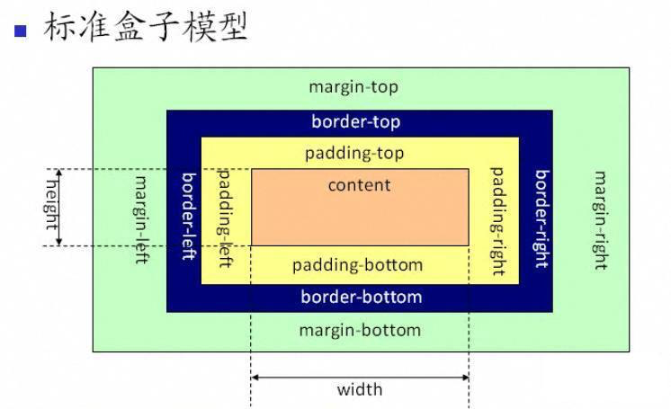
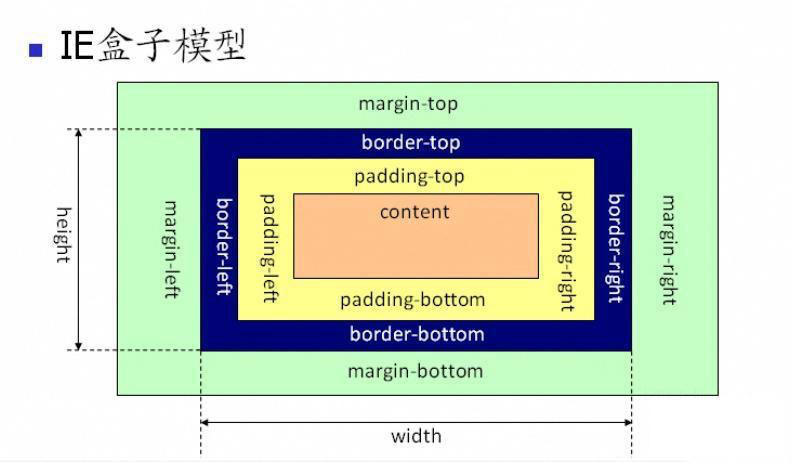
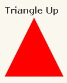
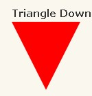
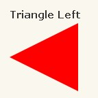
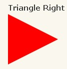

# HTML、CSS

### <font style="color:rgb(64, 64, 64);">web 标准的理解</font>

<font style="color:rgb(64, 64, 64);">WEB标准不是某一个标准，而是</font>**<font style="color:rgb(64, 64, 64);">一系列标准的集合</font>**<font style="color:rgb(64, 64, 64);">。\ </font><font style="color:rgb(64, 64, 64);">网页主要由三部分组成：结构（html），表现（css）和行为（js）</font>

***

### <font style="color:rgb(37, 41, 51);">HTML 语义化</font>

语义化标签：

`<header>`代表头部

`<nav>`代表超链接区域

`<main>`定义文档主要内容

`<article>`可以表示文章、博客等内容

`<aside>`通常表示侧边栏或嵌入内容

`<footer>`代表尾部

* **更具可读性**、**可维护性**
* 有**利于SEO**，搜索引擎根据标签来确定上下文和各个关键字的权重。
* 方便其他设备解析，如盲人阅读器根据语义渲染网页

***

### H5 新特性

1. 用于绘画 canvas 元素;
2. 多媒体标签：video 和 audio 元素；
3. 本地存储：localStorage 、sessionStorage ；
4. 语义化标签：如 article、footer、header、nav、section；
5. 表单控件：number、date、time、email、url、search、password。

***

### 浏览器及它们的内核

* **IE**：trident内核
* **Firefox**：gecko内核
* **Safari**：webkit内核
* **Opera**：以前是presto内核，Opera现已改用GoogleChrome的Blink内核
* **Chrome**：Blink(基于webkit，Google与OperaSoftware共同开发)

***

### HTML文件里开头的Doctype的作用

**<!DOCTYPE>** 声明位于文档中的最前面的位置，处于<html>标签之前。此标签可告知浏览器文档使用哪种HTML或XHTML规范。（重点：<font style="color:#F5222D;">告诉浏览器按照何种规范解析页面</font>）

***

### <font style="color:rgb(37, 41, 51);">盒子模型</font>

<font style="color:rgb(37, 41, 51);">盒模型分为</font>**<font style="color:rgb(37, 41, 51);">标准盒模型</font>**<font style="color:rgb(37, 41, 51);">和</font>**<font style="color:rgb(37, 41, 51);">怪异盒模型(IE模型)</font>**

**<font style="color:rgb(37, 41, 51);">标准盒模型</font>**<font style="color:rgb(37, 41, 51);">：</font><code>**<font style="color:rgb(37, 41, 51);">box-sizing：content-box</font>**</code><font style="color:rgb(37, 41, 51);">元素的宽度等于width+margin+border+padding</font>

**<font style="color:rgb(37, 41, 51);">怪异</font>\*\*\*\*<font style="color:rgb(37, 41, 51);">盒模型</font>**<font style="color:rgb(37, 41, 51);">：</font><code>**<font style="color:rgb(37, 41, 51);">box-sizing：border-box</font>**</code>**<font style="color:rgb(37, 41, 51);"> </font>**<font style="color:rgb(37, 41, 51);">元素的宽度等于width+margin（其中</font>**<font style="color:rgb(37, 41, 51);">width包含padding和border</font>**<font style="color:rgb(37, 41, 51);">）</font>

  

**<font style="color:rgb(37, 41, 51);"></font>**

***

### img的alt与title有何异同

* \*\*alt：\*\*图片加载失败时，显示在网页上的替代文字<font style="color:#000000;background-color:#FEFEF2;">；</font>
* \*\*title：\*\*鼠标放上面时显示的文字,title是对图片的描述与进一步说明；

> <font style="color:#F5222D;">alt是img必要的属性，而title不是</font>，对于<font style="color:#F5222D;">网站seo优化</font>来说，title与alt还有最重要的一点： 搜索引擎对图片意思的判断，主要靠alt属性。所以在图片alt 属性中以简要文字说明，同时包含关键词，也是页面优化的一部分。条件允许的话，可以在title属性里，进一步对图 片说明。

***

### css水平、垂直居中的写法

```css
// 行内元素: 
text-align: center
// 块级元素: 
margin: 0 auto;

position: absolute;
left: 50%;
transform: translateX(-50%);

display: flex;
justify-content: center;
```

```css
//设置line-height 等于height
height: 100px;
line-height: 100px;

position：absolute;
top: 50%;
transform: translateY(-50%);

display: flex;
align-items: center;

display: table;
display: table-cell;
vertical-align: middle;
```

***

### **块级元素水平垂直居中的方法（**<font style="color:#505050;">处于屏幕的正中央</font>**）**

1、<font style="color:#505050;">利用CSS的margin设置为auto让浏览器自己帮我们水平和垂直居中。</font>

```css
.box{
  height: 200px;
  width: 300px;
  position: absolute;
  left: 0px;
  right: 0;
  top: 0;
  bottom: 0;
  margin: auto;
}
```

2、原理：要让div等块级元素水平和垂直居中，必需知道该div等块级元素的宽度和高度，然后设置位置为绝对位置，距离页面窗口左边框和上边框的距离设置为50%，这个50%就是指页面窗口的宽度和高度的50%，最后将该div等块级元素分别左移和上移，左移和上移的大小就是该div等块级元素宽度和高度的一半。

```css
.mycss{ 
  width:300px;  
  height:200px;  
  position:absolute;  
  left:50%;  
  top:50%;  
  margin:-100px 0 0 -150px;
}
```

3、垂直居中一个

```css
//的容器设置如下
#container {
  display:table-cell;
  text-align:center;
  vertical-align:middle;
}
```

4、Flex布局

```css
// 盒子设置如下
display: flex;
align-items: center;
justify-content: center;
```

***

### rem、em、vh、px 对比

**rem：**<font style="color:rgb(37, 41, 51);">相对于根元素 </font>**<font style="color:rgb(37, 41, 51);">html </font>**<font style="color:rgb(37, 41, 51);">的font-size；</font>

> <font style="color:rgb(37, 41, 51);">html为font-size：100px，那么，在其当中的div设置为font-size：1rem,就是当中的div为100px</font>

**<font style="color:rgb(37, 41, 51);">em：</font>**<font style="color:rgb(37, 41, 51);">相对于父元素计算</font>

> <font style="color:rgb(37, 41, 51);">假如某个p元素为font-size:12px，在它内部有个span标签，设置font-size：2em，这时候的span字体大小为：12\*2=24px</font>

\*\*vw：\*\*Viewport Width，视窗的宽度，屏幕宽度的 1%

\*\*vh：\*\*Viewport Height，视窗的高度，屏幕高度的 1%

\*\*px：\*\*像素（Pixel），相对长度单位，像素px是相对于显示器屏幕分辨率而言的。

> 浏览器的默认字体高都是16px。所以未经调整的浏览器都符合:1em=16px。

***

### 画一条0.5px的直线

> 考查的是css3的transform

```css
height: 1px;
transform: scale(0.5);
```

***

### 画一个三角形



```css
#triangle-up {
    width: 0;
    height: 0;
    border-left: 50px solid transparent;
    border-right: 50px solid transparent;
    border-bottom: 100px solid red;
}
#triangle-down {
    width: 0;
    height: 0;
    border-left: 50px solid transparent;
    border-right: 50px solid transparent;
    border-top: 100px solid red;
}
```

***

### 说一下盒模型

盒模型的组成，由里向外<code><font style="color:#F5222D;">content</font></code>，<code><font style="color:#F5222D;">padding</font></code>，<code><font style="color:#F5222D;">border</font></code>，<code><font style="color:#F5222D;">margin</font></code>；

* 在IE盒子模型中，width表示content+padding+border这三个部分的宽度；
* 在标准的盒子模型中，width指content部分的宽度；

box-sizing的使用

```css
box-sizing: content-box;  //是标准盒模型 (默认)
box-sizing: border-box;  //是IE盒模型
```

***

### **清除浮动的方法**

**<font style="color:#F5222D;">1：父级div定义 height</font>**

原理：父级div手动定义height，就解决了父级div无法自动获取到高度的问题。

优点：简单、代码少、容易掌握

缺点：只适合高度固定的布局，要给出精确的高度，如果高度和父级div不一样时，会产生问题

**<font style="color:#F5222D;">2：结尾处加空div标签 clear:both</font>**

原理：添加一个空div，利用css提高的clear:both清除浮动，让父级div能自动获取到高度

优点：简单、代码少、浏览器支持好、不容易出现怪问题

缺点：不少初学者不理解原理；如果页面浮动布局多，就要增加很多空div，让人感觉很不好

**<font style="color:#F5222D;">3：父级div定义 伪类:after 和 zoom</font>**

原理：IE8以上和非IE浏览器才支持:after，原理和方法2有点类似，zoom(IE转有属性)可解决ie6,ie7浮动问题

优点：浏览器支持好、不容易出现怪问题（目前：大型网站都有使用，如：腾迅，网易，新浪等等）

缺点：代码多、不少初学者不理解原理，要两句代码结合使用才能让主流浏览器都支持

**<font style="color:#F5222D;">4：父级div定义 overflow:hidden</font>**

原理：必须定义width或zoom:1，同时不能定义height，使用overflow:hidden时，浏览器会自动检查浮动区域的高度

优点：简单、代码少、浏览器支持好

缺点：不能和position配合使用，因为超出的尺寸的会被隐藏。

***

### display:none和visibility:hidden的区别

<code><font style="color:#F5222D;">display:none</font></code>  隐藏对应的元素，在文档布局中<font style="color:#F5222D;">不再给它分配空间</font>，它各边的元素会合拢，就当他从来不存在。

<code><font style="color:#F5222D;">visibility:hidden</font></code>  隐藏对应的元素，但是在文档布局中仍<font style="color:#F5222D;">保留原来的空间</font>。

***

### CSS中 link 和@import 的区别是

|  | **<font style="color:#F5222D;">link</font>** | **<font style="color:#F5222D;">@import</font>** |
| --- | --- | --- |
| 归属 | 属于HTML标签 | <font style="color:rgb(37, 41, 51);">只能用于加载 css</font> |
| 加载 | <font style="color:rgb(37, 41, 51);">当解析到link时，页面会同步加载所引的 css</font> | 等到页面被加载完再加载 |
| 兼容性 | 无兼容问题 | IE5以上才能识别 |
| 权重 | + <font style="color:#404040;">link方式的样式的权重 高于@import的权重。</font><br/>+ <font style="color:rgb(37, 41, 51);">link可以使用 js 动态引入，@import不行</font> | |

***

### position的absolute与fixed共同点与不同点

**共同点：**

1. 改变行内元素的呈现方式，display被置为block；
2. 让元素脱离普通流，不占据空间；
3. 默认会覆盖到非定位元素上。

**不同点：**

absolute的”根元素“是可以设置的，而fixed的”根元素“固定为浏览器窗口；当你滚动网页，fixed元素与浏览器窗口之间的距离是不变的。

***

### 解释下 CSS sprites，以及如何使用它

<code>**<font style="color:#F5222D;">CSS Sprites</font>**</code> 其实就是把网页中一些背景图片整合到一张图片文件中，再利用CSS的“background-image”，“background- repeat”，“background-position”的组合进行背景定位，background-position可以用数字能精确的定位出背景图片的位置。这样可以<font style="color:#F5222D;">减少很多图片请求的开销</font>，因为请求耗时比较长；请求虽然可以并发，但是也有限制，一般浏览器都是6个。对于未来而言，就不需要这样做了，因为有了`http2`。

***

### 减少页面加载时间的方法

1. 优化图片  

2. 图像格式的选择（GIF：提供的颜色较少，可用在一些对颜色要求不高的地方）  

3. 优化CSS（压缩合并css，如margin-top,margin-left...)  

4. 网址后加斜杠（如www.campr.com/目录，会判断这个“目录是什么文件类型，或者是目录。）  

5. 标明高度和宽度（如果浏览器没有找到这两个参数，它需要一边下载图片一边计算大小，如果图片很多，浏览器需要不断地调整页面。这不但影响速度，也影响浏览体验。  

   当浏览器知道了高度和宽度参数后，即使图片暂时无法显示，页面上也会腾出图片的空位，然后继续加载后        面的内容。从而加载时间快了，浏览体验也更好了。）  

6. 减少http请求（合并文件，合并图片）。

***

### 渐进增强和优雅降级

* \*\*渐进增强（progressive enhancement）：\*\*针对低版本浏览器进行构建页面，保证最基本的功能，然后再针对高级浏览器进行效果、交互等改进和追加功能达到更好的用户体验。
* \*\*优雅降级（graceful degradation）：\*\*一开始就构建完整的功能，然后再针对低版本浏览器进行兼容。

> \*\*区别：\*\*优雅降级是从复杂的现状开始，并试图减少用户体验的供给，而渐进增强则是从一个非常基础的，能够起作用的版本开始，并不断扩充，以适应未来环境的需要。降级（功能衰减）意味着往回看；而渐进增强则意味着朝前看，同时保证其根基处于安全地带。

***

### 简述一下src与href的区别

* **src** 是 source 的缩写，<font style="color:#F5222D;">指向外部资源的位置</font>，指向的内容将会嵌入到文档中当前标签所在位置；在请求src资源时会将其指向的资源下载并应用到文档内，例如js脚本，img图片和frame等元素：

<script src="js.js"></script>

> 当浏览器解析到该元素时，会暂停其他资源的下载和处理，直到将该资源加载、编译、执行完毕，图片和框架等元素也如此，类似于将所指向资源嵌入当前标签内。这也是为什么将js脚本放在底部而不是头部。

* **href** 是 Hypertext Reference 的缩写，<font style="color:#F5222D;">指向网络资源所在位置</font>，建立和当前元素（锚点）或当前文档（链接）之间的链接，如果我们在文档中添加

<link href="common.css" rel="stylesheet"/>

那么浏览器会识别该文档为css文件，就会并行下载资源并且不会停止对当前文档的处理。这也是为什么建议        使用link方式来加载css，而不是使用@import方式。

<font style="color:#262626;background-color:transparent;">设置DOM的CSS样式方法</font>

* **外部样式表**：引入一个外部css文件
* **内部样式表**：将css代码放在<head>标签内部
* **内联样式**：将css样式直接定义在HTML元素内部

***

### 什么是CssHack？ie6,7,8的hack分别是什么？

<font style="color:#F5222D;">针对不同的浏览器写不同的CSS code的过程，就是Css Hack。</font>

```css
#test {
    width:300px;
    height:300px;
    background-color:blue; /*firefox*/
    background-color:red\9; /*allie*/
    background-color:yellow; /*ie8*/
    +background-color:pink; /*ie7*/
    _background-color:orange; /*ie6*/
}

#test {
  	background-color:purple\9; /*ie9*/
}
@mediaalland(min-width:0px) {
  #test {
    	background-color:black; /*opera*/
  }
}
@mediascreenand(-webkit-min-device-pixel-ratio:0) {
  #test {
    background-color:gray; /*andsafari*/
  }
}
```

***

### 行内元素、块级元素、行内块元素区别

**块级元素（****block-level****）：**

* <font style="color:#F5222D;">独占一行</font>，其宽度自动填满其父元素宽度（即使设置了宽度仍然是独占一行的）
* 多个块状元素标签写在一起，默认排列方式为<font style="color:#F5222D;">自上至下</font>
* 高度，行高，内外边距（padding、margin）都<font style="color:#F5222D;">可控制</font>

> div、h1-h6、p、ul、ol、li、nav、aside、header、footer、section、article、address、form、table

**内联元素（inl&#x69;****ne****-level**\*\*）：\*\*

* 和相邻的内联元素<font style="color:#000000;">在同一行</font>，其宽度随元素的内容而变化
* 设置行高有效，等同于给父级元素设置行高
* <font style="color:#F5222D;">宽</font><font style="color:#F5222D;">高</font><font style="color:#F5222D;">不可控</font>，对内外边距（padding、margin）<font style="color:#F5222D;">仅设置左右方向有效上下无效</font>
* 内边距（padding）设置上下从显示效果是增加的，但其实设置时无效的，并不会影响周围的元素
* <font style="color:#F5222D;">行内元素中不能放块级元素</font>，a 链接里面不能再放链接

> span、a、label、i、b、strong、em、del(删除线)、ins(下划线)、sub(下标)、sup（上标）

**行内块元素（****inline-block****）：**

* 默认宽度就是它本身内容的宽度，宽高度、行高、内外边距都可控
* 和相邻元素（行内块）在同一行，但之间会有空白缝隙（设置它上一级的font-size为0，才会消除间隙）

> <input>、、<button>、<texterea>、<label>。

***

### rgba()和opacity的透明效果有什么不同

**rgba()** 和 **opacity** 都能实现透明效果，但最大的不同是 <font style="color:#F5222D;">opacity 作用于元素</font><font style="color:#F5222D;">，以及元素内的所有内容的透明度</font>；而<font style="color:#F5222D;"> rgba() 只作用于元素的颜色或其背景色</font><font style="color:#F5222D;">，</font><font style="color:#F5222D;">设置 rgba 透明的元素的子元素不会继承透明效果</font>！

***

### html语义化

* 当页面样式加载失败的时候能够<font style="color:#F5222D;">让页面呈现出清晰的结构</font>；
* <font style="color:#F5222D;">有利于seo优化</font>，利于被搜索引擎收录（更便于搜索引擎的爬虫程序来识别）；
* <font style="color:#F5222D;">便于项目的开发及维护</font>，使html代码更具有<font style="color:#F5222D;">可读性</font>，便于其他设备解析。

***

### HTML与XHTML——二者有什么区别

1. 所有的标记都必须要有一个相应的结束标记
2. 所有标签的元素和属性的名字都必须使用小写
3. 所有的XML标记都必须合理嵌套
4. 所有的属性必须用引号""括起来
5. 把所有<和&特殊符号用编码表示
6. 给所有属性赋一个值
7. 不要在注释内容中使用"--"
8. 图片必须有说明文字

***

### html常见兼容性问题

1. 双边距 BUG float 引起的使用 display ；
2. 像素问题使用 float 引起的使用 dislpay:inline-3px；
3. 超链接 hover 点击后失效使用正确的书写顺序 link  visited  hover  active；
4. IE z-index 问题给父级添加 position:relative；
5. Png 透明使用 js 代码改；
6. Min-height 最小高度 ！Important解决；
7. select 在ie6 下遮盖使用 iframe 嵌套；
8. 为什么没有办法定义1px左右的宽度容器（IE6默认的行高造成的，使用over:hidden,zoom:0.08line-height:1px）；
9. IE 5-8 不支持 opacity，解决办法：

```css
.opacity {
  opacity:0.4
  filter:alpha(opacity=60);/*forIE5-7*/
  -ms-filter:"progid:DXImageTransform.Microsoft.Alpha(Opacity=60)";/*forIE8*/
}
```

10. IE6不支持PNG透明背景，解决办法:IE6下使用gif图片。

***

### 哪些css属性可以继承

* 可继承：font-size、font-family、color，ul、li、dl、dd、dt；
* 不可继承：border、padding、margin、width、height。

***

### <font style="color:rgb(44, 62, 80);">有哪些方式可以隐藏页面元素</font>

* <code><font style="color:rgb(44, 62, 80);">display:none</font></code><font style="color:rgb(44, 62, 80);"> - 元素不可见，不占据空间，无法响应点击事件</font>
* <code><font style="color:rgb(44, 62, 80);">visibility:hidden</font></code><font style="color:rgb(44, 62, 80);"> - 元素不可见，占据页面空间，无法响应点击事件</font>
* <code><font style="color:rgb(44, 62, 80);">opacity:0</font></code><font style="color:rgb(44, 62, 80);"> - 改变元素透明度，元素不可见，占据页面空间，可以响应点击事件</font>
* <code><font style="color:rgb(44, 62, 80);">设置height、width模型属性为0</font></code><font style="color:rgb(44, 62, 80);"> - 元素不可见，不占据页面空间，无法响应点击事件</font>
* <code><font style="color:rgb(44, 62, 80);">position:absolute</font></code><font style="color:rgb(44, 62, 80);"> - 元素不可见，不影响页面布局</font>
* <code><font style="color:rgb(44, 62, 80);">clip-path</font></code><font style="color:rgb(44, 62, 80);"> - 通过</font>**<font style="color:rgb(44, 62, 80);">裁剪</font>**<font style="color:rgb(44, 62, 80);">的形式，元素不可见，占据页面空间，无法响应点击事件</font>

***

### <font style="color:rgb(44, 62, 80);">回流跟重绘</font>

* <font style="color:rgb(44, 62, 80);">回流：布局引擎会根据各种样式计算每个盒子在页面上的大小与位置</font>
* <font style="color:rgb(44, 62, 80);">重绘：当计算好盒模型的位置、大小及其他属性后，浏览器根据每个盒子特性进行绘制</font>

***

### <font style="color:rgb(51, 51, 51);">常见的伪元素</font>

* **::before**：在元素的内容**前面插入新内容。**
* **::after**：在元素的内容**后面插入新内容**。
* **::first-letter**：选择元素的**首字母**
* **::first-line**：选择元素的**第一行**

***

### 移动端如何适配不同屏幕尺寸

1. @media screen - **媒体查询**
2. **rem适配** - 通过设置跟元素 html 的font-size来适配
3. 第三方**插件** - px2rem-loader

***

### <font style="color:rgb(44, 62, 80);">Flex：1 包含哪三种属性</font>

* <font style="color:rgb(30, 31, 36);">flex-grow</font><font style="color:rgb(30, 31, 36);">：决定了元素如何占用可用的额外空间。</font>
* <font style="color:rgb(30, 31, 36);">flex-shrink</font><font style="color:rgb(30, 31, 36);">：决定了元素如何缩小以适应容器。</font>
* <font style="color:rgb(30, 31, 36);">flex-basis</font><font style="color:rgb(30, 31, 36);">：定义了元素的默认大小。</font>

<font style="color:rgb(30, 31, 36);">当你设置</font><font style="color:rgb(30, 31, 36);"> </font><font style="color:rgb(30, 31, 36);">flex: 1;</font><font style="color:rgb(30, 31, 36);">，你实际上是设置了这三个属性的默认值：</font>

* <code><font style="color:rgb(30, 31, 36);">flex-grow: 1</font></code><font style="color:rgb(30, 31, 36);">元素会尝试占用所有可用的额外空间</font>
* <code><font style="color:rgb(30, 31, 36);">flex-shrink: 1</font></code><font style="color:rgb(30, 31, 36);">如果需要缩小，它会均匀地缩小</font>
* <code><font style="color:rgb(30, 31, 36);">flex-basis: 0</font></code><font style="color:rgb(30, 31, 36);">如果没有明确设置flex-basis，它的默认值为0</font>

***

### 如何实现响应式布局

响应式布局没有一个明确的定义，我个人理解定义：**在不同设备 不同终端的布局表现**（适配多终端，让用户在不同设备上都有一个比较好的体验）

* rem：根据根元素的 `font-size`
* em：根据父元素的 `font-size`
* vw/wh：相对视框的百分比
* flex：

***

### link标签的preload

HTML5 引入的一种优化技术，用于告诉浏览器在解析 HTML 文档的过程中，**优先加载并缓存某些资源**。这有助于改善页面加载的性能，特别是当页面需要加载大量资源时。

使用 <link rel="preload"> 的主要目的是**优化资源加载的顺序**，**确保关键资源能够更快地加载并可供使用**。这有助于减少页面渲染的延迟，并提高用户的体验。

***


> 更新: 2024-07-09 11:09:13  
> 原文: <https://www.yuque.com/hutaoao/blog/dablh8>