# Javascript

### JavaScript 数据类型

**基本类型（原始类型）7种**：String、Number、Boolean、Null、Undefined、Symbol（ES6引入）、BigInt（ES2020引入）

**引用数据类型（对象类型）**：对象(Object)、数组(Array)、函数(Function)

\*\*其它应用类型：\*\*Date、RegExp、Map、Set 等

> `Symbol` 是 ES6 引入了一种新的原始数据类型，表示独一无二的值。
>
> 应用场景：
>
> 1. **创建唯一的对象属性**：定义特定用途的内部属性或库的私有属性时特别有用；
> 2. **作为对象的私有属性**：Symbol属性不会被常规的枚举方法如for...in循环或Object.keys()所包含；

> <code><font style="color:rgb(30, 31, 36);">BigInt</font></code>进行**任意精度的整数算术**：可以用来表示或操作任意大的整数，只受限于系统的可用内存

> 注：Function、Array都继承于Object，如下图：

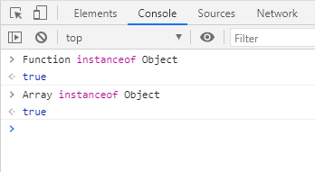

**<font style="color:rgb(44, 62, 80);">存储区别</font>**

<font style="color:rgb(44, 62, 80);">基本数据类型和引用数据类型存储在内存中的位置不同：</font>

* **<font style="color:rgb(44, 62, 80);">基本数据类型</font>**<font style="color:rgb(44, 62, 80);">存储在</font>**<font style="color:rgb(44, 62, 80);">栈</font>**<font style="color:rgb(44, 62, 80);">中</font>
* **<font style="color:rgb(44, 62, 80);">引用类型</font>**<font style="color:rgb(44, 62, 80);">的对象存储于</font>**<font style="color:rgb(44, 62, 80);">堆</font>**<font style="color:rgb(44, 62, 80);">中</font>

> 主要在于它们在\*\*<font style="color:#DF2A3F;">内存中的存储方式</font>**以及**<font style="color:#DF2A3F;">比较方式</font>**。基本类型直接**<font style="color:#DF2A3F;">存储值本身</font>**，而引用类型存储的是指向实际数据的**<font style="color:#DF2A3F;">内存地址的引用（堆）</font>\*\*。同时，比较基本类型值时，比较的是它们的<font style="color:#DF2A3F;">值</font>，而比较应用类型值时，比较的是它们的<font style="color:#DF2A3F;">引用</font>。

***

### Javascript数据类型判断

1. **typeof - 返回变量的基本类型**

> 弊端：判断 **null** 和 **引用数据类型** 时返回 object（function 除外）

```javascript
typeof 1 // 'number'
typeof '1' // 'string'
typeof undefined // 'undefined'
typeof true // 'boolean'
typeof Symbol() // 'symbol'
typeof null // 'object'
typeof [] // 'object'
typeof {} // 'object'
typeof console // 'object'
typeof console.log // 'function'
```

2. **instanceof - 返回布尔值**

**用于判断引用类型的继承关系**

> 弊端：不支持基本数据类型判断

```javascript
Function instanceof Object  //true
Date instanceof Object  //true
//不支持基本数据类型判断
"123" instanceof String  //false
123 instanceof Number  //false
```

> `Object.setPrototypeOf`能改对象的原型

```javascript
const obj = {};
console.log(obj instanceof Object); // true
Object.setPrototypeOf(obj, Array.prototype);
console.log(obj instanceof Array); // true
```

3. **Object.prototype.toString -****<font style="color:#DF2A3F;"> 最佳（ES6之前）</font>**** - **可以**<font style="color:#DF2A3F;">精确的判断各种数据类型</font>**

<font style="color:rgb(44, 62, 80);">统一返回格式</font><font style="color:rgb(71, 101, 130);">“\[object Xxx]”</font><font style="color:rgb(44, 62, 80);">的字符串</font>

```javascript
Object.prototype.toString({})       // "[object Object]"
Object.prototype.toString.call({})  // "[object Object]"
Object.prototype.toString.call(1)    // "[object Number]"
Object.prototype.toString.call('1')  // "[object String]"
Object.prototype.toString.call(true)  // "[object Boolean]"
Object.prototype.toString.call(function(){})  // "[object Function]"
Object.prototype.toString.call(null)   //"[object Null]"
Object.prototype.toString.call(undefined) //"[object Undefined]"
Object.prototype.toString.call(/123/g)    //"[object RegExp]"
Object.prototype.toString.call(new Date()) //"[object Date]"
Object.prototype.toString.call([])       //"[object Array]"
Object.prototype.toString.call(document)  //"[object HTMLDocument]"
Object.prototype.toString.call(window)   //"[object Window]"
```

> ES6可以通过 `Symbol.toStringTag` 进行修改对应的 type 值

4. **⚠️**\*\*<font style="color:#DF2A3F;">判断数组最佳方案 Array.isArray()  </font>****<font style="color:#DF2A3F;">👍</font>****<font style="color:#DF2A3F;"> </font>****<font style="color:#DF2A3F;">👍</font>****<font style="color:#DF2A3F;"> </font>****<font style="color:#DF2A3F;">👍</font>****<font style="color:#DF2A3F;"> </font>****<font style="color:#DF2A3F;">👍</font>****<font style="color:#DF2A3F;"> </font>****<font style="color:#DF2A3F;">👍</font>****<font style="color:#DF2A3F;"> </font>\*\*\*\*<font style="color:#DF2A3F;">👍</font>\*\*

***

### JSON 的了解

<code>**<font style="color:#F5222D;">JSON(JavaScript Object Notation)</font>**</code> 是一种轻量级的数据交换格式。

它是基于JavaScript的一个子集。数据格式简单, 易于读写, 占用带宽小

***

### javascript的typeof返回哪些数据类型.

string、boolean、number、undefined、function、object、symbol

***

### \[类型转换]\(https://www.yuque.com/hutaoao/blog/bp7tqf?singleDoc# 《Js类型转换》)

* **<font style="color:rgb(44, 62, 80);">强制转换</font>**<font style="color:rgb(44, 62, 80);">（显示转换）</font>
* **<font style="color:rgb(44, 62, 80);">自动转换</font>**<font style="color:rgb(44, 62, 80);">（隐式转换）</font>

强制：parseInt()、parseFloat()、Number()、String()、Boolean()

隐式：==、 ===、<font style="color:rgb(71, 101, 130);">+</font><font style="color:rgb(44, 62, 80);">、</font><font style="color:rgb(71, 101, 130);">-</font><font style="color:rgb(44, 62, 80);">、</font><font style="color:rgb(71, 101, 130);">\*</font><font style="color:rgb(44, 62, 80);">、</font><font style="color:rgb(71, 101, 130);">/</font><font style="color:rgb(44, 62, 80);">、</font><font style="color:rgb(71, 101, 130);">%</font>

> 1=="1"     //true
>
> null==undefined     //true

***

### 如何阻止事件冒泡

IE：ev.cancelBubble = true；非IE：ev.stopPropagation();

***

### js延迟加载的方式有哪些

\*\*延迟加载（Lazy Loading）\*\*是一种优化技术，用于延迟加载某些资源（如图像、视频、样式表等），以减少页面加载时间并提高性能。

延迟加载通常用于\*\*<font style="color:#DF2A3F;">在用户需要时才加载相关资源</font>\*\*，而不是在页面加载时一次性加载所有资源。

* <code>**defer**</code> <font style="color:rgb(30, 31, 36);">用于</font><code><font style="color:rgb(30, 31, 36);"><script></font></code><font style="color:rgb(30, 31, 36);">标签的属性，它指示浏览器延迟脚本的加载和执行，直到整个HTML文档都解析完成</font>
* <code>**async**</code> 异步脚本，用于`<script>`标 签的属性，它指示浏览器异步加载和执行脚本：使用`async`属性的脚本会**立即开始加载**
* **动态创建DOM方式**：动态创建`script`标签，当页面的全部内容加载完毕后，在执行创建挂载，加载完毕后callBack）
* **按需加载**：用于大型应用，可以将应用分割成多个模块，按需加载。可以使用webpack等打包工具进行按需打包
* **延迟加载**：将某些代码包裹在条件语句中，当满足条件时才执行

***

### null，undefined的区别

<code>**<font style="color:#F5222D;">null</font>**</code><font style="color:#212529;"> </font><font style="color:rgb(44, 62, 80);">表示一个</font>**尚未存在的对象**<font style="color:#212529;">，转换为数值时为0；</font>

<code>**<font style="color:#F5222D;">undefined</font>**</code><font style="color:#212529;"> 表示</font>**<font style="color:#212529;">声明的变量未初始化</font>**<font style="color:#212529;">，转换为数值时为NAN；</font>

<font style="color:#212529;">typeof(null) -- object;</font>

<font style="color:#212529;">typeof(undefined) -- undefined</font>

***

### 说说JavaScript的基本规范

<font style="color:#212529;">1) 不要在同一行声明多个变量</font>

<font style="color:#212529;">2) 使用 ===或!==来比较true/false或者数值</font>

<font style="color:#212529;">3) switch必须带有default分支</font>

<font style="color:#212529;">4) 函数应该有返回值</font>

<font style="color:#212529;">5) for if else 必须使用大括号</font>

<font style="color:#212529;">6) 语句结束加分号</font>

<font style="color:#212529;">7) 命名要有意义，使用驼峰命名法</font>

***

###  什么是闭包（closure）

**<font style="color:#212529;">闭包</font>**<font style="color:#212529;">：</font><font style="color:#F5222D;">能够读取其它函数内部变量的函数</font><font style="color:#212529;">。</font>

<font style="color:#212529;">又或者：</font><font style="color:rgb(37, 41, 51);">函数A 里面包含了 函数B，而 函数B 里面使用了 函数A 的变量，那么 函数B 被称为闭包。</font>

<font style="color:#212529;">优点：避免全局变量污染。缺点：常驻内存，容易造成内存泄漏。</font>

<font style="color:#212529;"></font>

<font style="color:#212529;">说明：</font>

> <font style="color:#212529;">闭包的定义是能够读取其它函数内部变量的函数，其实</font>就是将函数内部和函数外部连接的一座桥梁；
>
> 闭包另一个作用就是**避免全局变量的污染**，**让这些变量的值始终保持在内存中**，同时副作用就是容易造成**内存泄漏**；

**闭包的经典问题**

```javascript
for(var i = 0; i < 3; i++) {
  setTimeout(function() {
    console.log(i);
  }, 1000);
}

// 输出： 3 3 3
// 首先，for 循环是同步代码，先执行三遍 for，i 变成了 3；
// 然后，再执行异步代码 setTimeout，这时候输出的 i，只能是 3 个 3 了
```

**解决方案**

**1）使用let**

```javascript
for(let i = 0; i < 3; i++) {
  setTimeout(function() {
    console.log(i);
  }, 1000);
}

// 在这里，每个 let 和代码块结合起来形成块级作用域
// 当 setTimeout() 打印时，会寻找最近的块级作用域中的 i，所以依次打印出 0 1 2
```

**2）**<font style="color:rgb(37, 41, 51);">使用</font>**<font style="color:rgb(37, 41, 51);">立即执行函数</font>**<font style="color:rgb(37, 41, 51);">解决闭包的问题</font>

```javascript
for(var i = 0; i < 3; i++) {
  (function(i){
    setTimeout(function() {
      console.log(i);
    }, 1000);
  })(i)
}
```

> **<font style="color:#DF2A3F;">！！！立即执行函数：</font>**<font style="color:rgb(0, 0, 0);">创建一个独立的作用域。这个作用域里面的变量，外面访问不到（即避免了「变量污染」）</font>

***

### <font style="color:rgb(37, 41, 51);">JS 作用域及作用域链</font>

**作用域**

<font style="color:rgb(37, 41, 51);">在JavaScript中，作用域分为 </font>**<font style="color:rgb(37, 41, 51);">全局作用域</font>**<font style="color:rgb(37, 41, 51);"> 和 </font>**<font style="color:rgb(37, 41, 51);">函数作用域</font>**

* **<font style="color:rgb(37, 41, 51);">全局作用域：</font>**<font style="color:rgb(37, 41, 51);">代码在程序的任何地方都能被访问，</font><font style="color:#DF2A3F;">window 对象的内置属性都拥有全局作用域</font>

1. <font style="color:rgb(77, 77, 77);">在最外层函数外面定义的变量拥有全局作用域</font>
2. <font style="color:rgb(77, 77, 77);">所有末定义直接赋值的变量自动声明为拥有全局作用域(不论函数内外)</font>

* **<font style="color:rgb(37, 41, 51);">函数作用域：</font>**<font style="color:rgb(37, 41, 51);">在固定的代码片段才能被访问</font>
* \*\*<font style="color:rgb(44, 62, 80);">块级作用域：</font>\*\***let/const**，在大括号中使用let和const声明的变量存在于块级作用域中。在大括号之外不能访问这些变量

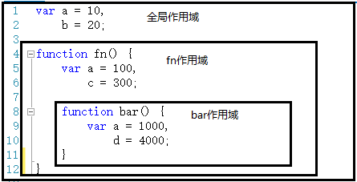

作用域有上下级关系，上下级关系的确定就看函数是在哪个作用域下创建的。

如上：`fn` 作用域下创建了`bar`函数，那么“fn作用域”就是“bar作用域”的上级。

作用域最大的用处就是**隔离变量**，不同作用域下同名变量不会有冲突。

**<font style="color:rgb(37, 41, 51);">作用域链</font>**

<font style="color:rgb(37, 41, 51);">当使用一个变量的时候：首先js引擎会在当前作用域下去寻找，如果没找到 就会向上级作用域去查，直到找到该变量或查到全局作用域，这么一个查找过程形成的链条就叫做</font>**<font style="color:rgb(37, 41, 51);">作用域链</font>**

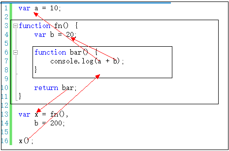

***

### let 、var、const的区别

|  | **const** | **let** | **var** |
| --- | --- | :---: | :---: |
| 全局污染 | 没有 | | 声明的变量挂到window了 |
| 暂存性死区 | 存在暂存性死区 | | 不存在 |
| 块级作用域 | 块级作用域 | | 没有块级作用域 |
| 变量提升 | 不支持变量提升 | | 支持变量提升 |
| 重复声明 | 不允许重复声明同名变量 | | 可以重复声明变量，后声明的同名变量会覆盖之前声明的变量 |
| 声明赋值 | 声明同时必须赋值 | 可以先声明再赋值 | |
| 修改 | 声明的是常量不可以修改 | 声明赋值后变量值还可以修改 | |

> 浏览器的全局对象是**window**，Node的全局对象是**global**
>
> \*\*暂时性死区（TDZ）：\*\*在使用let、const命令声明变量之前，该变量都是不可用的（报错），var 可以使用 打印出来 undefined
>
> **变量提升**：即变量可以在声明之前使用
>
> **块级作用域**（Block Scope）：指通过大括号（{}）包裹的代码块的作用域

```javascript
let x
x = 1
console.log(x) // 1

const x
x = 1
console.log(x) // Uncaught SyntaxError: Missing initializer in const declaration

function fun() {
  let a = 1;
  if (a === 1) {
    var b = 2;
    let c = 3;

    for(var i = 0; i < 5; i++){
      console.log(i); // 0 1 2 3 4
    }
  }
  console.log(i) // 5
  console.log(b) // 2
  console.log(c) // c is not defined
}
fun()
```

***

### \[原型、原型链]\(https://www.yuque.com/hutaoao/blog/ykatkt81m36olm1g?singleDoc# 《原型和原型链理解》)

JS 每个**函数**都有 `prototype` 属性 称之为原型，因为这个属性的值是个对象，也称之为 \*\*原型对象：\*\*用来存放一些属性和方法，共享给实例对象使用；

所有实例对象都有一个\*\* \*\*<code><font style="color:rgb(33, 37, 41);">__proto__</font></code> 属性，这个属性指向它的原型对象，所以<font style="color:#DF2A3F;">实例对象都会继承这个原型对象的属性和方法</font>；

原型对象（prototype）上也有一个\*\* **<font style="color:rgb(33, 37, 41);">**proto**</font>** **属性 指向 Object 原型对象，而 Object 原型对象的** **<font style="color:rgb(33, 37, 41);">**proto**</font>** \*\*指向的是 null。

<font style="color:#F5222D;">当我们访问对象的某个属性时，就会从实例对象，原型对象，Object原型对象上层层寻找，形成的链式结构称为</font>**<font style="color:#F5222D;">原型链</font>**<font style="color:#F5222D;">。</font>

```javascript
function Person() {
    console.log(1)
}
Person.prototype.name = 'bob'
let person = new Person() // 1

// person.__proto__ 指向 Person.prototype
console.log(person.__proto__, person.__proto__ === Person.prototype) // {name: "bob", [[Prototype]]: Object} true

// person.__proto__.__proto__ 指向Object.prototype
console.log(person.__proto__.__proto__) // {}

// 下面 Object.prototype 指向了 null
console.log(person.__proto__.__proto__.__proto__) // null
```

> 原型的作用：JS语言要实现面向对象，避免了类型的丢失。

***

### GET和POST区别

* **协议层面：语意区别**，GET表示获取数据 PSOT表示提交一些东西；
* \*\*应用层面：\*\*GET请求体为空（不是没有请求体）；
* **浏览器层面：**

| GET | POST |
| --- | --- |
| **参数URL可见**<br/>+ 参数保留在浏览器历史中<br/>+ 能被缓存<br/>+ 相对安全性较差 | 参数URL不可见，<font style="color:#121212;">存放在HTTP的包体内</font><br/>+ <font style="color:#121212;">参数不会保存在浏览器历史中</font><br/>+ <font style="color:#121212;">不能缓存</font><br/>+ 相对安全性较好 |
| URL长度有限制（浏览器限制） | 无限制 |
| 只能发送 ASCII 字符 | 没有限制。也允许二进制数据 |
| <font style="color:#121212;">只URL编码</font> | <font style="color:#121212;">支持多种编码方式</font> |

get和post请求缓存补充：

> * <font style="color:rgb(37, 41, 51);">get 请求类似于查找的过程，用户获取数据，可以不用每次都与数据库连接，所以</font>**<font style="color:rgb(37, 41, 51);">可以使用缓存</font>**<font style="color:rgb(37, 41, 51);">。</font>
> * <font style="color:rgb(37, 41, 51);">post 不同，post做的一般是修改和删除的工作，所以必须与数据库交互，所以</font>**<font style="color:rgb(37, 41, 51);">不能使用缓存</font>**<font style="color:rgb(37, 41, 51);">。因此get请求适合于请求缓存。</font>

***

### <font style="color:rgb(37, 41, 51);">get 请求传参长度的误区</font>

误区：我们经常说get请求参数的大小存在限制，而post请求的参数大小是无限制的

**实际上HTTP 协议从未规定 GET/POST 的请求长度限制是多少**。对get请求参数的**限制是来源于浏览器或web服务器**，浏览器或web服务器限制了url的长度。为了明确这个概念，我们必须再次强调下面几点:

1. HTTP 协议 未规定 GET 和POST的长度限制
2. GET的最大长度显示是因为 浏览器和 web服务器限制了 URI的长度
3. 不同的浏览器和WEB服务器，限制的最大长度不一样
4. 要支持IE，则最大长度为2083byte，若只支持Chrome，则最大长度 8182byte

***

### JS用递归的方式写1到100求和 - 闭包

```javascript
function sumToN(n) {
  if (n === 1) {
    return 1;
  } else {
    return n + sumToN(n - 1);
  }
}

console.log(sumToN(100)); // 输出5050
```

***

### target、currentTarget的区别

<code><font style="color:rgb(30, 31, 36);">target</font></code><font style="color:rgb(30, 31, 36);">和</font><code><font style="color:rgb(30, 31, 36);">currentTarget</font></code><font style="color:rgb(30, 31, 36);">都是事件对象（Event Object）中的属性</font>

* **<font style="color:#F5222D;">target</font>** <font style="color:rgb(30, 31, 36);">属性代表触发事件的DOM元素；</font>在事件流的目标阶段；<font style="color:rgb(30, 31, 36);">不会随着事件在DOM树中的传递而改变。</font>
* **<font style="color:#F5222D;">currentTarget</font>** <font style="color:rgb(30, 31, 36);">属性表示当前正在处理事件的元素，这可能是事件的源头，也可能不是</font>；在事件流的捕获、目标及冒泡阶段；<font style="color:rgb(30, 31, 36);">可能会随着事件在DOM树中的传递而改变。</font>

> <font style="color:rgb(30, 31, 36);">如果你只关心事件最初发生的元素，可以使用target；</font>
>
> <font style="color:rgb(30, 31, 36);">如果你需要跟踪事件在整个DOM树中的传递过程，可以使用currentTarget。</font>

***

### export和export default的区别

1. **<font style="color:rgb(30, 31, 36);">数量不同</font>**<font style="color:rgb(30, 31, 36);">：export可以导出多个；export default只能默认的，只能有一个。</font>
2. **<font style="color:rgb(30, 31, 36);">使用时的语法不同</font>**<font style="color:rgb(30, 31, 36);">：export default导入导出时不用加</font><code><font style="color:rgb(30, 31, 36);">{}</font></code><font style="color:rgb(30, 31, 36);">；export 导入导出一般 要加</font><code><font style="color:rgb(30, 31, 36);">{}</font></code><font style="color:rgb(30, 31, 36);">。</font>

```javascript
export default  xxx
import xxx from './'

export xxx
import {xxx} from './'
```

***

### 什么是会话cookie，什么是持久cookie

**会话cookie（Session Cookie）**：只在当前浏览器会话期间有效，当用户关闭浏览器时，会话cookie会被自动删除。主要用于在用户访问网站时保存用户的登录状态，以及其他与当前会话相关的信息。

**持久cookie（Persistent Cookie）**：在浏览器关闭后仍然存在，并在**指定的过期日期**之前一直有效。它们通常用于跟踪用户的偏好设置、记录用户的登录状态，以及实现其他**需要长时间保存**的功能。持久cookie可以设置一个过期日期，当超过该日期时，cookie将自动过期并被删除。

> `cookie`如果没有指定有效期，那么这个 Cookie 就是 Session Cookie，只在当前会话（Session）有效，如果关闭浏览器，那么 Cookie 就会被删除。

***

### 浏览器缓存机制

<font style="color:rgb(30, 31, 36);">指的是通过在一段时间内保留已接收到的web资源的一个副本。如果发起了对这个资源的再一次请求，那么浏览器会直接使用缓存的副本，而不是向服务器发起请求。</font>

其机制是<font style="color:#F5222D;">根据 </font><code><font style="color:#F5222D;">HTTP</font></code><font style="color:#F5222D;"> 报文的缓存标识（头部信息）来控制缓存行为。</font>

***

### documen.write和 innerHTML的区别

* document.write 只能重绘整个页面
* innerHTML 可以重绘页面的一部分

***

### 什么叫优雅降级和渐进增强

<font style="color:rgb(30, 31, 36);">优雅降级和渐进增强是两种</font>**<font style="color:rgb(30, 31, 36);">前端开发策略</font>**<font style="color:rgb(30, 31, 36);">，它们都</font>**<font style="color:rgb(30, 31, 36);">旨在提高网站或应用的可用性和可访问性</font>**

* **<font style="color:#F5222D;">优雅降级</font>**：它要求首先构建一个完整、功能齐全的网站或应用，然后逐步移除或降低某些功能，直到只留下最基本的、满足所有用户需求的功能。

> <u><font style="color:#F5222D;">针对低版本浏览器进行构建页面，完成基本的功能。</font></u>

* **<font style="color:#F5222D;">渐进增强</font>**：它要求首先构建一个基本的、能够满足所有用户需求的网站或应用，然后逐步添加更多的特性和功能，以提供更好的用户体验

> <u><font style="color:#F5222D;">针对最高级、最完善的浏览器进行构建页面，追求完整功能。</font></u>

***

### \[JS 如何实现继承]\(https://www.yuque.com/hutaoao/blog/ev5d9atz0o87akx0?singleDoc# 《JS如何实现继承》)

1. 原型链继承
2. 借用构造函数继承
3. 组合继承(原型+借用构造)
4. 原型式继承
5. 寄生式继承
6. 寄生组合式继承

***

### \[Ajax原理、过程及如何中断]\(https://www.yuque.com/hutaoao/blog/hok4og?singleDoc# 《Ajax 介绍及使用》)

**核心：**

1. Ajax就是<font style="color:#F5222D;">异步的 JS 和 XML</font>（目前我们一般用JSON代替XML）
2. Ajax主要用于<font style="color:#F5222D;">不刷新页面</font>的情况下浏览器发起请求并接受响应，<font style="color:#F5222D;">局部更新</font>
3. Ajax核心点是 <font style="color:#F5222D;">XMLHttpRequest</font> 对象

**缺点：**

1. 不能进行跨域访问（解决：<font style="color:#F5222D;">JSONP、CORS</font>）

**过程：**

1. 创建XMLHttpRequest对象；
2. 连接服务器（使用 open 方法），并指定请求方式、URL等；
3. 发送HTTP请求（使用 send 方法）；
4. 获取返回数据（xhr.onreadystatechange）,根据状态码（xhr.readyState）判断。

**如何中断：**

1. 设置超时时间让ajax自动断开；
2. 手动停止ajax请求；

> 其核心是调用XML对象的abort方法，<font style="color:#F5222D;">ajax.abort()</font>

***

### 同源策略及跨域解决方案

【协议+域名+端口号】相同，即为同源，只能向同源的服务发起AJAX请求。

是浏览器的基本安全策略，否则会很容易受到XSS、CSRF攻击。

**实现跨域请求：**

* \*\*JSONP（JSON with padding）：\*\*借助于`<script>`标签元素，因为`<script>`的`src`可以访问任何站点的资源，需要服务端对应接口支持，所以是需要双方约定好；仅支持GET方式请求，通过回调函数来接收数据；
* \*\*CORS：\*\*原理就是在请求头加入一个身份来源标识，服务端根据这个标识来判等是否允许访问；
* \*\*WebSocket：\*\*WebSocket可以实现浏览器与服务端的双向通信，允许跨域通讯；
* \*\*iframe+postMessage：\*\*使用window.postMessage()来实现窗口之间的通信；
* \*\*nginx反向代理：\*\*生产环境常用做法；
* \*\*node服务代理：\*\*本地开发常用做法。

***

### CORS（跨域资源共享）

**<font style="color:#F5222D;">CORS </font>**<font style="color:#121212;">是一种新标准，</font><font style="color:#F5222D;">支持同源通信，也支持跨域通信，</font><font style="color:#121212;">fetch是实现CORS通信的。</font>

CORS需要浏览器和服务器同时支持，实现CORS通信的关键是服务器。只要服务器实现了CORS接口（<font style="color:rgb(30, 31, 36);">CORS 通过在服务器端设置特殊的 HTTP 头部信息来实现跨域资源共享</font>），就可以跨源通信。

CORS**简单请求**和**预检请求**的区别如下：

1. **简单请求**：

请求方式：[GET](https://so.csdn.net/so/search?q=GET\&spm=1001.2101.3001.7020)、POST、HEAD 三者之一

请求头(仅包含安全的字段，常见的安全字段如下）：

```
- Accept
- Accept-Language
- Content-Language
- DPR
- Downlink
- Save-Data
- Viewport-Width
- Width 
- Content-Type
```

Content-Type：只有三个值 text/plain、multipart/form-data、application/x-www-form-urlencoded

**<font style="color:rgb(79, 79, 79);"></font>**

2. **预检请求**：

<font style="color:rgb(77, 77, 77);">只要符合以下任何一个条件的请求，都需要进行预检请求：  </font>

```
- <font style="color:rgb(51, 51, 51);">请求方式为 GET、POST、HEAD 之外的请求 Method 类型  </font>
- <font style="color:rgb(51, 51, 51);">请求头中包含自定义头部字段  </font>
- <font style="color:rgb(51, 51, 51);">向服务器发送了 application/json 格式的数据</font>
```

* **请求方式**：简单请求只发起一次网络请求；预检请求会发起两次请求，先发起一个option请求，获得服务器响应后才会发起真正的请求；
* **请求头信息**：简单请求是指请求方法是HEAD、GET、POST之一，并且Content-Type的值只限于text/plain、multipart/form-data、application/x-www-form-urlencoded，同时请求头中只包含Accept等字段；预检请求则没有这些限制。

***

### 异步加载和延迟加载

1. 异步加载的方案： 动态插入script标签
2. 通过ajax去获取js代码，然后通过eval执行
3. script标签上添加defer或者async属性
4. 创建并插入iframe，让它异步执行js
5. 延迟加载：有些 js 代码并不是页面初始化的时候就立刻需要的，而稍后的某些情况才需要的。

***

### http和https协议有什么区别

> http: 是互联网上应用最为广泛的一种网络协议，是一个客户端和服务器端请求和应答的标准（`TCP`
>
> ），用于从`WWW`服务器传输超文本到本地浏览器的传输协议，它可以使浏览器更加高效，使网络传输减少
>
> https: 是以安全为目标的HTTP通道，简单讲是 `HTTP` 的安全版，即 `HTTP` 下加入 `SSL` 层，`HTTPS` 的安全基础是 `SSL` ，因此加密的详细内容就需要 `SSL`

* <code><font style="color:#F5222D;">http</font></code> 是<font style="color:#F5222D;">超文本传输协议</font>，信息是<font style="color:#F5222D;">明文传输</font>，<code><font style="color:#F5222D;">https</font></code> 则是<font style="color:#F5222D;">具有安全性的 </font><code><font style="color:#F5222D;">ssl</font></code><font style="color:#F5222D;"> 加密传输协议</font>
* `http` 和 `https` 使用的是完全<font style="color:#F5222D;">不同的连接方式</font>，用的<font style="color:#F5222D;">端口也不同</font>，前者是 `80` ，后者是 `443`
* `http` 的连接很简单，是<font style="color:#F5222D;">无状态</font>的；`HTTPS` 协议是由 `SSL+HTTP` 协议构建的可进行加密传输、身份认证的网络协议，比 `http` 协议安全

***

### http的响应码及含义

**<font style="color:#F5222D;">1xx(临时响应)</font>**

* 100: 请求者应当继续提出请求。
* 101(切换协议) 请求者已要求服务器切换协议，服务器已确认并准备进行切换。

**<font style="color:#F5222D;">2xx(成功)</font>**

* 200：正确的请求返回正确的结果
* 201：表示资源被正确的创建。比如说，我们 POST 用户名、密码正确创建了一个用户就可以返回 201。
* 202：请求是正确的，但是结果正在处理中，这时候客户端可以通过轮询等机制继续请求。

**<font style="color:#F5222D;">3xx(已重定向)</font>**

* 300：请求成功，但结果有多种选择。
* 301：请求成功，但是资源被永久转移。
* 303：使用 GET 来访问新的地址来获取资源。
* 304：请求的资源并没有被修改过

**<font style="color:#F5222D;">4xx(请求错误)</font>**

* 400：请求出现错误，比如请求头不对等。
* 401：没有提供认证信息。请求的时候没有带上 Token 等。
* 402：为以后需要所保留的状态码。
* 403：请求的资源不允许访问。就是说没有权限。
* 404：请求的内容不存在。

**<font style="color:#F5222D;">5xx(服务器错误)</font>**

* 500：服务器错误。
* 501：请求还没有被实现。

***

### 你有哪些性能优化的方法

1. 减少http请求次数：CSS Sprites, JS、CSS源码压缩、图片大小控制合适；网页Gzip，CDN托管，data缓存 ，图片服务器。
2. 前端模板 JS+数据，减少由于HTML标签导致的带宽浪费，前端用变量保存AJAX请求结果，每次操作本地变量，不用请求，减少请求次数
3. 用innerHTML代替DOM操作，减少DOM操作次数，优化javascript性能。
4. 当需要设置的样式很多时设置className而不是直接操作style。
5. 少用全局变量、缓存DOM节点查找的结果。减少IO读取操作。
6. 避免使用CSS Expression（css表达式)又称Dynamic properties(动态属性)。
7. 图片预加载，将样式表放在顶部，将脚本放在底部  加上时间戳。

***

### 事件绑定和普通事件有什么区别

**普通添加事件的方法：**

```javascript
var btn = document.getElementById("box");
btn.onclick = function(){
	alert(1);
}
btn.onclick = function(){
	alert(2);
}
```

执行上面的代码只会 alert <font style="color:#F5222D;">2</font> ；

**事件绑定方式添加事件：**

```javascript
var btn = document.getElementById("box");
btn.addEventListener("click",function(){
	alert(1);
},false);
btn.addEventListener("click",function(){
	alert(2);
},false);
```

执行上面的代码会先 alert 1 再 alert 2；

> <font style="color:#F5222D;">普通添加事件的方法不支持添加多个事件，最下面的事件会覆盖上面的，而事件绑定（addEventListener）方式添加事件可以添加多个。</font>

***

### [call、apply 和 bind 的区别](https://www.yuque.com/hutaoao/blog/vyz4zv)

**相同点：**<font style="color:#F5222D;">为了改变函数体内部 this 的指向</font>。

**不同点：**

<font style="color:#F5222D;">参数书写方式不同</font>：call(thisObj, arg1, arg2, arg3)；apply(thisObj, \[arg1, arg2, arg3])；

thisObj：call 和apply <font style="color:#F5222D;">第一个参数都是 this 的指向对象</font>；

**call** 的参数是直接放进去的，第二第三第 n 个参数全都用逗号分隔；

**apply** 的所有参数都必须放在一个<font style="color:#F5222D;">数组</font>里面传进去；

**bind** 除了<font style="color:#F5222D;">返回是函数</font>以外，它的参数和 call 一样。

* <font style="background-color:#F8FAFC;">call/apply 改变了函数的 this 上下文后马上</font>**<font style="background-color:#F8FAFC;">执行该函数</font>**
* <font style="background-color:#F8FAFC;">bind 则是返回改变了上下文后的函数,</font>**<font style="background-color:#F8FAFC;">不执行该函数</font>**

> 三者的参数不限定是 string 类型，允许是各种类型，包括函数 、 object 等等！
>
> 注意：调用 call / apply / bind 的必须是个函数<font style="color:#1C1F21;background-color:#F8FAFC;"></font>

***

### Javascript的本地对象，内置对象和宿主对象

1. **本地对象**：

本地对象是ECMAScript规范中定义的对象，它们不依赖于宿主环境（如浏览器或Node.js）。这些对象在所有的ECMAScript环境中都是可用的。

```
- **<font style="color:rgb(30, 31, 36);">核心对象</font>**<font style="color:rgb(30, 31, 36);">：如</font><font style="color:rgb(30, 31, 36);">Object</font><font style="color:rgb(30, 31, 36);">,</font><font style="color:rgb(30, 31, 36);"> </font><font style="color:rgb(30, 31, 36);">Function</font><font style="color:rgb(30, 31, 36);">,</font><font style="color:rgb(30, 31, 36);"> </font><font style="color:rgb(30, 31, 36);">Array</font><font style="color:rgb(30, 31, 36);">,</font><font style="color:rgb(30, 31, 36);"> </font><font style="color:rgb(30, 31, 36);">String</font><font style="color:rgb(30, 31, 36);">,</font><font style="color:rgb(30, 31, 36);"> </font><font style="color:rgb(30, 31, 36);">Boolean</font><font style="color:rgb(30, 31, 36);">,</font><font style="color:rgb(30, 31, 36);"> </font><font style="color:rgb(30, 31, 36);">Number</font><font style="color:rgb(30, 31, 36);">,</font><font style="color:rgb(30, 31, 36);"> </font><font style="color:rgb(30, 31, 36);">Date</font><font style="color:rgb(30, 31, 36);">,</font><font style="color:rgb(30, 31, 36);"> </font><font style="color:rgb(30, 31, 36);">RegExp</font><font style="color:rgb(30, 31, 36);">,</font><font style="color:rgb(30, 31, 36);"> </font><font style="color:rgb(30, 31, 36);">Error</font><font style="color:rgb(30, 31, 36);">等。</font>
- **<font style="color:rgb(30, 31, 36);">数学对象</font>**<font style="color:rgb(30, 31, 36);">（</font><font style="color:rgb(30, 31, 36);">Math</font><font style="color:rgb(30, 31, 36);">）：提供了一系列数学相关的方法和常量。</font>
- **<font style="color:rgb(30, 31, 36);">JSON对象</font>**<font style="color:rgb(30, 31, 36);">（</font><font style="color:rgb(30, 31, 36);">JSON</font><font style="color:rgb(30, 31, 36);">）：用于处理JSON数据。</font>
- **<font style="color:rgb(30, 31, 36);">其他内置对象</font>**<font style="color:rgb(30, 31, 36);">：如decodeURI, encodeURI, decodeURIComponent, encodeURIComponent等全局函数。</font>
```

2\. **内置对象**：

但通常指的是那些全局可用的构造函数和函数，内置对象通常也是本地对象的一部分，但这里强调的是它们的全局可访问性。

```
- **<font style="color:rgb(30, 31, 36);">全局对象</font>**<font style="color:rgb(30, 31, 36);">（在浏览器中是</font><font style="color:rgb(30, 31, 36);">window</font><font style="color:rgb(30, 31, 36);">，在Node.js中是</font><font style="color:rgb(30, 31, 36);">global</font><font style="color:rgb(30, 31, 36);">）：代表了全局作用域，并提供了许多全局函数和变量。</font>
- **<font style="color:rgb(30, 31, 36);">全局函数</font>**<font style="color:rgb(30, 31, 36);">：如</font><font style="color:rgb(30, 31, 36);">eval()</font><font style="color:rgb(30, 31, 36);">,</font><font style="color:rgb(30, 31, 36);"> </font><font style="color:rgb(30, 31, 36);">isNaN()</font><font style="color:rgb(30, 31, 36);">,</font><font style="color:rgb(30, 31, 36);"> </font><font style="color:rgb(30, 31, 36);">parseFloat()</font><font style="color:rgb(30, 31, 36);">,</font><font style="color:rgb(30, 31, 36);"> </font><font style="color:rgb(30, 31, 36);">parseInt()</font><font style="color:rgb(30, 31, 36);">等。</font>
- **<font style="color:rgb(30, 31, 36);">其他构造函数</font>**<font style="color:rgb(30, 31, 36);">：如Array, Function, Date, RegExp等，它们不仅是构造函数，也是内置对象。</font>
```

3\. **宿主对象**

由JavaScript运行环境（宿主环境）提供的对象；

```
- 在浏览器中，宿主对象通常指的是由DOM（文档对象模型）提供的对象，如document, window, location, navigator等。
- 在Node.js中，宿主对象可能指的是与文件系统、网络、进程等交互的模块和对象。
```

***

### Javascript 中的this理解

this 的值取决于函数是如何被调用的。在对象的方法中，this 指向调用该方法的对象；在构造函数中，this 指向新创建的对象实例；在箭头函数中，this 继承自包围它的函数或全局作用域；在事件监听器的回调函数中，this 指向触发事件的元素。此外，你还可以使用 call、apply 或 bind 方法来显式地设置 this 的值。

1. this 总是指向函数的直接调用者（而非间接调用者）

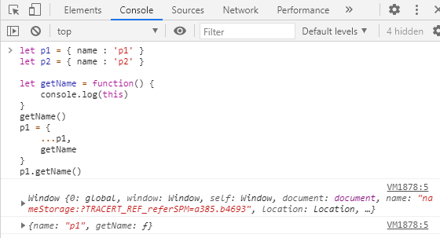

2. 如果有new关键字，this 指向 new 出来的那个对象

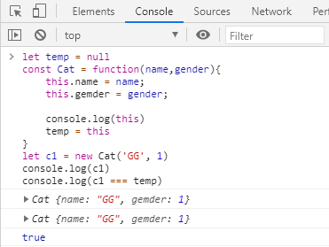

3. 在DOM 事件中，this 指向目标元素
4. 箭头函数的 this 指向他所在的函数级作用域，并且不可改变

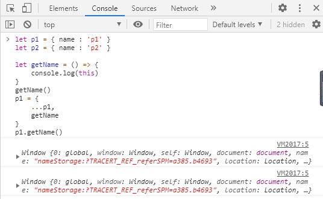

***

### Javascript 中 new操作符new对象，内部发生了什么

1. <font style="color:#F5222D;">创建一个空对象</font>（即{ } ）；
2. <font style="color:#F5222D;">设置原型链：</font>这个新创建的对象的\[\[Prototype]]（原型）被设置为构造函数的prototype对象，这使得新对象可以继承原型的属性和方法。
3. <font style="color:#F5222D;">绑定构造函数：</font>new操作符将当前上下文绑定到构造函数上，这意味着在构造函数中this关键字将指向新创建的对象（<font style="color:#DF2A3F;">改变this指向</font>）
4. <font style="color:#F5222D;">返回新对象：</font>如果构造函数成功地返回了一个对象，那么这个对象就会被返回。否则，new操作符会返回undefined。

```javascript
function Person(name) {
  this.name = name;
}

var john = new Person('John');
console.log(john.name); // 输出 'John'
```

在这个例子中，new Person('John')创建了一个新的空对象，并把它的原型设置为Person.prototype。然后，构造函数Person(name)被调用，并且其内部的this被绑定到新创建的对象。最后，由于构造函数返回了新创建的对象（没有显式返回其他值），所以这个新创建的对象被赋值给变量john。

***

### 函数声明和函数表达式

**函数声明：\*\*\*\*<font style="color:#F5222D;">变量提升 - </font>**<font style="color:rgb(30, 31, 36);">使用</font><code><font style="color:rgb(30, 31, 36);">function</font></code><font style="color:rgb(30, 31, 36);">关键字来声明一个函数</font>

```javascript
fn(); //在函数声明之后调用 fn，可以正常调用。因为 fn 被提前到最前面定义了。
function fn () {
	console.log('hello word')
}
```

\*\*函数表达式：\*\*在一个表达式中创建一个函数

```javascript
fn(); // 在函数表达式之前调用函数，报错。因为这时候还没有 fn 这个变量。

// 匿名函数表达式
var fn = function () {
	console.log('hello word')
}

// 具名函数表达式
var fn = function test() {
	console.log('hello word')
}
```

***

### Javascript中的严格模式

**启用更严格的解析和执行规则**。使用严格模式有助于编写更安全、更稳定、更少出错的代码。

1. 只要在 .js 文件第一行增加 'use strict' 的声明，这就是告诉解释器开启严格模式
2. 在严格模式下 this 不会指向 window 而是指向 undefined

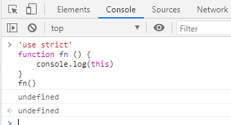

3. 消除 js 不合理，不严谨地方，减少怪异行为

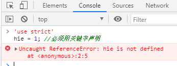

4. 帮助我们养成良好的编码习惯

***

### eval 解释器

<font style="color:rgb(30, 31, 36);"> </font><font style="color:rgb(30, 31, 36);">是 JavaScript 中的一个</font>**<font style="color:rgb(30, 31, 36);">内置函数</font>**<font style="color:rgb(30, 31, 36);">，它可以</font>**<font style="color:rgb(30, 31, 36);">将传入的字符串作为 JavaScript 代码进行解析和执行</font>**<font style="color:rgb(30, 31, 36);">。</font>

1. 正因为如此，他的**执行效率特别慢**，因为要编译一次然后执行一次
2. eval 中声明的**变量是不会被提升**的

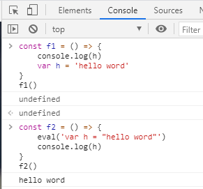

***

### 深度克隆（拷贝）和浅克隆（拷贝）

**区分**：假设B复制了A，当修改A时，看B是否会发生变化，如果B也跟着变了，说明这是浅拷贝；如果B没变，那就是深拷贝。

**浅拷贝（****<font style="color:rgb(30, 31, 36);">Shallow Copy</font>****）**：浅拷贝只是拷贝一层，<font style="color:#DF2A3F;">复制对象的引用</font> - 意味着复制的对象会受到原始对象的影响

1. for···in：只循环第一层
2. Object.assign(target, ...sources)

**深拷贝（Deep Copy）**：复制对象的所有层级和嵌套数据，<font style="color:#DF2A3F;">创建完全独立的副本</font> - 意味着复制的对象不会受到原始对象的影响

1. JSON.parse(JSON.stringify(obj)); - 不能处理函数和循环引用的对象
2. 通过jQuery的extend方法实现深拷

```javascript
var array = [1,2,3,4];
var newArray = $.extend(true,[],array); // true为深拷贝，false为浅拷贝
```

3. 采用递归去拷贝所有层级属性

```javascript
function deepCopy(obj, hash = new WeakMap()) {
  // 如果obj是null或者不是对象，直接返回
  if (obj == null || typeof obj !== 'object') {
    return obj;
  }

  // 如果obj是日期对象，则创建一个新的日期对象
  if (obj instanceof Date) {
    return new Date(obj);
  }

  // 如果obj是RegExp对象，则创建一个新的RegExp对象
  if (obj instanceof RegExp) {
    return new RegExp(obj);
  }

  // 如果obj已经在hash中存在，则直接返回
  if (hash.has(obj)) {
    return hash.get(obj);
  }

  let newObj = new obj.constructor();

  // 将新对象加入hash中
  hash.set(obj, newObj);

  for (let key in obj) {
    if (obj.hasOwnProperty(key)) {
      newObj[key] = deepCopy(obj[key], hash);
    }
  }

  return newObj;
}

let originalObject = {
  name: 'John',
  age: 30,
  address: {
    city: 'New York',
    country: 'USA'
  },
  func: function() { console.log('Hello'); },
  date: new Date(),
  regex: /ab+c/
};

let copiedObject = deepCopy(originalObject);

console.log(copiedObject); // { name: 'John', age: 30, address: { city: 'New York', country: 'USA' }, func: [Function], date: Date, regex: /ab+c/ }
```

4. <font style="color:#121212;">Array 的 slice 和 concat 方法 返回新数组</font>

***

### 什么时候执行栈

也称作：调用栈、运行栈

是计算机程序运行时内存管理的重要组成部分，遵循后进先出的原则。主要用于存储函数调用的上下文信息，比如局部变量、函数参数、返回地址等等，

工作原理：

1. 函数调用时的栈帧创建
2. 栈帧的入栈和出栈
3. 返回地址的保持和恢复

作用：

1. 管理函数调用
2. 优化内存使用
3. 异常处理

***

### JS执行机制 - 事件循环/1

JS 是**单线程**的，通过**事件循环**来调度任务：事件循环不断地从任务队列中取出任务，执行它们，然后进入下一个任务，直到所有任务都完成。

1. 先执行执行栈中的同步任务
2. 异步任务（回调函数）放入任务队列中
3. 一旦执行栈中的所有同步任务执行完毕，系统就会按次序读取任务队列中的异步任务。
4. 直到所有任务都执行完

**<font style="color:#DF2A3F;">同步任务进入主线程，即主执行栈，异步任务进入任务队列，主线程内的任务执行完毕后，会去任务队列读取对应的任务，推入主线程执行。上述过程的不断重复就是【事件循环】</font>**

***

### **JS执行机制 - 事件循环/2**

<font style="color:rgb(30, 31, 36);">JavaScript 的事件循环（Event Loop）机制是 JavaScript 运行时环境（如浏览器或 Node.js）</font><font style="color:#DF2A3F;">用来处理异步操作和回调的一种重要方式</font><font style="color:rgb(30, 31, 36);">。</font><font style="color:#DF2A3F;">它使得 JavaScript 能够在执行单线程代码的同时，仍然能够响应用户输入、网络请求等异步事件。</font>

<font style="color:rgb(30, 31, 36);">下面是 JavaScript 事件循环机制的基本工作原理：</font>

1. **<font style="color:rgb(30, 31, 36);">调用栈（Call Stack）</font>**<font style="color:rgb(30, 31, 36);">：</font>
   * <font style="color:rgb(30, 31, 36);">JavaScript 引擎有一个单一的线程，该线程有一个调用栈来跟踪在这个线程上执行的函数调用。调用栈是一种后进先出（LIFO）的数据结构，它记录了当前执行上下文的函数调用。</font>
2. **<font style="color:rgb(30, 31, 36);">同步代码执行</font>**<font style="color:rgb(30, 31, 36);">：</font>
   * <font style="color:rgb(30, 31, 36);">当 JavaScript 代码开始执行时，它会按照代码的顺序，一行一行地将同步函数压入调用栈并执行。只有当调用栈为空时，JavaScript 引擎才会考虑执行异步任务。</font>
3. **<font style="color:rgb(30, 31, 36);">Web APIs</font>**<font style="color:rgb(30, 31, 36);">：</font>
   * <font style="color:rgb(30, 31, 36);">浏览器提供了一些 Web APIs（如</font><font style="color:rgb(30, 31, 36);"> </font><font style="color:rgb(30, 31, 36);">setTimeout</font><font style="color:rgb(30, 31, 36);">,</font><font style="color:rgb(30, 31, 36);"> </font><font style="color:rgb(30, 31, 36);">fetch</font><font style="color:rgb(30, 31, 36);">,</font><font style="color:rgb(30, 31, 36);"> </font><font style="color:rgb(30, 31, 36);">addEventListener</font><font style="color:rgb(30, 31, 36);"> </font><font style="color:rgb(30, 31, 36);">等），这些 API 允许 JavaScript 与浏览器环境进行交互，并执行一些异步操作。当这些异步操作完成时，它们的结果会被添加到任务队列（Task Queue）或微任务队列（Microtask Queue）中等待处理。</font>
4. **<font style="color:rgb(30, 31, 36);">任务队列与微任务队列</font>**<font style="color:rgb(30, 31, 36);">：</font>
   * <font style="color:rgb(30, 31, 36);">任务队列（Task Queue）和微任务队列（Microtask Queue）都是存放待处理任务的队列。任务队列通常存放宏任务（macrotask），如</font><font style="color:rgb(30, 31, 36);"> </font><font style="color:rgb(30, 31, 36);">setTimeout</font><font style="color:rgb(30, 31, 36);">、</font><font style="color:rgb(30, 31, 36);">setInterval</font><font style="color:rgb(30, 31, 36);">、UI 渲染、用户交互事件等；而微任务队列存放微任务（microtask），如</font><font style="color:rgb(30, 31, 36);"> </font><font style="color:rgb(30, 31, 36);">Promise</font><font style="color:rgb(30, 31, 36);"> </font><font style="color:rgb(30, 31, 36);">的回调、</font><font style="color:rgb(30, 31, 36);">process.nextTick</font><font style="color:rgb(30, 31, 36);">（Node.js）等。</font>
5. **<font style="color:rgb(30, 31, 36);">事件循环</font>**<font style="color:rgb(30, 31, 36);">：</font>
   * <font style="color:rgb(30, 31, 36);">当调用栈为空时，事件循环会检查微任务队列。如果微任务队列中有任务，事件循环会将其全部取出并执行，直到微任务队列为空。这个过程会不断重复，直到微任务队列中再也没有任务。</font>
   * <font style="color:rgb(30, 31, 36);">微任务队列清空后，事件循环会检查任务队列。如果任务队列中有任务，它会取出一个任务并执行。这个任务可能是一个事件回调、一个</font><font style="color:rgb(30, 31, 36);"> </font><font style="color:rgb(30, 31, 36);">setTimeout</font><font style="color:rgb(30, 31, 36);"> </font><font style="color:rgb(30, 31, 36);">的回调等。执行这个任务时，如果有新的微任务产生，它们会被添加到微任务队列中，等待下一轮的事件循环处理。</font>
   * <font style="color:rgb(30, 31, 36);">这个过程会一直循环下去，直到任务队列和微任务队列都为空，并且没有更多的异步任务产生。</font>

<font style="color:rgb(30, 31, 36);">通过这种方式，JavaScript </font><font style="color:#DF2A3F;">能够在不阻塞单线程的情况下处理异步操作，并且保证了异步操作的执行顺序（</font><font style="color:rgb(30, 31, 36);">微任务先于宏任务，同一类型的任务按照它们被添加到队列的顺序执行）。</font>

> <font style="color:rgb(30, 31, 36);">需要注意的是，虽然事件循环使得 JavaScript 能够处理异步操作，但过度使用或滥用异步操作也可能导致性能问题或难以调试的代码。</font>

***

### 同步和异步任务

JS 特点是单线程（同一时间只能做同一件事）

\*\*同步：\*\*前一个任务执行完成后再执行下一个任务（<font style="color:#F5222D;">一次只能做一个任务</font>）

**异步**：执行一个任务的同时还可以去执行下一个任务（<font style="color:#F5222D;">可以同时做多个任</font><font style="color:#F5222D;">务</font>）

> setTimeout、setInterval、Ajax异步请求、ES6的Promise

***

### JS 是单线程的，为什么 JS 能有异步任务？

`JavaScript`是一门**单线程**的语言，意味着\_同一时间内只能做一件事\_，但它可以通过\[**事件循环**]\(https://www.yuque.com/hutaoao/blog/stzz5w8l82ntu6cw?singleDoc# 《事件循环的理解》)机制来处理异步任务。

**<font style="color:#DF2A3F;">事件循环</font>\*\*\*\*<font style="color:rgb(30, 31, 36);">允许</font>**<font style="color:rgb(30, 31, 36);"> JS 在等待异步操作（如网络请求或定时器）完成时执行其他任务，并在异步操作完成后通过回调函数或 Promise 来处理结果。</font>

<font style="color:rgb(30, 31, 36);">事件循环中，JavaScript 会按照顺序执行任务队列中的任务，直到队列为空。当遇到异步操作时，JavaScript 会将异步操作放入任务队列中，并继续执行其他任务。当异步操作完成后，JavaScript 会从任务队列中取出该任务，并执行相关的回调函数或 Promise 的 then 方法。</font>

***

### 事件传播<font style="color:rgb(77, 77, 77);">（event propagation）</font>

> 也可叫 **事件流**

是**事件冒泡**（event bubbling）和**事件捕获**(event capturing)的统称:

通俗来讲，事件传播是从外向内（捕获阶段），然后再从内往外（冒泡阶段）。

<font style="color:rgba(0, 0, 0, 0.75);">事件传播是双向的，从window到事件目标，然后再返回。可以分为三个阶段：</font><font style="color:#222222;">（Capturing > Target > Bubbling）</font>

* <code><font style="color:#222222;">Capturing</font>：<font style="color:#DF2A3F;">捕获阶段</font></code><font style="color:rgba(0, 0, 0, 0.75);"> — 事件捕获：从window到事件目标的父级元素</font>
* <code><font style="color:#222222;">Target</font><font style="color:#DF2A3F;">：目标阶段</font></code><font style="color:rgba(0, 0, 0, 0.75);"> — 事件目标，在此阶段，将调用在事件目标上注册的所有监听器，而不管其捕获标志的值如何。</font>
* <code><font style="color:#222222;">Bubbling</font>:<font style="color:#DF2A3F;">冒泡阶段</font></code><font style="color:rgba(0, 0, 0, 0.75);"> — 事件冒泡：从事件目标的父级元素回到 window</font>

> 停止事件传播：<code>event.<font style="color:#DF2A3F;">stopPropagation</font>()</code>
>
> <font style="color:rgba(0, 0, 0, 0.75);">阻止默认事件传播：</font><code><font style="color:rgba(0, 0, 0, 0.75);">event.</font><font style="color:#DF2A3F;">preventDefault</font><font style="color:rgba(0, 0, 0, 0.75);">()</font></code><font style="color:rgba(0, 0, 0, 0.75);"> 》 - 阻止浏览器默认行为</font>

```html
<!DOCTYPE html>
<html lang="en">
  <head>
    <meta charset="UTF-8">
    <title>事件传播 demo</title>
  </head>
  <body>
    <div>
      <button>
        <span>点击span标签</span>
      </button>
    </div>
    <script>
      const oP = document.querySelector('span');
      const oB = document.querySelector('button');
      const oD = document.querySelector('div');
      const oBody = document.querySelector('body');

      // -----捕获
      oP.addEventListener('click',function(){
        console.log('span标签被点击---捕获')
      },true);

      oB.addEventListener('click',function(){
        console.log("button被点击---捕获")
      },true);

      oD.addEventListener('click',  function(){
        console.log('div被点击---捕获')
      },true);

      oBody.addEventListener('click',function(){
        console.log('body被点击---捕获')
      },true);

      window.addEventListener('click',function(){
        console.log('window被点击---捕获')
      },true);

      // -----冒泡
      oP.addEventListener('click',function(){
        console.log('span标签被点击---冒泡')
      },false);

      oB.addEventListener('click',function(){
        console.log("button被点击---冒泡")
      },false);

      oD.addEventListener('click',  function(){
        console.log('div被点击---冒泡')
      },false);

      oBody.addEventListener('click',function(){
        console.log('body被点击---冒泡')
      },false);

      window.addEventListener('click',function(){
        console.log('window被点击---冒泡')
      },false);
    </script>
  </body>
</html>
```

**<font style="color:rgba(0, 0, 0, 0.75);">事件委托（事件代理）</font>**

利用冒泡原理，把目标元素的事件委托给父元素。

<font style="color:rgba(0, 0, 0, 0.75);">优点：</font><font style="color:rgba(0, 0, 0, 0.75);">减少内存消耗，提高性能；动态绑定事件。</font>

```javascript
// 将父层元素 #list 下的 li 元素的事件委托到它的父层元素上：
// 给父层元素绑定事件
document.getElementById('list').addEventListener('click', function (e) {
  // 兼容性处理
  var event = e || window.event;
  var target = event.target || event.srcElement;
  // 判断是否匹配目标元素
  if (target.nodeName.toLocaleLowerCase === 'li') {
    console.log('the content is: ', target.innerHTML);
  }
});
```

***

### 对象常用方法

* **<font style="color:rgb(30, 31, 36);">Object.keys(obj)</font>**<font style="color:rgb(30, 31, 36);">：返回一个由对象的所有自身可枚举属性的</font>**<font style="color:rgb(30, 31, 36);">属性名组成的数组</font>**<font style="color:rgb(30, 31, 36);">。</font>
* **<font style="color:rgb(30, 31, 36);">Object.values(obj)</font>**<font style="color:rgb(30, 31, 36);">：返回一个由对象的所有自身可枚举</font>**<font style="color:rgb(30, 31, 36);">属性的值组成的数组</font>**<font style="color:rgb(30, 31, 36);">。</font>
* **<font style="color:rgb(30, 31, 36);">Object.entries(obj)</font>**<font style="color:rgb(30, 31, 36);">：返回一个由对象的所有自身可枚举</font>**<font style="color:rgb(30, 31, 36);">属性的键值对组成的数组</font>**<font style="color:rgb(30, 31, 36);">。</font>
* **<font style="color:rgb(30, 31, 36);">Object.getOwnPropertyNames(obj)</font>**<font style="color:rgb(30, 31, 36);">：返回一个由对象的所有自身属性（包括不可枚举属性但不包括Symbol值作为名称的属性）的属性名（包括不可枚举属性）组成的数组。</font>
* **<font style="color:rgb(30, 31, 36);">Object.getPrototypeOf(obj)</font>**<font style="color:rgb(30, 31, 36);">：返回对象的原型对象。</font>
* **<font style="color:rgb(30, 31, 36);">Object.assign(target, ...sources)</font>**<font style="color:rgb(30, 31, 36);">：将所有可枚举属性的值从一个或多个源对象复制到目标对象。它将返回目标对象。</font>

***

### \[数组常用方法]\(https://www.yuque.com/hutaoao/blog/ulh5ug?singleDoc# 《数组的常用方法》)

* **map**：遍历数组，返回 回调返回值 组成的新数组
* **forEach**：无法break，可以用try/catch中throw new Error来停止
* **filter**：过滤，返回符合条件的新数组
* **some**：有一个条件返回true，则整体为true
* **every**：有一个条件返回false，则整体为false，即所有条件返回true 才会返回true
* \*\*<font style="color:rgb(44, 62, 80);">find：</font>\*\*返回第一个匹配的元素
* **join**：通过指定连接符生成字符串
* **push / unshift**：头部添加/末尾删除，改变原数组， <font style="color:rgb(44, 62, 80);">返回数组的最新长度</font>
* **pop** **/ shift**：末尾删除/头部删除，改变原数组，<font style="color:rgb(44, 62, 80);">返回被删除的项</font>
* \*\*sort(fn) / reverse：\*\*排序与反转，改变原数组
* **concat**：连接数组，不影响原数组， 浅拷贝
* **slice(start, end)**：返回截断后的新数组，不改变原数组
* **splice(start, number, value...)**：删除/添加元素，value 为插入项，改变原数组，返回删除元素组成的数组
* \*\*indexOf / lastIndexOf(value, fromIndex)：\*\*查找数组项，返回对应的下标
* **reduce / reduceRight(fn(prev, cur)， defaultPrev)**：两两执行，prev 为上次化简函数的return值，cur 为当前值(从第二项开始)
* **includes**：返回要查找的元素在数组中的位置，找到返回true，否则false

***

### \[字符串常用方法]\(https://www.yuque.com/hutaoao/blog/tn37rm?singleDoc# 《JavaScript字符串方法整理 - 最齐全的》)

> 都不会改变原有字符串（基本数据类型）

* **<font style="color:rgb(44, 62, 80);">concat()：</font>**<font style="color:rgb(44, 62, 80);">将一个或多个字符串拼接成一个新字符串</font>
* **<font style="color:rgb(44, 62, 80);">slice(start, end)：</font>**<font style="color:rgb(44, 62, 80);">返回被截取的部分；start（包含） 和 end（不包含）；第二个参数省略的话 截取到结尾</font>
* **<font style="color:rgb(44, 62, 80);">substr(start, length)：</font>**<font style="color:rgb(44, 62, 80);">从起始索引位置提取字符串中指定数目的字符；第二个参数省略的话 截取到结尾</font>
* **<font style="color:rgb(44, 62, 80);">substring(start, end)：</font>**<font style="color:rgb(44, 62, 80);">提取两个指定的索引号之间的字符</font>
* **<font style="color:rgb(44, 62, 80);">charAt(index)：</font>**<font style="color:rgb(44, 62, 80);">返回在指定位置的字符</font>
* **<font style="color:rgb(44, 62, 80);">charCodeAt(index)：</font>**<font style="color:rgb(44, 62, 80);">返回在指定的位置的字符的 Unicode 编码</font>
* **<font style="color:rgb(44, 62, 80);">indexOf(str)：</font>**<font style="color:rgb(44, 62, 80);">从开头去搜索传入的字符串，并返回位置（如果没找到，则返回 -1 ）</font>
* **<font style="color:rgb(44, 62, 80);">trim()、trimLeft()、trimRight()：</font>**<font style="color:rgb(44, 62, 80);">删除前、后或前后所有空格符，再返回新的字符串</font>
* **<font style="color:rgb(44, 62, 80);">repeat(count)：</font>**<font style="color:rgb(44, 62, 80);">复制字符串指定次数，并将它们连接在一起返回</font>
* **<font style="color:rgb(34, 34, 38);">padStart(length, str) / padEnd(length, str)：</font>**<font style="color:rgb(34, 34, 38);">头部/尾部补全，</font><font style="color:rgb(44, 62, 80);">直至满足长度条件</font>
* **<font style="color:rgb(44, 62, 80);">toLowerCase() / toUpperCase()：</font>**<font style="color:rgb(44, 62, 80);">大写/小写转换</font>
* **<font style="color:rgb(44, 62, 80);">startWith(searchString, start)：</font>**<font style="color:rgb(44, 62, 80);">查看字符串是否以指定的子字符串开头，如果是返回 true，否则 false</font>
* **<font style="color:rgb(44, 62, 80);">includes(searchString, start)：</font>**<font style="color:rgb(44, 62, 80);">查找字符串中是否包含指定的子字符串，匹配到字符串则返回 true，否则返回 false</font>
* **<font style="color:rgb(44, 62, 80);">split(str)：</font>**<font style="color:rgb(44, 62, 80);">把字符串分割为字符串数组</font>
* **<font style="color:rgb(44, 62, 80);">match(regexp)：</font>**<font style="color:rgb(44, 62, 80);">查找找到一个或多个正则表达式的匹配，匹配到将返回一个数组，否则返回null</font>
* **<font style="color:rgb(44, 62, 80);">search()：</font>**<font style="color:rgb(44, 62, 80);">找到则返回匹配索引，否则返回 -1</font>
* **<font style="color:rgb(44, 62, 80);">replace()：</font>**<font style="color:rgb(44, 62, 80);">接收两个参数，第一个参数为匹配的内容，第二个参数为替换的元素（可用函数）</font>

***

### <font style="color:rgb(44, 62, 80);">JS 中创建对象和数组的方式有哪些</font>

**<font style="color:rgb(30, 31, 36);">创建对象</font>**

1. 字面量方式
2. Object 构造函数
3. 使用 Object.create 方法
4. 使用构造函数
5. 使用类（ES6 新增）
6. 工厂函数

```javascript
// 字面量方式
let obj = {};

// Object 构造函数
let obj = new Object();

// 使用 Object.create 方法
let obj = Object.create(proto); // proto 是原型对象

// 使用构造函数
function MyObject() {
  this.property = 'value';
}
let obj = new MyObject();

// 使用类（ES6 新增）
class MyObject {
  constructor() {
    this.property = 'value';
  }
}
let obj = new MyObject();

// 工厂函数方式
function createPerson(name, age) {
  return {
    name: name,
    age: age,
    greet: function() {
      console.log('Hello, I\'m ' + this.name);
    }
  };
}
let person = createPerson('Tom', 20);
person.greet(); // 输出：Hello, I'm Tom
```

**<font style="color:rgb(30, 31, 36);">创建数组</font>**

1. 字面量方式
2. Array 构造函数
3. 使用 Array.of 方法（创建一个具有给定元素的可迭代对象）
4. 使用 Array.from 方法（从一个可迭代对象或类数组对象创建一个新的数组实例）

```javascript
// 字面量方式
let arr = [];

// Array 构造函数
let arr = new Array(); // 或者 new Array(元素1, 元素2, ...)

// 使用 Array.of 方法
let arr = Array.of(元素1, 元素2, ...);

// 使用 Array.from 方法
let arr = Array.from(iterable或类数组对象);
```

***

### **<font style="color:rgb(25, 27, 31);">防抖和节流的区别</font>**

**防抖：**在单位时间内**频繁触发事件**，**只有最后一次生效**

\*\*理解：\*\*即防止抖动。抖动时就先不管它，等啥时候静止了，再做操作

比如：在游戏回城的时候被打断，再次点回城就会重新计时，最终只有没被打断的最后一次，才能成功回城，就是防抖

**应用场景**：<font style="color:rgb(77, 77, 77);">（1）手机号、邮箱地址的校验 （2）当用户input框输入完成后再发请求，如搜索等</font>

**节流：**在单位时间内频繁触发事件，只生效一次（也就是**只有第一次生效**）

理解：即节省交互沟通。流，可理解为交流，不一定会产生网络流量。

比如：鼠标点击下一张轮播图，不管单位时间内连续点击了多少次，轮播图都是2秒换下一张，就是节流

**应用场景**：高频事件<font style="color:rgb(77, 77, 77);">，如：多少秒之后获取验证码、resize 事件和scroll 事件等</font>

***

### <font style="color:rgb(44, 62, 80);">web常见的攻击方式有哪些</font>

<font style="color:rgb(44, 62, 80);">Web攻击（WebAttack）是针对用户上网行为或网站服务器等设备进行攻击的行为</font>

<font style="color:rgb(44, 62, 80);">如植入恶意代码，修改网站权限，获取网站用户隐私信息等等</font>

<font style="color:rgb(44, 62, 80);">常见的Web攻击方式有</font>

* **<font style="color:rgb(44, 62, 80);">XSS</font>**<font style="color:rgb(44, 62, 80);"> (Cross Site Scripting) 跨站脚本攻击 - </font><font style="color:rgb(44, 62, 80);">允许</font>**<font style="color:rgb(44, 62, 80);">攻击者（第三方）</font>**<font style="color:rgb(44, 62, 80);">将恶意代码植入到提供给其它用户使用的页面中</font>
* **<font style="color:rgb(44, 62, 80);">CSRF</font>**<font style="color:rgb(44, 62, 80);">（Cross-site request forgery）跨站请求伪造 - </font><font style="color:rgb(44, 62, 80);">攻击者诱导受害者进入</font>**<font style="color:rgb(44, 62, 80);">第三方网站</font>**<font style="color:rgb(44, 62, 80);">，在第三方网站中，向被攻击网站发送跨站请求</font>
* **<font style="color:rgb(44, 62, 80);">SQL</font>**<font style="color:rgb(44, 62, 80);">注入攻击 - 是通过将恶意的 </font><font style="color:rgb(71, 101, 130);">Sql</font><font style="color:rgb(44, 62, 80);">查询或添加语句插入到应用的输入参数中，再在后台 </font><font style="color:rgb(71, 101, 130);">Sql</font><font style="color:rgb(44, 62, 80);">服务器上解析执行进行的攻击</font>

***

### <font style="color:rgb(44, 62, 80);">本地存储对比</font>

**<font style="color:rgb(44, 62, 80);">1）cookie</font>**

**不超过 4KB**，由名称（Name）、值（Value）和其它几个用于控制 cookie有效期、安全性、使用范围的可选属性组成

**每次请求中都会被发送**，服务器端也可以写cookie到客户端，不使用 HTTPS 加密会有风险；

cookie 的**删除**，最常用的方法就是给cookie设置一个**过期的事件**，这样cookie过期后会被浏览器删除

**<font style="color:rgb(44, 62, 80);">2）localStorage</font>**

* **<font style="color:rgb(71, 101, 130);">HTML5</font>\*\*\*\*<font style="color:rgb(44, 62, 80);">新方法</font>**<font style="color:rgb(44, 62, 80);">，IE8及以上浏览器都兼容</font>
* **<font style="color:rgb(44, 62, 80);">持久化</font>**<font style="color:rgb(44, 62, 80);">的本地存储，除非主动删除数据，否则数据是永远不会过期的</font>
* <font style="color:rgb(44, 62, 80);">存储的信息在</font>**<font style="color:rgb(44, 62, 80);">同一域中是共享的</font>**
* <font style="color:rgb(44, 62, 80);">当本页操作（新增、修改、删除）</font>了localStorage的时候，本页面不会触发storage事件,但是别的页面会触发storage事件。
* <font style="color:rgb(44, 62, 80);">大小：</font>**<font style="color:rgb(44, 62, 80);">5M</font>**<font style="color:rgb(44, 62, 80);">（跟浏览器厂商有关系）</font>
* localStorage<font style="color:rgb(44, 62, 80);">本质上是对</font>**<font style="color:rgb(44, 62, 80);">字符串的读取</font>**<font style="color:rgb(44, 62, 80);">，如果存储内容多的话会消耗内存空间，会导致页面变卡</font>
* **<font style="color:rgb(44, 62, 80);">受同源策略的限制</font>**

**<font style="color:rgb(44, 62, 80);">缺点：</font>**

* <font style="color:rgb(44, 62, 80);">无法像</font>Cookie<font style="color:rgb(44, 62, 80);">一样设置过期时间</font>
* <font style="color:rgb(44, 62, 80);">只能存入字符串，无法直接存对象</font>

<font style="color:rgb(44, 62, 80);"></font>

**<font style="color:rgb(44, 62, 80);">3）sessionStorage</font>**

和<font style="color:rgb(71, 101, 130);"> </font>localStorage<font style="color:rgb(71, 101, 130);"> </font><font style="color:rgb(44, 62, 80);">使用方法基本一致，唯一不同的是生命周期，一旦页面（会话）关闭，</font>sessionStorage<font style="color:rgb(44, 62, 80);"> 将会删除数据</font>

<font style="color:rgb(44, 62, 80);"></font>

**<font style="color:rgb(44, 62, 80);">4）indexedDB</font>**

<font style="color:rgb(44, 62, 80);">用于客户端存储大量结构化数据；</font>

* <font style="color:rgb(44, 62, 80);">储存量理论上</font>**<font style="color:rgb(44, 62, 80);">没有上限</font>**<font style="color:rgb(44, 62, 80);">；</font>
* <font style="color:rgb(44, 62, 80);">所有操作都是</font>**<font style="color:rgb(44, 62, 80);">异步</font>**<font style="color:rgb(44, 62, 80);">的；</font>
* <font style="color:rgb(44, 62, 80);">支持储存</font><font style="color:rgb(71, 101, 130);">JS</font><font style="color:rgb(44, 62, 80);">的对象；</font>
* <font style="color:rgb(44, 62, 80);">是个正经的</font>**<font style="color:rgb(44, 62, 80);">数据库</font>**

***

### 导致内存泄漏的几种情况

* 意外的全局变量

```javascript
function foo(arg) {
  bar = "this is a hidden global variable";
}
```

* 定时器未及时清除

```javascript
var someResource = getData();
setInterval(function() {
  var node = document.getElementById('Node');
  if(node) {
    // 处理 node 和 someResource
    node.innerHTML = JSON.stringify(someResource));
  }
}, 1000);
```

* 闭包，维持函数内局部变量，使其得不到释放

```javascript
function bindEvent() {
  var obj = document.createElement('XXX');
  var unused = function () {
    console.log(obj, '闭包内引用obj obj不会被释放');
  };
  obj = null; // 解决方法
}
```

* 没有清理对DOM元素的引用同样造成内存泄露

```javascript
const refA = document.getElementById('refA');
document.body.removeChild(refA); // dom删除了
console.log(refA, 'refA'); // 但是还存在引用能console出整个div 没有被回收
refA = null;
console.log(refA, 'refA'); // 解除引用
```

* 没有及时清除事件监听 <code><font style="color:rgb(71, 101, 130);">addEventListener</font></code>

***

### <font style="color:rgba(15,23,42,var(--tw-text-opacity));">类数组转化为数组</font>

**定义：如果一个对象有 length 属性值，则它就是类数组**

常见的类数组：`document.getElementsByTagName`，`document.querySelectorAll`

* Array.from(arrayLike);
* Array.apply(null, arrayLike);
* Array.prototype.concat.apply(\[], arrayLike);

***

### 数组去重

1. <font style="color:rgb(30, 31, 36);">使用 </font><code><font style="color:rgb(30, 31, 36);">Set</font></code><font style="color:rgb(30, 31, 36);">：</font>

<font style="color:rgb(30, 31, 36);">使用了</font><code><font style="color:rgb(30, 31, 36);">Set</font></code><font style="color:rgb(30, 31, 36);">对象的特性，它</font>**<font style="color:rgb(30, 31, 36);">只允许包含唯一值的集合</font>**<font style="color:rgb(30, 31, 36);">，通过将数组转化为Set，然后再将Set转回为数组，即可得到去重后的数组。</font>

```javascript
const array = [1, 2, 3, 4, 4, 5, 6, 6];
// Array.from方法可以将 Set 结构转为数组。
const uniqueArray = Array.from(new Set(array));
// 或
const uniqueArray = [...new Set(array)];
console.log(uniqueArray);  // [1, 2, 3, 4, 5, 6]
```

1. <font style="color:rgb(30, 31, 36);">使用 </font><code><font style="color:rgb(30, 31, 36);">reduce</font></code><font style="color:rgb(30, 31, 36);"> 方法：</font>

<font style="color:rgb(30, 31, 36);">利用reduce方法迭代数组，将不重复的值添加到一个累加器数组中，然后利用 reduce。</font>

```javascript
const array = [1, 2, 3, 4, 4, 5, 6, 6];
const uniqueArray = array.reduce((acc, cur) => {
  if (!acc.includes(cur)) {
    acc.push(cur);
  }
  return acc;
}, []);
console.log(uniqueArray);  // [1, 2, 3, 4, 5, 6]
```

1. <font style="color:rgb(30, 31, 36);">使用</font><code><font style="color:rgb(30, 31, 36);">filter</font></code><font style="color:rgb(30, 31, 36);">方法和</font><code><font style="color:rgb(30, 31, 36);">indexOf</font></code><font style="color:rgb(30, 31, 36);">：</font>

<font style="color:rgb(30, 31, 36);">使用filter方法和indexOf来检查每个元素是否在数组中的</font>**<font style="color:rgb(30, 31, 36);">第一个出现位置</font>**<font style="color:rgb(30, 31, 36);">，从而筛选出不重复的元素。</font>

```javascript
const array = [1, 2, 3, 4, 4, 5, 6, 6];
const uniqueArray = array.filter((value, index, self) => {
  return self.indexOf(value) === index;
});
console.log(uniqueArray);  // [1, 2, 3, 4, 5, 6]
```

1. <font style="color:rgb(30, 31, 36);">使用</font><code><font style="color:rgb(30, 31, 36);">ES6</font></code><font style="color:rgb(30, 31, 36);">的</font><code><font style="color:rgb(30, 31, 36);">Map</font></code><font style="color:rgb(30, 31, 36);">：</font>

<font style="color:rgb(30, 31, 36);">使用ES6的Map对象，通过将数组元素映射成\[key, value]的形式，并将其转化为Map对象后，再通过扩展操作符将Map对象转回为数组。</font>

```javascript
const array = [1, 2, 3, 4, 4, 5, 6, 6];
const uniqueArray = [...new Map(array.map(item => [item, item])).values()];
console.log(uniqueArray);  // [1, 2, 3, 4, 5, 6]
```

***

### ES6 的 Set 和 Map 区别

* **<font style="color:rgb(30, 31, 36);">性质不同</font>**<font style="color:rgb(30, 31, 36);">：Set是值的</font>**<font style="color:rgb(30, 31, 36);">集合</font>**<font style="color:rgb(30, 31, 36);">，Map是</font>**<font style="color:rgb(30, 31, 36);">键值对</font>**<font style="color:rgb(30, 31, 36);">。</font>
* **<font style="color:rgb(30, 31, 36);">存储方式不同</font>**<font style="color:rgb(30, 31, 36);">：Set以\[value, value]的形式储存元素，Map以\[key, value] （键值对）的形式储存。</font>
* **<font style="color:rgb(30, 31, 36);">获取方式不同</font>**<font style="color:rgb(30, 31, 36);">：Set通过\[]获取，Map通过</font>**<font style="color:rgb(30, 31, 36);">get()</font>**<font style="color:rgb(30, 31, 36);">获取。</font>
* **<font style="color:rgb(30, 31, 36);">用途不同</font>**<font style="color:rgb(30, 31, 36);">：Set主要应用在数组去重；</font><font style="color:rgb(30, 31, 36);">Map由于没有格式限制，</font><font style="color:rgb(30, 31, 36);">Map主要应用在数据存储。</font>

***

### ES6新特性

<code><font style="color:rgb(13, 20, 30);">ES6</font></code><font style="color:rgb(13, 20, 30);"> 是 JavaScript 语言的下一代标准，它的目标是使得 JavaScript 语言可以用来</font>**<font style="color:rgb(13, 20, 30);">编写复杂的大型应用程序</font>**<font style="color:rgb(13, 20, 30);"></font>

* **<font style="color:rgb(30, 31, 36);">块级作用域</font>**<font style="color:rgb(30, 31, 36);">，可以在块级作用域中声明变量。</font>
* **<font style="color:rgb(30, 31, 36);">箭头函数</font>**<font style="color:rgb(30, 31, 36);">，一种新的函数声明方式。</font>
* **<font style="color:rgb(30, 31, 36);">解构赋值</font>**<font style="color:rgb(30, 31, 36);">，一种从数组或对象中提取值并赋值给变量的方式。</font>
* **<font style="color:rgb(30, 31, 36);">默认参数</font>**<font style="color:rgb(30, 31, 36);">，允许在函数定义时为参数提供默认值。</font>
* **<font style="color:rgb(30, 31, 36);">扩展运算符</font>**<font style="color:rgb(30, 31, 36);">，可以将数组或对象展开，提取出其中的元素。</font>
* **<font style="color:rgb(30, 31, 36);">模板字符串</font>**<font style="color:rgb(30, 31, 36);">。</font>
* **<font style="color:rgb(30, 31, 36);">类和模块</font>**<font style="color:rgb(30, 31, 36);">。</font>
* **<font style="color:rgb(30, 31, 36);">迭代器和生成器</font>**<font style="color:rgb(30, 31, 36);">。</font>
* **<font style="color:rgb(30, 31, 36);">Promise对象</font>**<font style="color:rgb(30, 31, 36);">。</font>
* **<font style="color:rgb(30, 31, 36);">Set 和 Map 数据结构</font>**
* **<font style="color:rgb(30, 31, 36);">模块化导入和导出</font>**<font style="color:rgb(30, 31, 36);">等等。</font>

***

### 箭头函数和普通函数的区别

1. **<font style="color:rgb(30, 31, 36);">外形不同</font>**<font style="color:rgb(30, 31, 36);">：箭头函数使用箭头定义，普通函数中没有。</font>
2. **<font style="color:rgb(30, 31, 36);">箭头函数全都是匿名函数</font>**<font style="color:rgb(30, 31, 36);">：普通函数可以有匿名函数，也可以有具名函数。</font>
3. **<font style="color:rgb(30, 31, 36);">箭头函数不能用于构造函数</font>**<font style="color:rgb(30, 31, 36);">：普通函数可以用于构造函数，以此创建对象实例。</font>
4. **<font style="color:rgb(30, 31, 36);">箭头函数中 this 的指向不同</font>**<font style="color:rgb(30, 31, 36);">：在普通函数中，this 总是指向调用它的对象，如果用作构造函数，它指向创建的对象实例。</font>
5. **<font style="color:rgb(30, 31, 36);">箭头函数不具有 arguments 对象</font>**<font style="color:rgb(30, 31, 36);">：每一个普通函数调用后都具有一个 arguments 对象，用来存储实际传递的参数。但是箭头函数并没有此对象。</font>
6. **<font style="color:rgb(30, 31, 36);">其他区别</font>**<font style="color:rgb(30, 31, 36);">：箭头函数不具有 prototype 原型对象；箭头函数不具有 super；箭头函数不具有 new.target。</font>

***

### 为什么需要箭头函数

**<font style="color:#DF2A3F;">消除函数二义性</font>** - 二义性（两个层面的含义）

1. 指令序列

```javascript
function fun() {}

fun()
```

2. 创建实例

```javascript
function Fun() {}

new Fun()
```

上面就是函数的两层意思：在过去的 JS 中没有做区分（设计缺陷），看到一个函数时 不知如何调用 》 二义性

> ES6中的重要理念：消除函数二义性，引入了 **class** 和 **箭头函数：**
>
> `class` 不能使用直接调用，而尖头函数也不能用 `new` 来调用
>
> 箭头函数（无this本质）代表的是指令序列，它跟实例无关，跟面向对象无关，this 来源于面向对象的概念

***

### \[0.1 + 0.2 等于 0.3吗？为什么？如何解决？]\(https://www.yuque.com/hutaoao/blog/lt8n3gh23rcbtcco?singleDoc# 《数字精度丢失的问题》)

**不等于**

**<font style="color:rgb(30, 31, 36);">为什么</font>**<font style="color:rgb(30, 31, 36);">：因为 JS 中的浮点数运算存在精度问题：JS 中的浮点数实际上是</font>**<font style="color:rgb(30, 31, 36);">以二进制的形式存储的</font>**<font style="color:rgb(30, 31, 36);">，</font>**<font style="color:rgb(30, 31, 36);">而有些数在二进制中并不精确</font>**<font style="color:rgb(30, 31, 36);">。当这些不精确的数被加在一起时，结果可能会变得更加不精确。</font>

**<font style="color:rgb(30, 31, 36);">解决</font>**<font style="color:rgb(30, 31, 36);">：可以使用一些第三方库，例如 decimal.js 或者 bignumber.js；或者全部转化整数在计算。</font>

***

### JS 中哪些方法会改变原数组

* **<font style="color:rgb(30, 31, 36);">push()</font>**
* **<font style="color:rgb(30, 31, 36);">pop()</font>**
* **<font style="color:rgb(30, 31, 36);">shift()</font>**
* **<font style="color:rgb(30, 31, 36);">unshift()</font>**
* **<font style="color:rgb(30, 31, 36);">splice()</font>**
* **<font style="color:rgb(30, 31, 36);">sort()</font>**

***

### 介绍一下promise，和async、await之间的区别

**<font style="color:rgb(13, 20, 30);">Promise 是</font>****<font style="color:#DF2A3F;">异步编程的</font>****<font style="color:rgb(13, 20, 30);">一种解决方案，ES6新标准（统一JS的异步实现方案）</font>**

> 在promise之前，异步的实现都是通过回调进行的，回调每个人实现不一样，所以promise核心是统一JS的异步实现方案，才有 <code><font style="color:#DF2A3F;">async</font></code><font style="color:#DF2A3F;"> </font><code><font style="color:#DF2A3F;">await</font></code>

有三种状态：<font style="color:rgb(199, 37, 78);background-color:rgb(249, 242, 244);">pending</font><font style="color:rgb(13, 20, 30);">（进行中）、</font><font style="color:rgb(199, 37, 78);background-color:rgb(249, 242, 244);">fulfilled</font><font style="color:rgb(13, 20, 30);">（已成功）和 </font><font style="color:rgb(199, 37, 78);background-color:rgb(249, 242, 244);">rejected</font><font style="color:rgb(13, 20, 30);">（已失败），</font><font style="color:rgb(30, 31, 36);">一旦状态变为已成功或已失败，就不可再改变。</font>

<font style="color:rgb(30, 31, 36);">使用 </font><code><font style="color:rgb(30, 31, 36);">.then()</font></code><font style="color:rgb(30, 31, 36);"> 方法处理异步操作成功的情况，使用 </font><code><font style="color:rgb(30, 31, 36);">.catch()</font></code><font style="color:rgb(30, 31, 36);"> 方法处理异步操作失败的情况</font>

<font style="color:rgb(13, 20, 30);"></font>

**<font style="color:rgb(13, 20, 30);">处理以下场景问题：</font>**

1. 链式回调 - <code><font style="color:#DF2A3F;">async</font></code><font style="color:#DF2A3F;"> </font><code><font style="color:#DF2A3F;">await</font></code>
2. 同时发起几个异步请求，谁先有结果就拿谁的 - <code>Promise.<font style="color:#DF2A3F;">race</font>(requests)</code>
3. 发起多个请求，等到所有请求后再做下一步处理 - <code>Promise.<font style="color:#DF2A3F;">all</font>(requests)</code>

**之间的关系和区别：**

`Promise` 是一种用于**处理异步操作**的对象，通过使用**链式调用**的 `then` 方法来处理异步操作的结果，而 `async/await` 是基于 `Promise` 的一种\*\*<font style="color:#DF2A3F;">语法糖</font>**，通过使用 `async` 关键字声明一个函数为异步函数，并使用 `await` 关键字来等待 `Promise` 对象的解决，**以同步的方式编写异步操作**的代码。因此 `Promise`和`async/await` 是**相辅相成\*\*的关系。

***

### <font style="color:rgb(30, 31, 36);">什么是webpack，它的核心原理是什么</font>

<code><font style="color:rgb(30, 31, 36);">Webpack</font></code><font style="color:rgb(30, 31, 36);"> 是一个用于</font>**<font style="color:rgb(30, 31, 36);">现代 JS 应用程序的静态模块打包工具</font>**<font style="color:rgb(30, 31, 36);">，其核心原理如下：</font>

* **<font style="color:rgb(30, 31, 36);">把一切视为模块</font>**<font style="color:rgb(30, 31, 36);">：webpack通过一个开发时态的入口模块为起点，分析出所有的依赖关系，然后经过一系列的过程（压缩、合并），最终生成运行时态的文件。</font>
* **<font style="color:rgb(30, 31, 36);">构建依赖图</font>**<font style="color:rgb(30, 31, 36);">：当webpack处理应用程序时，它会在内部构建一个依赖图，此依赖图对应映射到项目所需的每个模块，并生成一个或多个bundle。</font>

***

### 什么是CDN，它有什么作用

<font style="color:rgb(30, 31, 36);">CDN，全称Content Delivery Network，即</font>**<font style="color:rgb(30, 31, 36);">内容分发网络</font>**<font style="color:rgb(30, 31, 36);">。</font>

<font style="color:rgb(30, 31, 36);">CDN是构建在网络之上的内容分发网络，依靠部署在各地的边缘服务器，通过中心平台的负载均衡、内容分发、调度等功能模块，</font>**<font style="color:rgb(30, 31, 36);">使用户就近获取所需内容，降低网络拥塞</font>**<font style="color:rgb(30, 31, 36);">，</font>**<font style="color:rgb(30, 31, 36);">提高用户访问响应速度和命中率</font>**<font style="color:rgb(30, 31, 36);">。</font>

<font style="color:rgb(30, 31, 36);">CDN的作用如下：</font>

* **<font style="color:rgb(30, 31, 36);">加速网站访问</font>**<font style="color:rgb(30, 31, 36);">：CDN可以将网站的静态资源（如图片、视频、CSS、JS等）缓存到离用户最近的节点上，当用户访问网站时，可以从离用户最近的节点获取这些资源，从而大大减少了加载时间，提高了网站的访问速度和用户体验。</font>
* **<font style="color:rgb(30, 31, 36);">减轻源站压力</font>**<font style="color:rgb(30, 31, 36);">：由于CDN可以将网站的静态资源缓存到各个节点上，当用户访问网站时，可以从离用户最近的节点获取这些资源，从而减轻了源站的压力，提高了网站的稳定性和可靠性。</font>
* **<font style="color:rgb(30, 31, 36);">提高网站安全性</font>**<font style="color:rgb(30, 31, 36);">：CDN可以提供一些安全服务，如DDoS攻击防护、Web应用程序防火墙等，可以有效地保护网站免受各种网络攻击。</font>

***

### TS 中的 interface 和 type 区别

| \*\*\*\* | **interface** | **type** |
| --- | --- | --- |
| 定义类型范围 | **只能定义对象类型** | **可以声明任何类型**，包括基础类型、联合类型或交叉类型 |
| 扩展性 | **支持继承** - extends、implements | **不支持继承** |
| 合并声明 | 定义两个相同名称的interface会合并声明 | 定义两个同名的type会出现异常 |

> * <font style="color:rgb(30, 31, 36);">如果你正在定义一个对象的形状并需要默认值、继承或严格检查，应该使用接口（interface）。</font>
> * <font style="color:rgb(30, 31, 36);">如果你只是想为某个类型提供一个有意义的名称或简化复杂的类型，应该使用类型别名（type）。</font>

***

### <code><font style="color:rgb(30, 31, 36);">Generator</font></code><font style="color:rgb(30, 31, 36);">函数和</font><code><font style="color:rgb(30, 31, 36);">yield</font></code><font style="color:rgb(30, 31, 36);"> 关键字</font>

<font style="color:rgb(30, 31, 36);">在JavaScript中，yield 关键字主要用于 Generator 函数（生成器函数）中。Generator 是一种特殊的函数，它允许你暂停和恢复函数的执行。yield 表达式用于返回函数当前的值，并暂停函数的执行，直到下一次调用该生成器的 next() 方法。</font>

<font style="color:rgb(30, 31, 36);">下面是一个简单的 Generator 函数的例子：</font>

```javascript
// 生成器函数
function* myGenerator() {
  yield 'Hello';
  yield 'World';
  return 'Finished';
}

// 创建一个生成器对象
const generator = myGenerator();

// 调用 next() 来获取下一个 yield 的值
console.log(generator.next().value); // 输出: 'Hello'
console.log(generator.next().value); // 输出: 'World'
console.log(generator.next().value); // 输出: 'Finished'
console.log(generator.next().done);  // 输出: true，表示生成器已完成
```

<font style="color:rgb(30, 31, 36);">在上面的例子中，myGenerator 是一个 </font>**<font style="color:rgb(30, 31, 36);">Generator 函数，它使用 \* 符号进行标识</font>**<font style="color:rgb(30, 31, 36);">。在函数体内，我们使用 yield 关键字来返回值并暂停函数的执行。</font>

<font style="color:rgb(30, 31, 36);">当我们调用</font><font style="color:rgb(30, 31, 36);"> </font><font style="color:rgb(30, 31, 36);">myGenerator()</font><font style="color:rgb(30, 31, 36);"> </font><font style="color:rgb(30, 31, 36);">时，它不会立即执行函数体中的代码，而是返回一个生成器对象。我们可以使用这个生成器对象的</font><font style="color:rgb(30, 31, 36);"> </font><font style="color:rgb(30, 31, 36);">next()</font><font style="color:rgb(30, 31, 36);"> </font><font style="color:rgb(30, 31, 36);">方法来逐步执行函数并获取</font><font style="color:rgb(30, 31, 36);"> </font><font style="color:rgb(30, 31, 36);">yield</font><font style="color:rgb(30, 31, 36);"> </font><font style="color:rgb(30, 31, 36);">表达式的值。</font>

<font style="color:rgb(30, 31, 36);">每次调用</font><font style="color:rgb(30, 31, 36);"> </font><font style="color:rgb(30, 31, 36);">next()</font><font style="color:rgb(30, 31, 36);"> </font><font style="color:rgb(30, 31, 36);">方法时，生成器都会恢复执行，直到遇到下一个</font><font style="color:rgb(30, 31, 36);"> </font><font style="color:rgb(30, 31, 36);">yield</font><font style="color:rgb(30, 31, 36);"> </font><font style="color:rgb(30, 31, 36);">表达式或函数结束（如果使用了</font><font style="color:rgb(30, 31, 36);"> </font><font style="color:rgb(30, 31, 36);">return</font><font style="color:rgb(30, 31, 36);">）。</font><font style="color:rgb(30, 31, 36);">next()</font><font style="color:rgb(30, 31, 36);"> </font><font style="color:rgb(30, 31, 36);">方法返回一个对象，该对象有两个属性：</font><font style="color:rgb(30, 31, 36);">value</font><font style="color:rgb(30, 31, 36);"> </font><font style="color:rgb(30, 31, 36);">和</font><font style="color:rgb(30, 31, 36);"> </font><font style="color:rgb(30, 31, 36);">done</font><font style="color:rgb(30, 31, 36);">。</font><font style="color:rgb(30, 31, 36);">value</font><font style="color:rgb(30, 31, 36);"> </font><font style="color:rgb(30, 31, 36);">属性是</font><font style="color:rgb(30, 31, 36);"> </font><font style="color:rgb(30, 31, 36);">yield</font><font style="color:rgb(30, 31, 36);"> </font><font style="color:rgb(30, 31, 36);">表达式的值（或函数的返回值），而</font><font style="color:rgb(30, 31, 36);"> </font><font style="color:rgb(30, 31, 36);">done</font><font style="color:rgb(30, 31, 36);"> </font><font style="color:rgb(30, 31, 36);">属性是一个布尔值，表示生成器是否已经完成执行。</font>

<font style="color:rgb(30, 31, 36);">Generator 和 yield 在许多场景中都很有用，特别是当你需要控制函数的执行流程时，例如异步编程、数据流处理或实现迭代器等。它们与 Promise 和 async/await 一起，为JavaScript提供了强大的异步编程能力。</font>

***

### <font style="color:rgb(34, 34, 38);">迭代器（iterator）与可迭代对象（iterable）</font>

**iterator**

<font style="color:rgb(30, 31, 36);">它定义了如何遍历一系列值。</font>**<font style="color:rgb(30, 31, 36);">迭代器</font>**<font style="color:rgb(30, 31, 36);">有一个</font><code><font style="color:#DF2A3F;">next()</font></code><font style="color:rgb(30, 31, 36);">方法，每次调用这个方法时，它都会返回一个对象，这个对象有两个属性：</font><code><font style="color:rgb(30, 31, 36);">value</font></code><font style="color:rgb(30, 31, 36);">和</font><code><font style="color:rgb(30, 31, 36);">done</font></code><font style="color:rgb(30, 31, 36);">。</font>

* <font style="color:rgb(30, 31, 36);">value</font><font style="color:rgb(30, 31, 36);">：当前迭代到的值。</font>
* <font style="color:rgb(30, 31, 36);">done：一个布尔值，表示是否还有更多的值可以迭代。如果所有的值都被迭代过了，这个值为true。</font>

**iterable**

可以**被迭代**的**对象**，<font style="color:rgb(30, 31, 36);">有一个特殊的内部方法（称为\[</font>**<font style="color:#DF2A3F;">Symbol.iterator</font>**<font style="color:rgb(30, 31, 36);">]），该方法返回一个迭代器。大多数内置的可迭代对象（如</font>**<font style="color:#DF2A3F;">数组、字符串、Map、Set等）都是可迭代的</font>**<font style="color:rgb(30, 31, 36);">。</font>

<font style="color:rgb(30, 31, 36);">例如，数组是可迭代的，因为它们有一个\[Symbol.iterator]方法，返回一个迭代器。这意味着你可以使用</font>**<font style="color:#DF2A3F;">for...of循环</font>**<font style="color:rgb(30, 31, 36);">遍历数组的元素。</font>

```javascript
{
  [Symbol.iterator]: function() {
    return 迭代器
  }
}

var arr = [1, 2];
var [a, b] = arr;
var iter = arr[Symbol.iterator]();
console.log(iter.next()) // {value: 1, done: false}
console.log(iter.next()) // {value: 2, done: false}
console.log(iter.next()) // {value: undefined, done: true}

// 所以结构就等同于
var a = iter.next().value;
var b = iter.next().value;
```

<font style="color:rgb(30, 31, 36);"></font>

**示例：**

<font style="color:rgb(30, 31, 36);">下面是一个简单的示例，展示如何使用可迭代的对象（如数组）和迭代器：</font>

<font style="color:rgb(30, 31, 36);">首先获取了数组的迭代器，然后使用next()方法逐个获取值，直到所有的值都被遍历过，此时done属性为true。</font>

```javascript
const numbers = [1, 2, 3, 4, 5];
const iterator = numbers[Symbol.iterator](); // 获取数组的迭代器

console.log(iterator.next()); // { value: 1, done: false }
console.log(iterator.next()); // { value: 2, done: false }
console.log(iterator.next()); // { value: 3, done: false }
console.log(iterator.next()); // { value: 4, done: false }
console.log(iterator.next()); // { value: 5, done: false }
console.log(iterator.next()); // { value: undefined, done: true }
```

**经典面试题**

```javascript
// 让下面代码成立（不该动原代码）
var [a, b] = {
	a: 3,
  b: 4,
}
console.log(a, b); // 报错：{(intermediate value)(intermediate value)} is not iterable
```

根据上面知识所知，可以做如下修改

```javascript
Object.prototype[Symbol.iterator] = function() {
  const arr = Object.values(this);
  return arr[Symbol.iterator]();
}

var [a, b] = {
	a: 3,
  b: 4,
}
console.log(a, b);
```

***

### <font style="color:rgb(69, 77, 100);">什么是微前端</font>

微前端是一种**多个团队**通过**独立发布**功能的方式来共同**构建现代化 web 应用**的技术手段及方法策略。

> **将一个庞大的前端应用拆分为多个独立灵活的小型应用，每个应用都可以独立开发、独立运行、独立部署，再将这些小型应用联合为一个完整的应用**。微前端既可以将多个项目融合为一，又可以减少项目之间的耦合，提升项目扩展性，相比一整块的前端仓库，微前端架构下的前端仓库倾向于更小更灵活。

* **<font style="color:rgb(69, 77, 100);">技术栈无关</font>**<font style="color:rgb(69, 77, 100);">\ </font><font style="color:rgb(69, 77, 100);">主框架不限制接入应用的技术栈，微应用具备完全自主权</font>
* **<font style="color:rgb(69, 77, 100);">独立开发、独立部署</font>**<font style="color:rgb(69, 77, 100);">\ </font><font style="color:rgb(69, 77, 100);">微应用仓库独立，前后端可独立开发，部署完成后主框架自动完成同步更新</font>
* **<font style="color:rgb(69, 77, 100);">增量升级</font>**

<font style="color:rgb(69, 77, 100);">在面对各种复杂场景时，我们通常很难对一个已经存在的系统做全量的技术栈升级或重构，而微前端是一种非常好的实施渐进式重构的手段和策略</font>

* **<font style="color:rgb(69, 77, 100);">独立运行</font>**<font style="color:rgb(69, 77, 100);">时\ </font><font style="color:rgb(69, 77, 100);">每个微应用之间状态隔离，运行时状态不共享</font>

***

### 定时器为什么是不精确的

1. **<font style="color:#DF2A3F;">事件循环</font>\*\*\*\*<font style="color:rgb(30, 31, 36);">（Event Loop）</font>**<font style="color:rgb(30, 31, 36);">：JavaScript 是单线程的，它使用</font><font style="color:#DF2A3F;">事件循环来处理异步操作</font><font style="color:rgb(30, 31, 36);">。当你在 JavaScript 中设置一个定时器，它实际上是进入了一个队列，等待事件循环处理。但是，事件循环中的任务并不会立即执行，而是根据任务的优先级和可用的 CPU 时间来决定何时执行。因此，定时器的执行时间并不是精确的。</font>
2. **<font style="color:#DF2A3F;">操作系统</font>\*\*\*\*<font style="color:rgb(30, 31, 36);">的调度</font>**<font style="color:rgb(30, 31, 36);">：JavaScript 的定时器是基于浏览器的计时器 API，而这些 API 实际上是依赖于操作系统的计时功能。操作系统的计时器并不保证绝对的精确性，它会受到操作系统调度的影响。</font>
3. **<font style="color:rgb(30, 31, 36);">浏览器事件处理</font>**<font style="color:rgb(30, 31, 36);">：浏览器在处理其他事件（如用户交互、网络请求等）时，可能会影响定时器的执行。例如，当用户与页面交互时，浏览器可能会优先处理这些事件，从而延迟了定时器的执行。</font>
4. **<font style="color:rgb(30, 31, 36);">其他代码的执行</font>**<font style="color:rgb(30, 31, 36);">：如果你的代码中还有其他异步操作（如网络请求、setTimeout 等），它们可能会与定时器重叠，导致定时器的执行时间进一步偏离预期。</font>

***

### setTimeout(1)和setTimeout(2)之间的区别

* **<font style="color:rgb(0, 0, 0);">返回值timeoutID不一样</font>**

<font style="color:rgb(0, 0, 0);">每个 setTimeout 会对应一个 </font><font style="color:rgb(255, 80, 44);">timeoutID</font><font style="color:rgb(0, 0, 0);">，即定时器的编号。这个 timeoutID 可以传递给 </font><font style="color:rgb(255, 80, 44);">clearTimeout()</font><font style="color:rgb(0, 0, 0);">来取消定时器。</font>

* **<font style="color:rgb(0, 0, 0);">执行的时间不一样</font>**

<font style="color:rgb(0, 0, 0);">虽然在不设定 delay 延时时间的情况下，都是默认延时 </font>**<font style="color:rgb(0, 0, 0);">0 毫秒</font>**<font style="color:rgb(0, 0, 0);">执行，但是 </font><font style="color:rgb(255, 80, 44);">setTimeout</font><font style="color:rgb(0, 0, 0);"> 有一个显著的缺陷在于</font>**<font style="color:#DF2A3F;">时间是不精确的</font>**<font style="color:rgb(0, 0, 0);">：setTimeout/setInterval定时器 只能保证延时或者间隔不小于设定的时间。因为它们实际上只是</font>**<font style="color:#DF2A3F;">把任务添加到了任务队列中</font>**<font style="color:rgb(0, 0, 0);">，但是如果前面的任务还没有执行完成，它们必须要等待。</font>

***

### \[宏任务和微任务]\(https://www.yuque.com/hutaoao/blog/stzz5w8l82ntu6cw?singleDoc# 《事件循环的理解》)

* **<font style="color:rgb(30, 31, 36);">宏任务（MacroTask）</font>**<font style="color:rgb(30, 31, 36);">：</font>

<font style="color:rgb(30, 31, 36);">宏任务是指那些</font>**<font style="color:rgb(30, 31, 36);">需要较长时间才能完成的任务</font>**<font style="color:rgb(30, 31, 36);">，比如</font>**<font style="color:#DF2A3F;">定时器、事件监听器、I/O操作、UI渲染</font>**<font style="color:rgb(30, 31, 36);">等。这些任务在事件循环中被视为单独的单元，每次循环只处理一个宏任务。</font>

* **<font style="color:rgb(30, 31, 36);">微任务（MicroTask）</font>**<font style="color:rgb(30, 31, 36);">：</font>

<font style="color:rgb(30, 31, 36);">微任务是指那些</font>**<font style="color:rgb(30, 31, 36);">执行时间较短的任务</font>**<font style="color:rgb(30, 31, 36);">，比如</font>**<font style="color:#DF2A3F;">Promise、process.nextTick、MutationObserver</font>**<font style="color:rgb(30, 31, 36);">等。这些任务在事件循环的每个阶段都可能被处理，甚至可以中断当前正在执行的宏任务来处理微任务。</font>

***

### for.in 和 object.keys的区别

<font style="color:rgb(30, 31, 36);">for...in 和 Object.keys() 在 JavaScript 中都可以用来</font>**<font style="color:#DF2A3F;">遍历对象的属性</font>**<font style="color:rgb(30, 31, 36);">，但它们之间有几个重要的区别。</font>

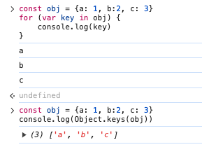

1. **<font style="color:rgb(30, 31, 36);">遍历的属性</font>**<font style="color:rgb(30, 31, 36);">：</font>
   * <font style="color:rgb(30, 31, 36);">for...in 循环不仅遍历对象自身的可枚举属性，</font>**<font style="color:rgb(30, 31, 36);">还会遍历其</font>****<font style="color:#DF2A3F;">原型链</font>****<font style="color:rgb(30, 31, 36);">上的可枚举属性</font>**<font style="color:rgb(30, 31, 36);">。</font>

> <font style="color:rgb(30, 31, 36);">如果你只想遍历对象自身的属性，那么你需要添加一个检查，例如使用 </font><code><font style="color:#DF2A3F;">hasOwnProperty()</font></code><font style="color:rgb(30, 31, 36);"> 方法。</font>

```
- <font style="color:rgb(30, 31, 36);">Object.keys()</font><font style="color:rgb(30, 31, 36);"> </font><font style="color:rgb(30, 31, 36);">返回一个由对象自身的所有可枚举属性（不包括继承的）组成的数组。</font>
```

2\. **<font style="color:rgb(30, 31, 36);">空值处理</font>**<font style="color:rgb(30, 31, 36);">：</font>
\- <font style="color:rgb(30, 31, 36);">for...in</font><font style="color:rgb(30, 31, 36);"> </font><font style="color:rgb(30, 31, 36);">循环不会忽略空值或</font><font style="color:rgb(30, 31, 36);">undefined</font><font style="color:rgb(30, 31, 36);">属性。</font>
\- <font style="color:rgb(30, 31, 36);">Object.keys()</font><font style="color:rgb(30, 31, 36);"> </font><font style="color:rgb(30, 31, 36);">会忽略值为</font><font style="color:rgb(30, 31, 36);">undefined</font><font style="color:rgb(30, 31, 36);">的属性。</font>
3\. **<font style="color:rgb(30, 31, 36);">性能</font>**<font style="color:rgb(30, 31, 36);">：</font>
\- <font style="color:rgb(30, 31, 36);">对于大量的数据，使用</font><font style="color:rgb(30, 31, 36);"> </font><font style="color:rgb(30, 31, 36);">Object.keys()</font><font style="color:rgb(30, 31, 36);"> </font><font style="color:rgb(30, 31, 36);">可能比</font><font style="color:rgb(30, 31, 36);"> </font><font style="color:rgb(30, 31, 36);">for...in</font><font style="color:rgb(30, 31, 36);"> </font><font style="color:rgb(30, 31, 36);">循环更快，因为它不需要遍历原型链。</font>
4\. **<font style="color:rgb(30, 31, 36);">兼容性</font>**<font style="color:rgb(30, 31, 36);">：</font>
\- <font style="color:rgb(30, 31, 36);">for...in</font><font style="color:rgb(30, 31, 36);"> </font><font style="color:rgb(30, 31, 36);">是 JavaScript 的基础语法，所以它应该在所有 JavaScript 环境中都能工作。</font>
\- <font style="color:rgb(30, 31, 36);">Object.keys()</font><font style="color:rgb(30, 31, 36);"> </font><font style="color:rgb(30, 31, 36);">是 ES5 的新特性，一些较老的 JavaScript 引擎可能不支持它。</font>
5\. **<font style="color:rgb(30, 31, 36);">返回值</font>**<font style="color:rgb(30, 31, 36);">：</font>
\- <font style="color:rgb(30, 31, 36);">for...in</font><font style="color:rgb(30, 31, 36);"> </font><font style="color:rgb(30, 31, 36);">直接返回一个对象的属性名。</font>
\- <font style="color:rgb(30, 31, 36);">Object.keys()</font><font style="color:rgb(30, 31, 36);"> </font><font style="color:rgb(30, 31, 36);">返回一个包含对象自身可枚举属性的数组。</font>
6\. **<font style="color:rgb(30, 31, 36);">使用场景</font>**<font style="color:rgb(30, 31, 36);">：</font>
\- <font style="color:rgb(30, 31, 36);">如果需要遍历对象的所有可枚举属性（包括自身和原型链上的），那么</font><font style="color:rgb(30, 31, 36);"> </font><font style="color:rgb(30, 31, 36);">for...in</font><font style="color:rgb(30, 31, 36);"> </font><font style="color:rgb(30, 31, 36);">可能是更好的选择。</font>
\- <font style="color:rgb(30, 31, 36);">如果只需要遍历对象自身的可枚举属性，并且想要一个数组来使用，那么</font><font style="color:rgb(30, 31, 36);"> </font><font style="color:rgb(30, 31, 36);">Object.keys()</font><font style="color:rgb(30, 31, 36);"> </font><font style="color:rgb(30, 31, 36);">可能是更好的选择。</font>

<font style="color:rgb(30, 31, 36);">总结：在大多数情况下，如果你只需要遍历对象自身的可枚举属性，并且想要一个数组来使用，那么 Object.keys() 是更好的选择。如果你需要遍历对象的所有可枚举属性（包括原型链上的），那么 for...in 是更好的选择。</font>

***

### 原生JS路由解析

**<font style="color:rgb(25, 27, 31);">pushState 和 replaceState</font>**

> <font style="color:rgb(83, 88, 97);">h</font>istory 提供了两个方法，能够无刷新的修改用户的浏览记录；
>
> pushState 在用户访问页面后面添加一个访问记录， replaceState 则是直接替换了当前访问记录

1. **<font style="color:rgb(79, 79, 79);">通过 hash(#) 哈希实现 - </font>\*\*\*\*<font style="color:#DF2A3F;">hashchange</font>**

<font style="color:rgb(77, 77, 77);">过监听 hash(#) 的变化来执行js代码 从而实现 页面的改变      </font>

```javascript
window.addEventListener('hashchange',function(){
  self.urlChange()
})
```

<font style="color:rgb(77, 77, 77);">就是通过这个原理 只要#改变了 就能触发这个事件，这也是很多单页面网站的url中都也 （#）的原因</font>

2. **<font style="color:rgb(77, 77, 77);">通过html5的最新history api来实现</font>**

<font style="color:rgb(77, 77, 77);">只要刷新 这个url（www.ff.ff/jjkj/fdfd/fdf/fd）就会请求服务器，然而服务器上根本没有这个资源，所以就会报404，解决方案就 配置一下服务器端；</font>

<font style="color:rgb(79, 79, 79);">实现原理：</font>

* <font style="color:rgb(77, 77, 77);">history.pushState</font>
* <font style="color:rgb(77, 77, 77);">history.replaceState</font>
* <font style="color:rgb(77, 77, 77);">history.state</font>
* <font style="color:rgb(77, 77, 77);">window.</font>**<font style="color:#DF2A3F;">onpopstate</font>**<font style="color:rgb(77, 77, 77);">事件 - </font><font style="color:rgb(77, 77, 77);">主要是监</font>听浏览器前进后退的按钮，不能触发pushState、replaceState

<font style="color:rgb(77, 77, 77);">第一步：history.pushState(null,null,"/abc");  改变url</font>

<font style="color:rgb(77, 77, 77);">第二部：执行一个函数（这个函数里有改变页面的代码）</font>

***

### 刷新页面的方式

* location.**reload**()
* location.**href** = location.href - location对象的href属性为当前页面的URL来刷新页面
* location.**assign**(location.href)
* window.**open**(location.href, '\_self').close()

***

### BOM对象有哪些

Window、Document、Location、History、Navigator、Screen

***

### 实现浏览器内多个标签页之间的通信

1. <code><font style="color:rgb(79, 79, 79);">localStorage</font></code><font style="color:rgb(79, 79, 79);">方式 - </font><code><font style="color:rgb(77, 77, 77);">setItem</font></code><font style="color:rgb(77, 77, 77);">时会自动触发整个浏览器的storage事件（</font><font style="color:#DF2A3F;">除当前页面之外</font><font style="color:rgb(77, 77, 77);">）</font>

```javascript
window.addEventListener("storage",function(){
  // do something
});
```

2. <code><font style="color:rgb(79, 79, 79);">webSocket</font></code><font style="color:rgb(79, 79, 79);">方式 - </font><font style="color:rgb(77, 77, 77);">a.html发送消息到WebSocketServer，WebSocketServer再实时把消息发给 b.html</font>

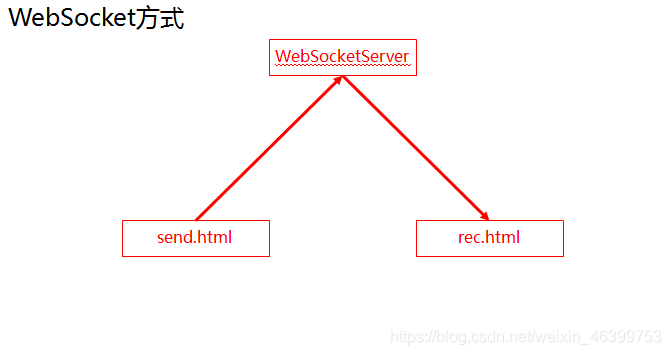

3. `PostMessage` API -

```javascript
/* page1.html */
// 获取第二个标签页的 window 对象引用
const page2Window = window.open('page2.html', '_blank');

// 向第二个标签页发送消息
page2Window.postMessage('Hello from Page 1!', '*');

/* page2.html */
// 监听来自其他窗口的消息
window.addEventListener('message', receiveMessage, false);

function receiveMessage(event) {
  // 检查消息来源是否安全
  if (event.origin !== 'http://example.com') return;

  // 更新页面显示接收到的消息
  document.getElementById('message').innerText = event.data;
}
```

4. `BroadcastChannel` API - 实现**同源**下浏览器不同窗口，Tab 页，frame 或者 iframe 下的浏览器上下文 (通常是同一个网站下不同的页面) 之间的简单通讯

```javascript
// 连接到广播频道
var bc = new BroadcastChannel('test_channel');

// 发送简单消息的示例
bc.postMessage('This is a test message.');

// 简单示例，用于将事件打印到控制台
bc.onmessage = function (ev) { console.log(ev); }
// 或
bc.addEventListener('message', (ev) => {
  console.log(ev);
});

// 断开频道连接
bc.close()
```

***

### JS的垃圾回收机制

<font style="color:rgb(51, 51, 51);">那些不再被程序使用的数据（变量/函数），就被称为垃圾</font>

内存释放：垃圾回收的过程本质也就是内存释放

JS 在创建变量的时候会自动分配内存，但这块内存不再使用的时候，就会被自动释放：这就是垃圾回收机制

内存的生命周期：分配内存 》使用内存 》释放内存

某些原因只会分配内存、使用内存 而无法释放内存，这就会**导致内存泄漏**：

1. 全局变量不会被回收
2. 滥用闭包：闭包会将函数内部的变量向外暴露，导致局部变量无法被释放
3. 没有及时清除的定时器
4. 没有移除DOM元素的事件绑定

***

### window.onload 和 <font style="color:rgb(30, 31, 36);">$(document).ready()</font>

**<font style="color:rgb(30, 31, 36);">window.onload</font>**<font style="color:rgb(30, 31, 36);">:</font>

* <font style="color:rgb(30, 31, 36);">这个事件会在整个页面完全加载后触发，包括所有的图像、样式表、脚本等。</font>
* <font style="color:rgb(30, 31, 36);">这意味着，如果一个页面有很多图片或其他外部资源，</font><font style="color:rgb(30, 31, 36);">window.onload</font><font style="color:rgb(30, 31, 36);"> </font><font style="color:rgb(30, 31, 36);">可能会延迟很长时间才触发。</font>
* <font style="color:rgb(30, 31, 36);">它是一个纯 JavaScript 的事件，不依赖于任何库。</font>

```javascript
window.onload = function() {
    // 页面完全加载后的代码
};
```

**<font style="color:rgb(30, 31, 36);">$(document).ready()</font>**<font style="color:rgb(30, 31, 36);">:</font>

* <font style="color:rgb(30, 31, 36);">如果你在使用 jQuery，</font><font style="color:rgb(30, 31, 36);">$(document).ready()</font><font style="color:rgb(30, 31, 36);"> </font><font style="color:rgb(30, 31, 36);">会在 DOM（Document Object Model）结构加载完成后触发，而不必等待所有的外部资源如图片和样式表加载完成。</font>
* <font style="color:rgb(30, 31, 36);">这意味着，你可以更快地执行与 DOM 相关的操作，而不必等待所有的外部资源都加载完毕。</font>
* <font style="color:rgb(30, 31, 36);">这个方法是 jQuery 提供的，所以你需要先引入 jQuery 库。</font>

```javascript
$(document).ready(function() {
    // DOM 加载完成后的代码
});
```

***


> 更新: 2024-07-11 14:47:10  
> 原文: <https://www.yuque.com/hutaoao/blog/dxbhti>