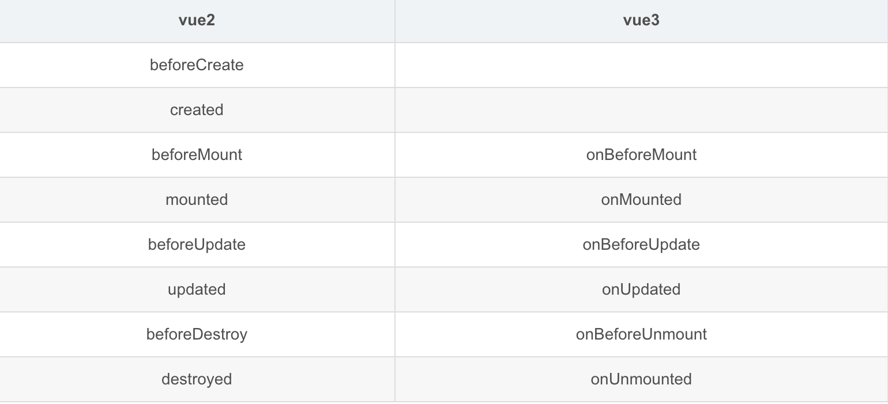

# Vue

### MVVM

> <code><font style="color:#F5222D;">MVVM</font></code><font style="color:#4D4D4D;"> 是 </font><code><font style="color:#F5222D;">Model-View-ViewModal</font></code> <font style="color:#4D4D4D;">的缩写，是一种脱胎于 </font>MVC<font style="color:#4D4D4D;"> 模式的设计模式 - 核心是</font>**<font style="color:#DF2A3F;">数据双向绑定</font>**

<code><font style="color:#F5222D;">Model</font></code> 代表**数据层**，负责存放业务相关的数据；

<code><font style="color:#F5222D;">View</font></code> 代表**视图层**，负责在页面上展示数据；

<code><font style="color:#F5222D;">ViewModel</font></code> **业务逻辑层**，作用是同步 View 和 Model 之间的关联；

其实现同步关联的核心是DOM Listeners和 Data Bindings两个工具。DOMListeners 工具用于监听 View 中 DOM 的变化，并会选择性的传给 Model；Data Bindings 工具用于监听 Model 数据变化，并将其更新给 View。

***

### SPA

* **SPA**（single-page application）：**单页应用** - 通过动态\_重写当前页面\_来与用户交互
* **MPA**（MultiPage-page application）：**多页应用** - 访问另一个页面的时候，都需要重新加载html、css、js文件

<font style="color:rgb(44, 62, 80);"></font>

**<font style="color:rgb(44, 62, 80);">优点</font>**<font style="color:rgb(44, 62, 80);">：</font>

* <font style="color:rgb(44, 62, 80);">具有桌面应用的</font>**<font style="color:rgb(44, 62, 80);">即时性</font>**<font style="color:rgb(44, 62, 80);">、网站的</font>**<font style="color:rgb(44, 62, 80);">可移植性</font>**<font style="color:rgb(44, 62, 80);">和</font>**<font style="color:rgb(44, 62, 80);">可访问性</font>**
* <font style="color:rgb(44, 62, 80);">用户</font>**<font style="color:rgb(44, 62, 80);">体验好、快</font>**<font style="color:rgb(44, 62, 80);">，内容的改变不需要重新加载整个页面</font>
* <font style="color:rgb(44, 62, 80);">良好的前后端分离，分工更明确</font>

**<font style="color:rgb(44, 62, 80);">缺点</font>**<font style="color:rgb(44, 62, 80);">：</font>

* <font style="color:rgb(44, 62, 80);">不利于搜索引擎的抓取</font>
* <font style="color:rgb(44, 62, 80);">首次渲染速度相对较慢</font>

***

### <font style="color:rgb(44, 62, 80);">什么是vue的响应式</font>

vue数据响应式设计的初衷是为了实现数据和函数（渲染也就是函数）的联动；

***

### vue的双向绑定原理是什么？关键点？

<font style="color:#DF2A3F;">vue 双向数据绑定主要讲的是数据和视图的双向绑定</font><font style="color:rgb(64, 64, 64);">：数据和视图同步，数据发生变化 视图跟着变化，视图变化 数据也随之发生改变；</font>

<font style="color:#DF2A3F;">是通过 </font>**<font style="color:#DF2A3F;">数据劫持 结合 发布订阅模式</font>**<font style="color:#DF2A3F;">的方式来实现的；</font>

**<font style="color:rgb(64, 64, 64);">数据劫持：核心</font>**<font style="color:rgb(64, 64, 64);">是通过 </font><code>**<font style="color:rgb(64, 64, 64);">Object.defineProperty(</font>**obj, prop, descriptor**<font style="color:rgb(64, 64, 64);">)</font>**</code>**<font style="color:rgb(64, 64, 64);"> </font>**<font style="color:rgb(64, 64, 64);">方法（ES6新增）</font>对数据进行劫持，可以监听到数据的变化。当数据发生变化时，可以触发相应的处理函数（getter\setter方法），通知订阅者更新视图；当视图中的元素发生变化时 会触发相应的事件，然后同步新的数据。这样就完成了双向绑定

* **obj**（要定义其上属性的对象）
* **prop**（要定义或修改的属性）
* **descriptor**（具体的改变方法）

<font style="color:rgb(48, 48, 48);">就是用这个方法定义一个值，当调用时我们使用了它里面的 </font>**<font style="color:rgb(48, 48, 48);">get </font>**<font style="color:rgb(48, 48, 48);">方法，当我们给这个属性赋值时，同时又调用了里面的 </font>**<font style="color:rgb(48, 48, 48);">set </font>**<font style="color:rgb(48, 48, 48);">方法</font>

\*\*<font style="color:rgb(64, 64, 64);">发布订阅模式：</font>\*\*Vue通过发布订阅模式来实现双向数据绑定。当数据发生变化时，Vue会发布一个事件，订阅该事件的组件会收到通知，从而更新视图。

***

### <font style="color:rgb(44, 62, 80);">SPA首屏加载速度慢的怎么解决</font>

<font style="color:rgb(44, 62, 80);">分成两大部分：资源加载优化 和 页面渲染优化</font>

<font style="color:rgb(44, 62, 80);"></font>

* <font style="color:rgb(44, 62, 80);">减小入口文件积</font>
* <font style="color:rgb(44, 62, 80);">静态资源本地缓存</font>
* <font style="color:rgb(44, 62, 80);">UI框架按需加载</font>
* <font style="color:rgb(44, 62, 80);">图片资源的压缩</font>
* <font style="color:rgb(44, 62, 80);">组件重复打包</font>
* <font style="color:rgb(44, 62, 80);">开启GZip压缩</font>
* <font style="color:rgb(44, 62, 80);">使用SSR</font>

***

### vue优缺点

| 优点 | 缺点 |
| --- | --- |
| + 无刷新体验；<br/>+ 组件化开发思想；<br/>+ 数据双向绑定，数据视图结构分离<br/>+ 轻量级框架：只关注视图层<br/>+ 虚拟 DOM加载 HTML 节点，运行效率高。 | + <font style="color:#646464;">不支持低版本的浏览器，最低只支持到IE9；</font><br/>+ <font style="color:#646464;">不利于SEO的优化（如果要支持SEO，建议通过服务端来进行渲染组件）；</font><br/>+ <font style="color:#646464;">第一次加载首页耗时相对长一些；</font><br/>+ <font style="color:#646464;">不可以使用浏览器的导航按钮需要自行实现前进、后退。</font> |

***

### vue的两个核心点

> <font style="color:#121212;">数据驱动、组件系统</font>

* **<font style="color:#F5222D;">数据驱动</font>**<font style="color:#121212;">：ViewModel，保证数据和视图的一致性。</font>
* **<font style="color:#F5222D;">组件系统</font>**<font style="color:#121212;">：应用类UI可以看作全部是由组件树构成的。</font>

***

### <font style="color:#121212;">Vue中的diff算法</font>

**diff 算法**是一种通过同层的树节点进行比较的高效算法：作用于虚拟 dom 渲染成真实 dom 的新旧 VNode 节点比较

其有两个特点：

* **比较只会在同层级进行**, 不会跨层级比较
* 在diff比较的过程中，**循环从两边向中间比较**

***

### \[组件通信（传值）]\(https://www.yuque.com/hutaoao/blog/fele98?singleDoc# 《Vue组件之间的通信方式》)

1. 通过 **props** 传递：<font style="color:rgb(44, 62, 80);">父组件向子组件传递数据</font>
2. 通过 **$emit** 触发自定义事件：<font style="color:rgb(44, 62, 80);">子组件向父组件传递数据</font>
3. 使用 **ref**：<font style="color:rgb(44, 62, 80);">父组件在使用子组件的时候设置</font><font style="color:rgb(71, 101, 130);">ref，</font><font style="color:rgb(44, 62, 80);">通过设置子组件</font><font style="color:rgb(71, 101, 130);">ref</font><font style="color:rgb(44, 62, 80);">来获取数据</font>
4. **EventBus**：<font style="color:rgb(44, 62, 80);">兄弟组件传值</font>
5. **$parent** 或 \*\*$root：\*\*通过共同祖辈$parent或者$root搭建通信桥连
6. **$attrs** 与 **$listeners**：祖先传递数据给子孙
7. **Provide** 与 **Inject**：在祖先组件定义provide属性，返回传递的值，在后代组件通过inject接收组件传递过来的值
8. **Vuex**：

***

### vue2 生命周期

> <font style="color:#646464;">Vue实例</font>**<font style="color:#646464;">从创建到销毁的过程</font>**<font style="color:#646464;">，就是生命周期。总共分为8个阶段</font>
>
> <font style="color:#646464;">第一次页面加载时会触发 </font><code><font style="color:#FA541C;">beforeCreate</font></code><font style="color:#646464;"> ，</font><code><font style="color:#FA541C;">created</font></code><font style="color:#646464;">，</font><code><font style="color:#FA541C;">beforeMount</font></code><font style="color:#646464;">，</font><code><font style="color:#FA541C;">mounted</font></code>

**1）创建阶段**

1. <code><font style="color:#FA541C;">beforeCreate</font></code>（创建前）**实例刚被创建**，**此时不能访问 data、methods、ref**
2. <code><font style="color:#FA541C;">created</font></code>（创建后）**data数据、methods中的方法已可访问**<font style="color:#4D4D4D;">，</font>**dom未创建，ref 仍为 undefined，$el 尚不可用。**

**2）挂载阶段**

3. <code><font style="color:#FA541C;">beforeMount</font></code>（载入前）<font style="color:rgb(44, 62, 80);">完成了模版的编译，但未挂载到页面中 - </font>**<font style="color:rgb(44, 62, 80);">dom未创建</font>**
4. <code><font style="color:#FA541C;">mounted</font></code>    — （载入后）**dom已创建**，**能获取到 $ref 属性**，可用于获取访问数据和dom元素

> <font style="color:rgb(77, 77, 77);">注意！！！ mounted 不会保证所有的子组件也都被挂载完成。如果你希望等到整个视图都渲染完毕再执行某些操作，可以在 mounted 内部使用 vm.$nextTick：</font>

**3）更新阶段**

5. <code><font style="color:#FA541C;">beforeUpdate</font></code> （更新前）**此时data 中的状态只是最新的，当时页面上显示的数据还是旧的**
6. <code><font style="color:#FA541C;">updated</font></code>（更新后）**此时data中的状态值和界面上显示的数据都是最新的**

**4）卸载阶段**

7. <code><font style="color:#FA541C;">beforeDestroy</font></code>（卸载前\*\*）准备销毁，实例属性方法仍可使用 - \*\***<font style="color:rgb(44, 62, 80);">用于一些定时器或订阅的取消</font>**
8. <code><font style="color:#FA541C;">destroyed</font></code>（卸载后）**所有内容均不可使用**

> <font style="color:#4D4D4D;">针对 </font>**keep-alive**<font style="color:#4D4D4D;"> 组件还有两个钩子函数：</font>
>
> **activated**<font style="color:#4D4D4D;">：在被 </font>**keep-alive**<font style="color:#4D4D4D;"> 缓存的组件激活时调用。</font>
>
> **deactivated**<font style="color:#4D4D4D;">：在被 </font>**keep-alive**<font style="color:#4D4D4D;"> 缓存的组件停用时调用。</font>
>
> <font style="color:#4D4D4D;">还有一个错误处理捕获函数：</font>
>
> **errorCaptured**<font style="color:#4D4D4D;">：在捕获到一个来自子孙组件的错误时调用。</font>

***

### vue3 生命周期

1. setup() : 开始创建组件，在 beforeCreate 和 created 之前执行，创建的是 data 和 method
2. onBeforeMount() : 组件挂载到节点上之前执行的函数；
3. onMounted() : 组件挂载完成后执行的函数；
4. onBeforeUpdate(): 组件更新之前执行的函数；
5. onUpdated(): 组件更新完成之后执行的函数；
6. onBeforeUnmount(): 组件卸载之前执行的函数；
7. onUnmounted(): 组件卸载完成后执行的函数；
8. onActivated(): 被包含在 <keep-alive> 中的组件，会多出两个生命周期钩子函数，被激活时执行；
9. onDeactivated(): 比如从 A 组件，切换到 B 组件，A 组件消失时执行；
10. onErrorCaptured(): 当捕获一个来自子孙组件的异常时激活钩子函数。

> <font style="color:rgb(77, 77, 77);">Vue2 的 beforeCreate 、created  两个钩子被setup()钩子来替代。</font>

***

### <font style="color:rgb(79, 79, 79);">Vue 子组件和父组件执行顺序</font>

* **组件的调用顺序都是先父后子，渲染完成的顺序是先子后父。**
* **组件的销毁操作是先父后子，销毁完成的顺序是先子后父。**

**加载渲染过程：**

1. 父组件 beforeCreate
2. 父组件 created
3. 父组件 beforeMount
4. 子组件 beforeCreate
5. 子组件 created
6. 子组件 beforeMount
7. 子组件 mounted
8. 父组件 mounted

**更新过程：**

1. 父组件 beforeUpdate
2. 子组件 beforeUpdate
3. 子组件 updated
4. 父组件 updated

**销毁过程：**

1. 父组件 beforeDestroy
2. 子组件 beforeDestroy
3. 子组件 destroyed
4. 父组件 destoryed

***

### <font style="color:rgb(44, 62, 80);">数据请求在created和mouted的区别</font>

`created` 是在组件实例一旦创建完成的时候立刻调用，这时候页面dom节点并未生成；

`mounted` 是在页面dom节点渲染完毕之后就立刻执行的。

触发时机上 `created` 是比 `mounted` 要更早的，两者的相同点：都能拿到实例对象的属性和方法。

讨论这个问题本质就是触发的时机，放在`mounted`中的请求有可能**导致页面闪动**（因为此时页面dom结构已经生成），但如果在页面加载前完成请求，则不会出现此情况。<font style="color:#DF2A3F;">建议对页面内容的改动放在created生命周期当中</font>。

***

### 为什么 Vue 组件中 data 必须是一个函数

<font style="color:rgb(29, 33, 41);background-color:rgb(247, 248, 250);">为了保证组件的 </font>**<font style="color:rgb(29, 33, 41);background-color:rgb(247, 248, 250);">独立性</font>**<font style="color:rgb(29, 33, 41);background-color:rgb(247, 248, 250);"> 和 </font>**<font style="color:rgb(29, 33, 41);background-color:rgb(247, 248, 250);">可复用性</font>**<font style="color:rgb(29, 33, 41);background-color:rgb(247, 248, 250);">。</font>

如果 `data` 是一个对象，当复用组件时，因为 `data` 都会指向同一个引用类型地址，其中一个组件的 `data` 一旦发生修改，则其他复用的组件中的 `data` 也会被一并修改。（<font style="color:#F5222D;">因为组件是用来复用的，JS 里对象是引用关系，这样作用域没有隔离</font>）

如果 `data` 是一个返回对象的函数，因为每次重用组件时返回的都是一个新对象，引用地址不同，便不会出现如上问题。

***

### v-show与v-if的区别

`v-if` 是真实的条件渲染（<font style="color:rgb(44, 62, 80);">局部编译/卸载的过程</font>）- 较高的切换消耗；

`v-show` 则只是简单地基于 CSS <code><font style="color:#4D4D4D;">display</font></code><font style="color:#4D4D4D;"> </font> 切换 - <font style="color:rgb(44, 62, 80);">更高的初始渲染消耗；</font>

如果需要<font style="color:#FF0000;">频繁切换</font>使用 v-show 较好<font style="color:#FF0000;">；</font><font style="color:rgb(44, 62, 80);">如果在</font><font style="color:#DF2A3F;">运行时条件很少改变</font><font style="color:rgb(44, 62, 80);">，则使用 v-if 较好</font>

***

### 常用的指令

<code><font style="color:#F5222D;">v-show</font></code> <font style="color:#646464;">与</font> <code><font style="color:#F5222D;">v-if</font></code><font style="color:#646464;">：</font>条件渲染

<code><font style="color:#F5222D;">v-model</font></code><font style="color:#646464;">：</font>让表单元素和数据实现双向绑定（映射关系）

<code><font style="color:#F5222D;">v-html</font></code><font style="color:#646464;">：更新元素的innerHTML</font>

<code><font style="color:#F5222D;">v-on</font></code><font style="color:#646464;">:click：</font>可以简写为@click,@绑定一个事件。

<code><font style="color:#F5222D;">v-for</font></code><font style="color:#646464;">：列表渲染</font>

<code><font style="color:#F5222D;">v-bind</font></code><font style="color:#646464;">：当表达式的值改变时，将其产生的连带影响，响应式地作用于DOM语法</font>

<code><font style="color:#F5222D;">v-bind</font></code><font style="color:#646464;">:title=“msg”简写：title="msg"</font>

***

### <keep-alive>的作用

<font style="color:#121212;">keep-alive 是 Vue 内置的一个</font>**<font style="color:#121212;">组件</font>**<font style="color:#121212;">，可以</font>**<font style="color:#121212;">使被包含的组件保留状态、避免重复渲染。</font>**

<font style="color:rgb(30, 31, 36);">两个生命周期：</font>

* **<font style="color:rgb(30, 31, 36);">deactivated</font>**<font style="color:rgb(30, 31, 36);">：组件被切换时</font>
* **<font style="color:rgb(30, 31, 36);">activated</font>**<font style="color:rgb(30, 31, 36);">：组件被缓存时</font>

***

### 如何获取dom

<font style="color:#121212;">ref="domName" 用法：this.$refs.domName</font>

***

### 为什么使用key

<font style="color:#121212;">需要使用key来给每个节点做一个</font><font style="color:#FA541C;">唯一标识</font><font style="color:#121212;">，</font><font style="color:#FA541C;">Diff算法</font><font style="color:#121212;">就可以更准确/更快的识别此节点。</font>

<font style="color:#121212;">作用主要是为了</font>**<font style="color:#FA541C;">高效的更新虚拟DOM</font>**<font style="color:#121212;">。</font>

***

### Vue中双向数据绑定是如何实现的（响应式原理）

<font style="color:#121212;">vue 双向数据绑定是通过</font><font style="color:#FA541C;"> 数据劫持 结合 发布订阅</font><font style="color:#121212;">模式的方式来实现的，也就是说数据和视图同步，数据发生变化，视图跟着变化，视图变化，数据也随之发生改变；</font>

<font style="color:#121212;">核心：双向数据绑定其核心是 </font><code>**<font style="color:#FA541C;">Object.defineProperty()</font>**</code> <font style="color:#121212;">方法。</font>

***

### v-if和v-for的优先级

<font style="color:#121212;">当 v-if 与 v-for 一起使用时：</font>

**在vue2中**\*\*<font style="color:#FA541C;">：v-for 比 v-if 更高的优先级</font>\*\*<font style="color:#121212;">，这意味着 v-if 将分别重复运行于每个 v-for 循环中，</font><font style="color:rgb(25, 27, 31);">将造成很大的性能浪费；</font>

**<font style="color:#121212;">在vue3中</font>**<font style="color:#121212;">：</font>**<font style="color:#DF2A3F;">v-if 比 v-for 的优先级更高</font>**<font style="color:rgb(33, 53, 71);">，这意味着 </font>v-if<font style="color:rgb(33, 53, 71);"> 的条件将无法访问到 </font>v-for<font style="color:rgb(33, 53, 71);"> 作用域内定义的变量别名。</font>

***

### computed 和 watch 区别

|  | 计算属性 'computed' | 侦听属性 'watch' |
| --- | --- | --- |
| 作用不同 | 解决模板语法渲染代码冗余问题 | 监听data中某一个数据的变化 |
| 缓存机制不同 | **支持缓存**，只有依赖数据发生变化时，才会重新进行计算函数； | **不支持缓存**，只要数据发生变化，就会执行侦听函数； |
| 语法不同 | **有返回值**；都有一个 get 和 set | **没有返回值**；侦听属性的值可以是一个对象 |
| 是否支持异步 | **不支持异步操作** | **支持异步操作** |
| 监听数量不同 | 可以监听多个数据变化 | 只能监听一个数据变化 |
| 初始执行时机不同 | 在页面一加载的时候就会执行一次 | 在绑定时执行一次 |

```vue
watch: { 
  obj: { 
    //handler接收两个参数（newVal：新值，oldVal：旧值 
    handler: function(newVal, oldVal){ 
      console.log(newVal); 
    }, 
    deep: true,//设置为true时会监听对象内部值的变化； 
    immediate: true//设置为true时会立即以表达式的当前值触发回调； 
  } 
}
```

***

### 常用的修饰符

**表单修饰符**

* <code><font style="color:#DF2A3F;">.lazy</font></code> 在我们填完信息，光标离开标签的时候，才会将值赋予给value，也就是在change事件之后再进行信息同步
* <code><font style="color:#DF2A3F;">.trim</font></code> 自动过滤用户输入的**首空格字符**，而中间的空格不会过滤
* <code><font style="color:#DF2A3F;">.number</font></code> 自动将用户的输入值转为数值类型，但如果这个值无法被parseFloat解析，则会返回原来的值

**事件修饰符**

* <code><font style="color:#DF2A3F;">.stop</font></code><font style="color:#4D4D4D;">：阻止冒泡；</font>相当于调用了`event.stopPropagation`方法
* <code><font style="color:#DF2A3F;">.prevent</font></code><font style="color:#4D4D4D;">：阻止默认行为；</font>相当于调用了`event.preventDefault`方法
* <code><font style="color:#DF2A3F;">.self</font></code><font style="color:#4D4D4D;">：仅绑定元素自身可触发；</font>

> 使用修饰符时，顺序很重要；相应的代码会以同样的顺序产生。
>
> 因此，用 v-on:click.prevent.self 会阻止所有的点击，而 v-on:click.self.prevent 只会阻止对元素自身的点击

* <code><font style="color:#DF2A3F;">.once</font></code><font style="color:#4D4D4D;">：事件只触发一次</font>

**<font style="color:#4D4D4D;">鼠标按钮修饰符</font>**

* <code><font style="color:#F5222D;">.left</font></code>\*\*<font style="color:#4D4D4D;"> </font>\*\*左键点击
* <code><font style="color:#F5222D;">.right</font></code>\*\*<font style="color:#4D4D4D;"> </font>\*\*右键点击
* <code><font style="color:#DF2A3F;">.middle</font></code> 中键点击

**键盘修饰符**

键盘修饰符是用来修饰键盘事件（onkeyup，onkeydown）的，有如下：

keyCode存在很多，但vue为我们提供了别名，分为以下两种：

* <font style="color:#DF2A3F;">普通键（enter、tab、delete、space、esc、up...）</font>
* <font style="color:#DF2A3F;">系统修饰键（ctrl、alt、meta、shift...）</font>

> 只有按键为keyCode的时候才触发
>
> `<input type="text" @keyup.keyCode="shout()">`

**v-bind修饰符**

* `.async` 对 **props** 进行一个双向绑定
* .prop
* .camel

***

### vue自定义指令

\*\*全局注册：\*\*通过 `Vue.directive` 方法进行注册

`Vue.directive` 第一个参数是指令的名字（不需要写上v-前缀），第二个参数可以是对象数据，也可以是一个指令函数

```javascript
// 注册一个全局自定义指令 `v-focus`
Vue.directive('focus', {
  // 当被绑定的元素插入到 DOM 中时……
  inserted: function (el) {
    // 聚焦元素
    el.focus()  // 页面加载完成之后自动让输入框获取到焦点的小功能
  }
})
```

\*\*局部注册：\*\*通过在组件 `options` 选项中设置 `directive` 属性

```vue
directives: {
  focus: {
    // 指令的定义
    inserted: function (el) {
      el.focus() // 页面加载完成之后自动让输入框获取到焦点的小功能
    }
  }
}
```

**应用场景**

* 表单防止重复提交
* 图片懒加载
* 一键 Copy的功能

***

### SSR

<font style="color:#4D4D4D;">SSR也就是</font>**<font style="color:#F5222D;"> 服务端渲染</font>**<font style="color:#4D4D4D;">；</font>也就是将Vue在客户端把标签渲染成HTML的工作放在服务端完成，然后再把html直接返回给客户端。

SSR有着更好的SEO、并且首屏加载速度更快等优点。不过它也有一些缺点，比如我们的开发条件会受到限制，服务器端渲染只支持beforeCreate和created两个钩子，当我们需要一些外部扩展库时需要特殊处理，服务端渲染应用程序也需要处于Node.js的运行环境。还有就是服务器会有更大的负载需求。

***

### Vue的性能优化

**编码阶段**

* 尽量减少data中的数据，data中的数据都会增加getter和setter，会收集对应的watcher
* **<font style="color:#FA541C;">v-if和v-for不能连用</font>**
* 如果需要使用v-for给每项元素绑定事件时使用事件代理
* SPA 页面采用keep-alive缓存组件
* 在更多的情况下，使用v-if替代v-show
* key保证唯一（<font style="color:#F5222D;">key的作用主要是为了高效的更新虚拟DOM</font>）
* 使用路由懒加载、异步组件
* 第三方模块按需导入
* 长列表动态加载
* 图片懒加载

**SEO优化**

* 预渲染
* 服务端渲染SSR

**打包优化**

* 压缩代码
* 使用cdn加载第三方模块
* 多线程打包happypack
* splitChunks抽离公共文件
* sourceMap优化

**用户体验**

* 骨架屏
* PWA

***

### vue-router导航钩子（守卫）

1. **全局守卫**：在导航触发前调用。
2. **路由守卫**：在路由配置上定义。
3. **组件守卫**：在组件中定义。

```javascript
//1：全局钩子：beforeEach(to,form,next) 跳转前拦截、afterEach(to,form) 跳转后拦截
const router = new VueRouter({ ... });
router.beforeEach((to, from, next) => {
  if (to.name !== 'Login' && !isAuthenticated) {
    next({ name: 'Login' });
  } else {
    next();
  }
})
router.afterEach((to, from) => {
  // ...
})

//2：路由独享钩子：beforeEnter(to,form,next)
const router = new VueRouter({
  routes: [
    {
      path: '/foo',
      component: Foo,
      beforeEnter: (to, from, next) => {
        // ...
      }
    }
  ]
})

//3、组件内钩子
const Foo = {
  template: `...`,
  beforeRouteEnter (to, from, next) {
    // 在渲染该组件的对应路由被 confirm 前调用
    // 不！能！获取组件实例 `this`
    // 因为当守卫执行前，组件实例还没被创建
  },
  beforeRouteUpdate (to, from, next) { //(2.2 新增)
    // 在当前路由改变，但是该组件被复用时调用
    // 举例来说，对于一个带有动态参数的路径 /foo/:id，在 /foo/1 和 /foo/2 之间跳转的时候，
    // 由于会渲染同样的 Foo 组件，因此组件实例会被复用。而这个钩子就会在这个情况下被调用。
    // 可以访问组件实例 `this`
  },
  beforeRouteLeave (to, from, next) {
    // 导航离开该组件的对应路由时调用
    // 可以访问组件实例 `this`
  }
}
```

***

### vue-router的两种模式

* **<font style="color:#FA541C;">hash模式</font>**<font style="color:#121212;">：即地址栏 URL 中的 # 符号；</font>
* **<font style="color:#FA541C;">history模式</font>**<font style="color:#121212;">：window.history对象打印出来可以看到里边提供的方法和记录长度。利用了 HTML5 History Interface 中新增的 pushState() 和 replaceState() 方法。（需要特定浏览器支持）。</font>

***

### active-class的作用

active-class是vue-router模块的router-link组件中的属性，用来做选中样式的切换。

***

### NextTick() 作用

官方定义：

> <font style="color:#212529;">在下次 DOM 更新循环结束之后执行延迟回调。在修改数据之后，立即使用这个回调函数，获取更新后的 DOM。</font>

**理解：Vue 更新 DOM 时是异步执行的。当数据发生变化，Vue将开启一个异步更新队列（***异步操作队列还会进行去重***），NextTick() 等所有的异步队列更新完成之后，再统一进行更新（执行）。**

***

### 路由的跳转方式

* <code><font style="color:#FA541C;"><router-link to='home'></font></code>  `router-link` 标签会渲染为`<a>`标签；
* 另一种是编程式导航，也就是通过js跳转。比如：<code><font style="color:#FA541C;">this.router.push('/home')</font></code>

***

### 路由懒加载

**<font style="color:#2C3E50;">诉求：</font>**<font style="color:#2C3E50;">当打包构建应用时，JavaScript 包会变得非常大，影响页面加载（导致首页加载时间过长，</font>即使做了loading也是不利于用户体验<font style="color:#2C3E50;">）。</font>而运用懒加载则可以<font style="color:#2C3E50;">把不同路由对应的组件分割成不同的代码块，然后当路由被访问的时候才加载对应组件，这样就</font>有效的分担首页的加载压力。

**总结：**<font style="color:#333333;">为给客户更好的客户体验，</font><font style="color:#F5222D;">首屏加载速度更快一些，解决白屏问题</font><font style="color:#333333;">。</font>

**方法：**

1. **vue异步组件实现路由懒加载**

　　<font style="color:#F5222D;">component：resolve=>(\['需要加载的路由的地址'，resolve])</font>

2. **es6 提出的import（推荐）**

　　**<u><font style="color:#F5222D;">const HelloWorld = （）=>import('需要加载的模块地址')</font></u>**

**参考：**[Vue路由懒加载](https://www.yuque.com/hutaoao/blog/kz7fwa)

> \*\*原理：\*\*路由懒加载的实现方式是<font style="color:#DF2A3F;">将路由相关的组件，不再直接导入，而是改写成异步组件的写法，只有当函数被调用的时候，才加载对应的组件内容。</font>

***

### Axios、Fetch、Ajax

<code>**<font style="color:#F5222D;">Ajax：</font>**</code> 即“**Asynchronous Javascript And XML**”（**异步 JavaScript 和 XML**），是指一种创建交互式网页应用的网页开发技术；<font style="color:#4D4D4D;">本质是使用</font>**<font style="color:#DF2A3F;">XMLHttpRequest</font>**<font style="color:#4D4D4D;">对象来请求数据。</font>

<code><font style="color:#F5222D;">Axios：</font></code><font style="color:#444444;"> 是一个基于 </font><code><font style="color:#F5222D;">promise</font></code><font style="color:#444444;"> 的 HTTP 库，可以用在浏览器和 node.js 中</font><font style="color:#4D4D4D;">。简单的理解就是</font>**<font style="color:#F5222D;">Axios是通过promise实现对ajax技术的一种封装。</font>**

**特性**\*\*：\*\*

* 从浏览器中创建 [XMLHttpRequests](https://developer.mozilla.org/en-US/docs/Web/API/XMLHttpRequest)
* 从 node.js 创建 [http](http://nodejs.org/api/http.html) 请求
* 支持 [Promise](https://developer.mozilla.org/en-US/docs/Web/JavaScript/Reference/Global_Objects/Promise) API
* 拦截请求和响应
* 转换请求数据和响应数据
* 取消请求
* 自动转换 JSON 数据
* 客户端支持防御 [XSRF](http://en.wikipedia.org/wiki/Cross-site_request_forgery)

<code><font style="color:#F5222D;">Fetch：</font></code> 是**ES6推出**基于 <code><font style="color:#F5222D;">promise</font></code> 设计的。**fetch不是ajax的进一步封装，而是原生js，没有使用XMLHttpRequest对象**。fetch<font style="color:#4D4D4D;">是全局量 window 的一个方法</font>

1、第一个参数是URL；

2、第二个是可选参数，可以控制不同配置的 init 对象；

3、使用了 [JavaScript Promises](https://davidwalsh.name/promises) 来处理结果/回调。

```javascript
// 链式处理,将异步变为类似单线程的写法: 高级用法.
fetch('/some/url').then(function(response) {
  return . //... 执行成功, 第1步...
    }).then(function(returnedValue) {
  // ... 执行成功, 第2步...
}).catch(function(err) {
  // 中途任何地方出错...在此处理 :( 
});
```

**特点（优点）：**

1. 浏览器<font style="color:#F5222D;">原生支持的api</font>
2. 支持 promise api
3. <font style="color:#666666;">语法简洁，</font><font style="color:#666666;">更加语义化</font>

**缺点：**

1. <font style="color:#F5222D;">默认不带cookie</font>
2. 不支持请求终止
3. 不支持文件上传进度检测
4. <font style="color:#F5222D;">所有版本的 IE 均不支持原生 Fetch</font>
5. 服务器返回400 500 状态码时并不会reject，只有网络出错导致请求不能完成时，fetch才会被reject\*\*\*\*

***

### Vue3 和 Vue2



`vue3` 重构背景：

> 主要考虑两点因素：
>
> * 利用新的语言特性(es6)
> * 解决架构问题

`Vue3` 的新特性：

* 速度更快
* 体积减少
* 更易维护
* 更接近原生
* 更易使用

`vue3` 相比 `vue2`

* 重写了虚拟Dom实现
* 编译模板的优化
* 更高效的组件初始化
* undate性能提高1.3~2倍
* SSR速度提高了2~3倍

`vue3` 相比 `vue2`变化：

* 可以**使用 **<code>**vite**</code>** 构建项目**
* 生命周期钩子名称上 + “on”
* **支持多根节点（**<font style="color:rgb(25, 27, 31);">支持碎片（Fragments）</font>**）**
* 增加 **组合式API写法**（Composition API）
* **使用TS重写**：更好的支持TS
* 新增组件：`Teleport` 瞬移组件、`Suspense` 异步加载组件、`loading` 界面

***

### Vue 中组件和插件的区别

\*\*组件：\*\*在Vue中每一个.vue文件都可以视为一个组件

\*\*插件：\*\*通常用来为 Vue 添加全局功能 - 如vue-router

两者的区别：

* **<font style="color:rgb(44, 62, 80);">编写形式</font>**

<font style="color:rgb(44, 62, 80);">组件：每一个</font><font style="color:rgb(71, 101, 130);">.</font>vue<font style="color:rgb(44, 62, 80);">文件我们都可以看成是一个组件；通过 </font>`template`<font style="color:rgb(71, 101, 130);"> </font><font style="color:rgb(44, 62, 80);">属性来编写一个组件</font>

<font style="color:rgb(44, 62, 80);">插件：</font><font style="color:rgb(44, 62, 80);">插件的实现应该暴露一个 </font><font style="color:rgb(71, 101, 130);">install</font><font style="color:rgb(44, 62, 80);"> 方法；</font>

* **<font style="color:rgb(44, 62, 80);">注册形式</font>**

组件：全局注册与局部注册：全局注册通过 `Vue.component` 方法，局部注册只需在用到的地方通过 `components` 属性注册一个组件

插件：插件的注册通过 `Vue.use()` 的方式进行注册（安装）

* **<font style="color:rgb(44, 62, 80);">使用场景</font>**<font style="color:rgb(44, 62, 80);"></font>

组件：用来构成你的 App 的业务模块

插件：用来增强你的技术栈的功能模块\
简单来说，**插件就是指对Vue的功能的增强或补充**

***

### Vue项目部署404问题

HTTP 404 错误意味着链接指向的资源不存在，问题在于为什么不存在？且为什么**只有history模式下会出现这个问题**？

Vue是属于单页应用 - 所有用户交互是通过动态重写当前页面，只会产出一个index.html，默认nginx配置只会匹配主目录，当我们跳到其它页面执行刷新时，nginx location 是没有相关配置的，所以就会出现404情况。

而 **hash 模式**用 # 表示的：仅 hash 符号之前的内容会被包含在请求中，hash 虽然出现在 URL 中，但不会被包括在 HTTP 请求中，对服务端完全没有影响，因此改变 hash 不会重新加载页面；如 website.com/#/login 只有 website.com 会被包含在请求中 ，因此对于服务端来说，即使没有配置location，也不会返回404错误

**解决方案**：对nginx配置文件.conf修改，添加` try_files $uri $uri/ /index.html;`

***

### Vuex 核心属性及作用

1. **<font style="color:rgb(30, 31, 36);">state</font>**<font style="color:rgb(30, 31, 36);">：vuex的基本数据，用来存储变量。</font>
2. **<font style="color:rgb(30, 31, 36);">getters</font>**<font style="color:rgb(30, 31, 36);">：从基本数据(state)</font>**<font style="color:rgb(30, 31, 36);">派生的数据</font>**<font style="color:rgb(30, 31, 36);">，相当于state的计算属性。</font>
3. **<font style="color:rgb(30, 31, 36);">mutations</font>**<font style="color:rgb(30, 31, 36);">：</font>**<font style="color:rgb(30, 31, 36);">提交更新数据的方法</font>**<font style="color:rgb(30, 31, 36);">，必须是同步的（如果需要异步使用action）。</font>
4. **<font style="color:rgb(30, 31, 36);">actions</font>**<font style="color:rgb(30, 31, 36);">：和mutation的功能大致相同，不同之处在于</font>**<font style="color:rgb(30, 31, 36);">action提交的是mutation</font>**<font style="color:rgb(30, 31, 36);">，而不是直接变更状态；action可以包含任意异步操作。</font>
5. **<font style="color:rgb(30, 31, 36);">modules</font>**<font style="color:rgb(30, 31, 36);">：</font>**<font style="color:rgb(30, 31, 36);">模块化vuex</font>**<font style="color:rgb(30, 31, 36);">，可以让每一个模块拥有自己的state、mutation、action、getters，使得结构非常清晰，方便管理。</font>

***

### mixins

`mixins` 是一种在Vue中**复用Vue组件代码的方式**，它是一种**可复用的混入对象**，可以混入到其他的Vue组件中。

***

### vuex 刷新页面后数据消失，怎么保持数据？

<font style="color:rgb(30, 31, 36);">由于 </font><code><font style="color:rgb(30, 31, 36);">Vuex</font></code><font style="color:rgb(30, 31, 36);"> 的状态</font>**<font style="color:rgb(30, 31, 36);">存储在客户端的</font>\*\*\*\*<font style="color:#DF2A3F;">内存中</font>**<font style="color:rgb(30, 31, 36);">，因此数据会丢失。要保持数据，你可以采取以下几种方法：</font>

1. **<font style="color:rgb(30, 31, 36);">本地持久化存储</font>**<font style="color:rgb(30, 31, 36);">：如 </font><code><font style="color:rgb(30, 31, 36);">localStorage</font></code><font style="color:rgb(30, 31, 36);">、</font><code><font style="color:rgb(30, 31, 36);">sessionStorage</font></code><font style="color:rgb(30, 31, 36);">或 </font>`cookies`<font style="color:rgb(30, 31, 36);">。在组件中，你可以监听 store 的变化，并将变化的数据存储到存储中。当页面刷新后，你可以从存储中读取数据并恢复状态。</font>
2. **<font style="color:rgb(30, 31, 36);">使用服务端存储</font>**<font style="color:rgb(30, 31, 36);">：将数据存储在服务端的数据库或其他存储中。当页面刷新后，你可以从服务端获取数据并恢复状态。这种方法需要</font>**<font style="color:rgb(30, 31, 36);">后端支持</font>**<font style="color:rgb(30, 31, 36);">，并可能涉及到安全性和权限的问题。</font>
3. **<font style="color:rgb(30, 31, 36);">使用 Vuex 的插件</font>**<font style="color:rgb(30, 31, 36);">：如 </font><code><font style="color:rgb(30, 31, 36);">vuex-persistedstate</font></code><font style="color:rgb(30, 31, 36);">。这些插件可以与第三方库（如 localForage 或 IndexedDB）一起使用，以实现数据的持久化。</font>

***

### vue3 性能提升主要体现在哪几个方面

1. **<font style="color:rgb(30, 31, 36);">源码体积优化</font>**<font style="color:rgb(30, 31, 36);">：通过 </font><code><font style="color:rgb(30, 31, 36);">tree-shaking</font></code><font style="color:rgb(30, 31, 36);"> 技术，减少了 41% 的体积。</font>
2. **<font style="color:rgb(30, 31, 36);">响应式系统提升</font>**<font style="color:rgb(30, 31, 36);">：Vue 3 使用 </font><code>**<font style="color:#DF2A3F;">proxy</font>**</code><font style="color:rgb(30, 31, 36);"> 对象重写响应式，性能比 Vue 2 的 defineProperty 好。</font><font style="color:rgb(30, 31, 36);">⚠️⚠️⚠️</font>
3. **<font style="color:rgb(30, 31, 36);">初始渲染速度提升</font>**<font style="color:rgb(30, 31, 36);">：通过编译优化，提升了 55%。</font>
4. **<font style="color:rgb(30, 31, 36);">更新速度提升</font>**<font style="color:rgb(30, 31, 36);">：通过 diff 算法优化，提升了 133%。</font>
5. **<font style="color:rgb(30, 31, 36);">内存占用减少</font>**<font style="color:rgb(30, 31, 36);">：通过数据劫持优化，减少 54% 内存占用。</font>

***

### Vux 中的 $router 和 $route 的区别

* **<font style="color:rgb(30, 31, 36);">$router是全局路由对象实例</font>**<font style="color:rgb(30, 31, 36);">。它包含了所有的路由及许多关键的对象和属性，用于操作路由，如路由跳转、路由前进、路由替换等。</font>
* **<font style="color:rgb(30, 31, 36);">$route是当前路由对象</font>**<font style="color:rgb(30, 31, 36);">。每一个路由都会有一个$route对象，用于获取当前路由信息，如当前路径、查询参数等。</font>

***

### Proxy 和 DefineProperty

<font style="color:rgb(30, 31, 36);">Proxy和Object.defineProperty都是用于处理对象属性的工具</font>

**<font style="color:rgb(30, 31, 36);">Object.defineProperty</font>**<font style="color:rgb(30, 31, 36);">:</font>

1. <font style="color:rgb(30, 31, 36);">Object.defineProperty方法直接在一个对象上定义一个新属性，或者修改一个对象的现有属性，并返回这个对象。</font>
2. <font style="color:rgb(30, 31, 36);">它</font>**<font style="color:#DF2A3F;">主要用于静态属性的创建或修改，不能用于动态拦截属性的读取和设置</font>**<font style="color:rgb(30, 31, 36);">。</font>

<font style="color:rgb(30, 31, 36);">示例：</font>

```javascript
const obj = {a: 1};
Object.defineProperty(obj, 'b', {
  value: 'Hello',
  writable: false
});
console.log(obj); // {a: 1, b: 'Hello'}
```

**<font style="color:rgb(30, 31, 36);">Proxy</font>**<font style="color:rgb(30, 31, 36);">:</font>

1. <font style="color:rgb(30, 31, 36);">Proxy构造函数创建一个新的对象，其行为可以</font><font style="color:#DF2A3F;"></font><font style="color:rgb(30, 31, 36);">由一个“handler”对象来定义。</font>
2. <font style="color:rgb(30, 31, 36);">它主要用于</font>**<font style="color:#DF2A3F;">动态地拦截属性的读取和设置</font>**<font style="color:rgb(30, 31, 36);">，以及其他对象操作，如枚举、函数调用等。</font>

<font style="color:rgb(30, 31, 36);">示例：</font>

```javascript
const obj = {};
const handler = {
  get(target, prop) {
    return 'Hello';
  }
};
const proxy = new Proxy(obj, handler);
```

**<font style="color:rgb(30, 31, 36);">区别</font>**<font style="color:rgb(30, 31, 36);">:</font>

* <font style="color:rgb(30, 31, 36);">Object.defineProperty</font><font style="color:rgb(30, 31, 36);">更适合于静态属性的创建或修改，而</font><font style="color:rgb(30, 31, 36);">Proxy</font><font style="color:rgb(30, 31, 36);">更适合于动态地拦截和处理属性。</font>
* <font style="color:rgb(30, 31, 36);">Proxy</font>**<font style="color:#DF2A3F;">拦截几乎所有的对象基本操作</font>**<font style="color:rgb(30, 31, 36);">，而Object.defineProperty本来就是一个基本操作（众多基本操作中的一个）只能定义或修改一个属性。</font>
* <font style="color:rgb(30, 31, 36);">Proxy需要更多的代码和更深入的理解来正确使用，而Object.defineProperty相对简单和直接。</font>

***

### <font style="color:rgb(33, 53, 71);">组合式 API 和 React Hooks</font>

**React Hooks：**

* Hooks 有严格的调用顺序，并不可以写在条件分支中。
* React 组件中定义的变量会被一个钩子函数闭包捕获，若开发者传递了错误的依赖数组，它会变得“过期”。这导致了 React 开发者非常依赖 ESLint 规则以确保传递了正确的依赖，然而，这些规则往往不够智能，保持正确的代价过高，在一些边缘情况时会遇到令人头疼的、不必要的报错信息。
* 昂贵的计算需要使用 useMemo，这也需要传入正确的依赖数组。
* 在默认情况下，传递给子组件的事件处理函数会导致子组件进行不必要的更新。子组件默认更新，并需要显式的调用 useCallback 作优化。这个优化同样需要正确的依赖数组，并且几乎在任何时候都需要。忽视这一点会导致默认情况下对应用进行过度渲染，并可能在不知不觉中导致性能问题。
* 要解决变量闭包导致的问题，再结合并发功能，使得很难推理出一段钩子代码是什么时候运行的，并且很不好处理需要在多次渲染间保持引用 (通过 useRef) 的可变状态。

**组合式 API：**

* 仅调用 setup() 或 <script setup> 的代码一次。这使得代码更符合日常 JavaScript 的直觉，不需要担心闭包变量的问题。组合式 API 也并不限制调用顺序，还可以有条件地进行调用。
* Vue 的响应性系统运行时会自动收集计算属性和侦听器的依赖，因此无需手动声明依赖。
* 无需手动缓存回调函数来避免不必要的组件更新。Vue 细粒度的响应性系统能够确保在绝大部分情况下组件仅执行必要的更新。对 Vue 开发者来说几乎不怎么需要对子组件更新进行手动优化。

<font style="color:rgb(30, 31, 36);"></font>

[前端面试题.pdf](https://www.yuque.com/attachments/yuque/0/2024/pdf/256708/1709530317969-b91a6502-7e54-4b75-80af-36f8441d1e5f.pdf)


> 更新: 2024-07-09 14:24:14  
> 原文: <https://www.yuque.com/hutaoao/blog/rhcq90>